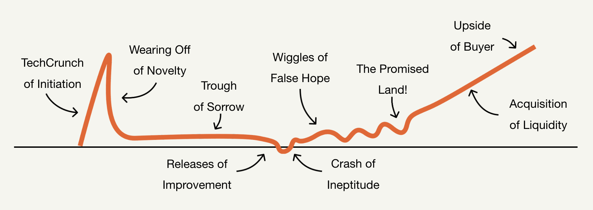
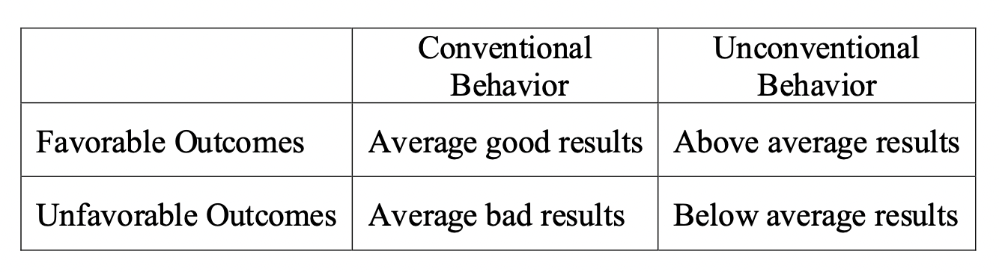

- ## How to get [[startup]] ideas
  collapsed:: true
	- url: https://docs.google.com/presentation/d/1Cm1TPjTSmZ9W_1ecxfNEYIwxPEMF8BWlWRyi14Je8OI/edit
	- ### Mistakes
	  collapsed:: true
		- **Not solving a real problem**
			- Solution In Search of a Problem
			- AI is cool.  What could I apply it too?"
			- Fall in love with a problem, 
			  not a solution
		- **Getting stuck on a "tarpit idea"**
			- Widespread problem that lots of potential founders encounter
			- Seems like it could be easily solvable with a startup
			- There’s a structural reason why it’s actually very difficult to solve
			- Example Tarpit Idea: "App to make casual plans with your friends"
			- Tarpit ideas are not necessarily impossible
			  Think of them as "Common ideas that are surprisingly difficult"
			  If you're determined to work on one, research past attempts and why they failed
			  Think about the reasons it has been structurally hard, and whether you have a novel solution
		- **Jumping into an idea without evaluating if it's a good one**
		- **Waiting for the perfect idea**
	- ### Think of your [[idea]] as a "good starting point"
	- ### 10 questions to ask
	  collapsed:: true
		- **Do you have Founder / Market Fit?**
			- Basically, “are you the right team to do this?”
			- Instead of picking a “good idea” … pick a good idea for your team.
		- How big is the market for this idea? How big could it be in the future?
		- How acute is the problem?
		- Do you have entrenched competition?  If so, do you have a new insight?
		- Do you want this? Do you know people personally who want this?
		- Did this only recently become possible or necessary?
		- Are there good proxies for this business?
			- Proxies: successful companies that do something similar, but not exactly the same thing
		- Is this an idea you’d want to work on for years?
		- Can your solution scale?
			- Pure software businesses: great
			- Pure services businesses (i.e., an agency, a devshop): bad
		- Is this in a good idea space?
			- Class of closely related startup ideas
			- Examples: 
			  “software for hospitals”
			  “ infrastructure monitoring tools”
			  “food delivery services”
			- You want to pick a good idea space
				- has a good hit rate
				- has founder/market fit
				- That way, even if your initial idea isn't quite right, there are good adjacent ideas
	- ### Three things that make startup ideas seem bad, but actually make them good
	  collapsed:: true
		- Hard to get started
			- http://www.paulgraham.com/schlep.html
		- Boring space
			- “boring” ideas have a much higher hit rate than “fun” ideas
		- Existing competitors
	- ### The best startup ideas are noticed organically
	  collapsed:: true
		- Become an expert on something valuable
		- Work at a startup
		- Build things you find interesting
	- ### 7 Recipes for Generating [[Startup]] Ideas
	  collapsed:: true
		- Start with what your team is especially good at
		- Start with a problem you’ve personally encountered, ideally one you were in an unusual position to see
		- Think of every job you've had (+ internships + life experiences).    
		  What problems did you come across?  What did you learn that other people don't know?
		  Compared to other likely founders, what are problems or opportunities you’ve been in a special position to see?
		- Think of things you personally wish existed
		- Look for things that have changed in the world recently
		- Find companies that have been successful recently and look for new variants of them
			- Nuvocargo is "Flexport for LATAM"
			- Hard pivoted after YC
			- Did a systematic search for ideas
			- Picked Nuvocargo because it was a large market, good proxies from other companies (flexport), and founder had relevant connections
		- Go talk to people and ask about problems they have
		- Look for big industries that seem broken
		- Find a cofounder that already has an idea
	- ### Remember, the only way to know for sure if your idea is good is to launch it
- ## How to set KPIs and Prioritize Your Time
  collapsed:: true
	- url: https://docs.google.com/presentation/d/1QviATd7S8p435nOPMgFqf978E_r2SnBOid7Hri-g2Tc/edit
	- Sure - you should try to do all the things.
	  But in a smart order.
	  ….and maybe you don’t get to all of them.
	- Why
		- If you prioritize badly, you won’t move your KPIs
		- If you choose the wrong KPIs, you spend your time on the wrong things
	- Identify your top KPI(s) and Blockers
		- In 90% of situations, this is Revenue Growth
		- Set a target for what you want to achieve in the short term, make sure it ladders up to any long term goals you have
		- Identify your biggest bottleneck/problem in moving your top KPI
	- [[System]] to move KPIs
		- Write down [[idea]]s that may help
		- [[Rank]] & choose a few
		- If your KPI doesn’t move, be brutally honest about why
		- Do honest retros; learn, and adjust course:
		- If it wasn’t working, do something different
		- If it was working, double down
		- Move fast.
	- Common traps
		- Checking things off a list feels good
		- It’s easy to convince yourself something is working when it isn’t
		- Perfectionism and indecision are your enemy: **fast decisions are good decisions **
		- Mitigating downside (rather than chasing upside) can feel falsely urgent
		- Working on secondary problems instead of the existential one
	- **Choosing the right [[KPI]]s makes sure that you’re moving fast in the right direction**
	- **Prioritization is only effective if you’re prioritizing against the right north star.  You can’t afford to waste time running fast in the wrong direction.**
	- **Two methods for setting goals**
		- Top down
			- Pick a milestone/date in the future that you want/need to hit (e.g. $10k MRR by Demo Day)
			- Work backwards from this for bi-weekly goals
		- Bottoms up
			- What is realistic for you to get done in the next 2 weeks?
			- Work up from this to determine a realistic future milestone
- ## How to [[Launch]] (again and again)
  collapsed:: true
	- url: https://docs.google.com/presentation/d/1BrxNnW678HdtSwXHzp5j2rrxcCTACM1oxJOJRp373qA/edit
	- When? ASAP
	- If you launch and no one notices, launch again.
	- **Build something that** **10 people** **love**
	- 1-sentence clear [[pitch]]
	  collapsed:: true
		- **A clear idea****  is the foundation for growth**
		- **Lead with what. Not why.**
	- X for Y
	  collapsed:: true
		- **X should be a household name**
		- **Does Y want X?**
		- **Y should be a huge market**
	- Why launch continuously?
	  collapsed:: true
		- A/B test your short pitch
		- See how users respond to your product
		- Launching to different audiences: Are you talking to the right users?
	- Pitch should be
	  collapsed:: true
		- Descriptive
		- Conversational
		- No jargon
		- No preamble
		- Concise
	- Types of launches
	  collapsed:: true
		- Silent
		  collapsed:: true
			- 
		- Friends and family
		- Stranger
		  collapsed:: true
			- 
			  id:: 62fcea4b-b639-4003-9ee4-1888f279e566
		- Online community
		  collapsed:: true
			- 
		- Request access
		- Social media/blogger
		  collapsed:: true
			- Build your own community/following
			- Be authentic. Write like you talk.
		- Pre-order
		- New feature/product launch
		- Press
	- The [[startup]] curve
		- 
	- Launching isn’t one moment in time.
- ## I beg to differ
  collapsed:: true
	- author: Howard Marks
	- In 1978, I was asked to move to the bank’s bond department to start funds in convertible bonds and, shortly thereafter, high yield bonds. Now I was investing in securities most fiduciaries considered “uninvestable” and which practically no one knew about, cared about, or deemed desirable... and I was making [[money]] steadily and safely. I quickly recognized that my strong performance resulted in large part from precisely that fact: I was investing in securities that practically no one knew about, cared about, or deemed desirable.
	- If you seek superior [[investment]] results, you have to invest in things that others haven’t flocked to and caused to be fully valued. In other words, you have to do something [[different]].
	- 
		- Of course, it’s not easy and clear-cut, but I think it’s the general situation. If your [[behavior]] and that of your managers is conventional, you’re likely to get conventional results – either good or bad. Only if the behavior is unconventional is your performance likely to be unconventional . . . and only if the judgments are superior is your performance likely to be above average.
		- The [[consensus]] opinion of [[market]] participants is baked into market prices. Thus, if investors lack insight that is superior to the average of the [[People]] who make up the consensus, they should expect average risk-adjusted performance.
	- “This just in: You can’t take the same actions as everyone else and expect to outperform.”
	- The [[best]] way to understand this [[idea]] is by [[thinking]] through a highly logical and almost mathematical process (greatly simplified, as usual, for illustrative purposes):
		- A certain (but unascertainable) number of dollars will be made over any given period by all investors collectively in an individual stock, a given market, or all markets taken together. That amount will be a function of (a) how companies or assets fare in fundamental terms (e.g., how their profits grow or decline) and (b) how [[People]] feel about those fundamentals and treat asset prices.
		- On average, all investors will do average.
		- If you’re [[happy]] doing average, you can simply invest in a broad swath of the assets in question, buying some of each in proportion to its representation in the relevant universe or index. By engaging in average behavior in this way, you’re guaranteed average performance. (Obviously, this is the [[idea]] behind index funds.)
		- If you want to be above average, you have to depart from consensus behavior. You have to overweight some securities, asset classes, or markets and underweight others. In other words, you have to do something different.
		- The challenge lies in the fact that (a) market prices are the result of everyone’s collective [[thinking]] and (b) it’s hard for any individual to consistently figure out when the consensus is wrong and an asset is priced too high or too low.
		- Nevertheless, “active investors” place active [[bets]] in an effort to be above average.
			- Investor A decides stocks as a whole are too cheap,and he sells bonds in order to overweight stocks. Investor B thinks stocks are too expensive, so she moves to an underweighting by selling some of her stocks to Investor A and putting the proceeds into bonds.
			- Investor X decides a certain stock is too cheap and overweights it,buying from investor Y, who thinks it’s too expensive and therefore wants to underweight it.
		- It’s essential to note that in each of the above cases, one investor is right and the other is wrong. Now go back to the first bullet point above: Since the total dollars earned by all investors collectively are fixed in amount, all active [[bets]], taken together, constitute a zero-sum game (or negative-sum after commissions and other costs). The investor who’s right earns an above average return, and by definition the one who’s wrong earns a below average return.
		- Thus, every active bet placed in the pursuit of above average returns carries with it the risk of below average returns. There’s no way to make an active bet such that you’ll win if it works but not lose if it doesn’t. Financial innovations are often described as offering some version of
		  this impossible bargain, but they invariably fail to live up to the hype.
		- The bottom line of the above is simple: You can’t hope to earn above average returns if you don’t place active bets, but if your active bets are wrong, your return will be below average.
	- If you hope to distinguish yourself in terms of performance, you have to depart from the pack. But, having departed, the difference will only be positive if your choice of strategies and tactics is correct and/or you’re able to execute better.
	- In order to outperform, your [[thinking]] has to be different and better.
	- n short, being right may be a necessary condition for investment success, but it won’t be sufficient. You have to be more right than others . . . which by definition means your [[thinking]] has to be different.
	- Second-level [[thinking]] is deep, [[complex]], and convoluted. The second-level thinker takes a great many things into account:
		- What is the range of likely future outcomes?
		- What outcome do I think will occur?
		- What’s the probability I’m right?
		- What does the consensus think?
		- How does my expectation differ from the consensus?
		- How does the current price for the asset comport with the consensus view of the future, and with mine?
		- Is the consensus psychology that’s incorporated in the price too bullish or bearish?
		- What will happen to the asset’s price if the consensus turns out to be right, and what if I’m right?
	- First-level thinkers look for simple formulas and easy answers. Second-level thinkers know that success in investing is the antithesis of simple.
	- “Readily available quantitative information with regard to the present cannot be the source of superior performance.”
	- Instead, their superiority has to come from an ability to:
		- better understand the significance of the published numbers,
		- better assess the qualitative aspects of the company, and/or
		- better divine the future.
	- This all leads me back to something Charlie Munger told me around the time The Most Important Thing was published: “It’s not supposed to be easy. Anyone who finds it easy is stupid.” Anyone who thinks there’s a formula for investing that guarantees success (and that they can possess it) clearly doesn’t understand the [[complex]], dynamic, and competitive nature of the [[investing]] [[process]]. The prize for superior investing can amount to a lot of [[money]]
	- “The investment herd” refers to the masses of [[People]] (or institutions) that drive security prices one way or the other. It’s their actions that take asset prices to bull market highs and sometimes bubbles and, in the other direction, to bear market territory and occasional crashes. At these extremes, which are invariably overdone, it’s essential to act in a contrary fashion.
	- [[Contrarianism]] received its own chapter in The Most Important Thing. Here’s how I set forth the [[logic]]:
		- Markets swing dramatically, from bullish to bearish, and from overpriced to underpriced.
		- Their movements are driven by the actions of “the crowd,” “the herd,” and “most people.” Bull markets occur because more people want to buy than sell, or the buyers are more highly motivated than the sellers.
		- The market rises as people switch from being sellers to being buyers, and as buyers become even more motivated and the sellers less so. (If buyers didn’t predominate, the market wouldn’t be rising.)
		- Market extremes represent [[inflection point]]s. These occur when bullishness or bearishness reaches a maximum. Figuratively speaking, a top occurs when the last person who will become a buyer does so. Since every buyer has joined the bullish herd by the time the top is reached, bullishness can go no further, and the market is as high as it can go. Buying or holding is dangerous.
		- Since there’s no one left to turn bullish, the market stops going up. And if the next day one person switches from buyer to seller, it will start to go down.
		- So at the extremes, which are created by what “most [[People]]” believe, most [[People]] are wrong.
		- Therefore, the key to investment success has to lie in doing the opposite: in diverging from the crowd. Those who recognize the errors that others make can profit enormously from contrarianism.
	- In other words, the mass of investors aren’t wrong all the time, or wrong so dependably that it’s always right to do the opposite of what they do. Rather, to be an effective contrarian, you have to figure out:
		- what the herd is doing;
		- why it’s doing it;
		- what’s wrong, if anything, with what it’s doing;
		- what you should do about it.
	- Most great investments begin in discomfort. The things most [[People]] feel good about – investments where the underlying premise is widely accepted, the recent performance has been positive, and the outlook is rosy – are unlikely to be available at bargain prices. Rather, bargains are usually found among things that are controversial, that [[People]] are pessimistic about, and that have been performing badly of late.
	- In a market that is even moderately efficient, everything you do to depart from the consensus in pursuit of above average returns has the potential to result in below average returns if your departure turns out to be a mistake. Overweighting something versus underweighting it; concentrating versus diversifying; holding versus selling; hedging versus not hedging – these are all double-edged swords. You gain when you make the right choice and lose when you’re wrong.
	- One of my favorite sayings came from a pit boss at a Las Vegas casino: “The more you bet, the more you win when you win.” Absolutely inarguable. But the pit boss conveniently omitted the converse: “The more you bet, the more you lose when you lose.” Clearly, those two ideas go together.
	- The cautious seldom err or [[write]] great poetry.
	- How much emphasis should be put on diversifying, avoiding risk, and ensuring against below-pack performance, and how much on sacrificing these things in the hope of doing better?
	- Unconventional behavior is the only road to superior investment results, but it isn’t for everyone. In addition to superior skill, successful investing requires the ability to look wrong for a while and survive some mistakes. Thus each person has to assess whether he’s temperamentally equipped to do these things and whether his circumstances – in terms of employers, clients and the [[impact]] of other [[People]]’s opinions – will allow it . . . when the chips are down and the early going makes him look wrong, as it invariably will.
	- To sum up all the above, I’d say Swensen dared to be different. He did things others didn’t do. He did these things long before most others picked up the thread. He did them to a [[degree]] that others didn’t [[approach]]. And he did them with exceptional skill. What a great formula for outperformance.
	- Idiosyncratic – When all investors love something, it’s likely their buying will render it highly priced. When they hate it, their selling will probably cause it to become cheap. Thus, it’s preferable to buy things most [[People]] hate and [[sell]] things most [[People]] love. Such behavior is by definition highly idiosyncratic (i.e., “eccentric,” “quirky,” or “peculiar”).
	- Uncomfortable – The mass of investors take the positions they take for reasons they find convincing. We witness the same developments they do and are impacted by the same news. Yet, we realize that if we want to be above average, our reaction to those inputs – and thus our behavior – should in many instances be different from that of others. Regardless of the reasons, if millions of investors are doing A, it may be quite uncomfortable to do B.
	- As John Maynard Keynes said, “Markets can remain irrational longer than you can remain solvent.” And as the old adage goes, “Being too far ahead of your time is indistinguishable from being wrong.” These two ideas are closely related to another great Keynes quote: “Worldly wisdom teaches that it is better for reputation to fail conventionally than to succeed unconventionally.”
	- Uninstitutional behavior from institutions – We all know what Swensen meant by the word “institutions”: bureaucratic, hidebound, conservative, conventional, risk-averse, and ruled by consensus; in short, unlikely mavericks. In such settings, the cost of being different and wrong can be viewed as highly unacceptable relative to the potential benefit from being different and right.
	- Two of the six tenets of Oaktree’s investment [[philosophy]] say
		- we don’t base our investment decisions on macro forecasts
		- we’re not market timers.
	- The possibility – or even the fact – that a negative event lies ahead isn’t in itself a reason to reduce risk; investors should only do so if the event lies ahead and it isn’t appropriately reflected in asset prices.
	- No [[strategy]] – and no level of brilliance – will make every quarter or every year a successful one. Strategies become more or less effective as the environment changes and their popularity waxes and wanes. In fact, highly disciplined managers who hold most rigorously to a given approach will tend to report the worst performance when that approach goes out of favor. Regardless of the appropriateness of a [[strategy]] and the quality of investment decisions, every portfolio and every manager will [[experience]] good and bad quarters and years that have no lasting [[impact]] and say nothing about the manager’s ability.
	- No one should fire managers or change strategies based on short-term results. Rather than taking [[capital]] away from underperformers, clients should consider increasing their allocations in the spirit of contrarianism (but few do). I find it incredibly simple: If you wait at a bus stop long enough, you’re guaranteed to catch a bus, but if you run from bus stop to bus stop, you may never catch a bus.
	- If everyone else is focusing on something that doesn’t matter and ignoring the thing that does, investors can profitably diverge from the pack by blocking out short-term concerns and maintaining a laser [[focus]] on long-term [[capital]] deployment.
	- Appropriate investment procedures contribute significantly to investment success, allowing investors to pursue profitable long-term contrarian investment positions. By reducing pressures to produce in the short run, liberated managers gain the freedom to create portfolios positioned to take advantage of opportunities created by short-term players. By encouraging managers to make potentially embarrassing out-of-favor investments, fiduciaries increase the likelihood of investment success.
		-