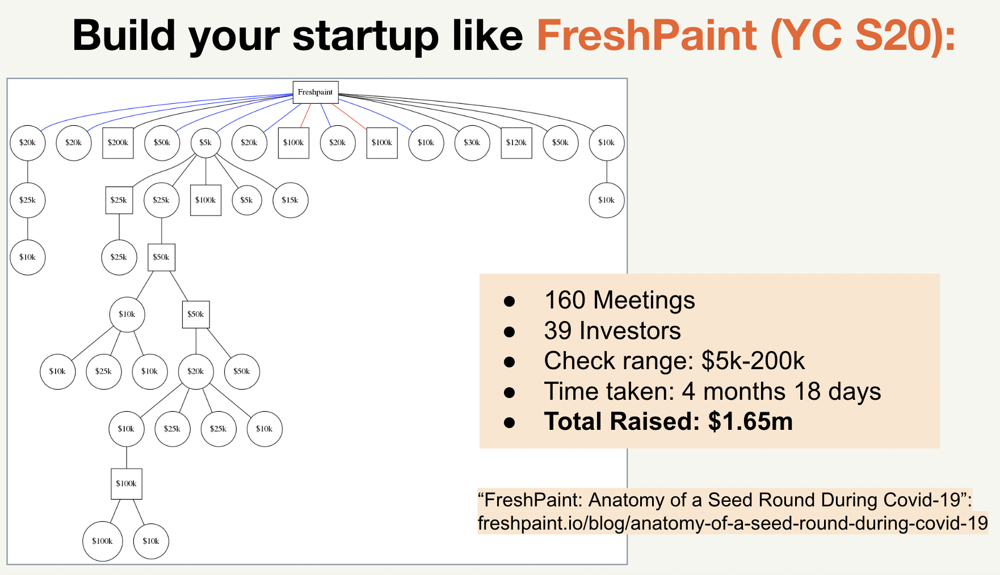
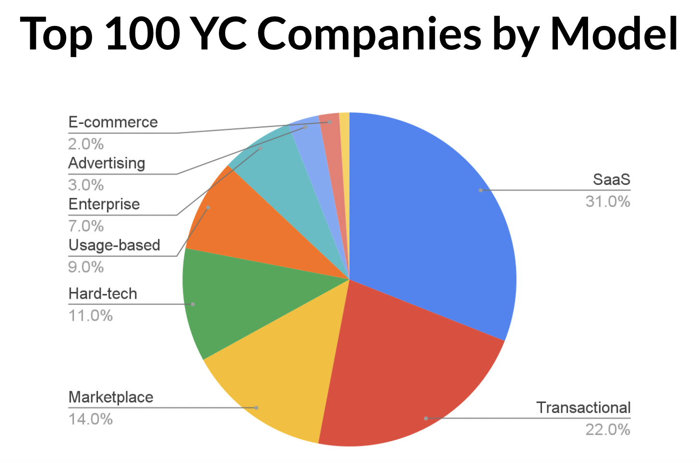
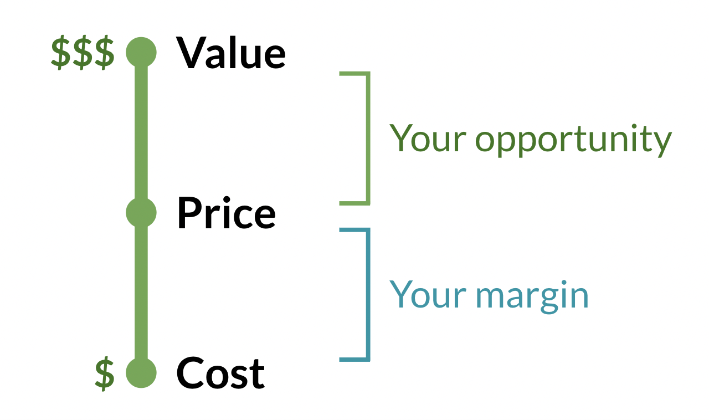
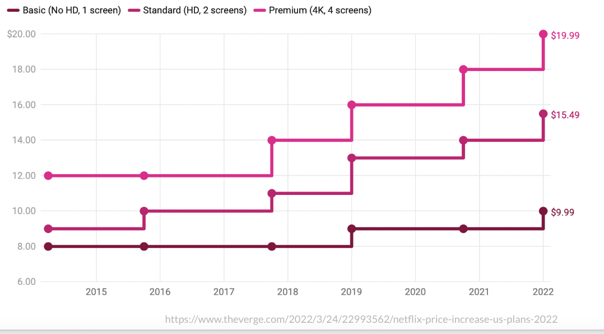

- ## How to build and succeed as a technical founder
  collapsed:: true
	- url: https://docs.google.com/presentation/d/14KMGE4iwo-DdwKRbxTNChWgiOuyJ30Vhx96mG4vbtNA/edit
	- How to build
		- Ideation stage
			- Build a prototype ASAP
			- Common mistakes
				- Overbuilding
		- MVP stage
			- [[goal]]: build to [[Launch]]
		- [[Launch]] stage
			- **Build & iterate to PMF [[goal]]**
		- Post-PMF stage
		  collapsed:: true
			- Things will definitely break (and that’s ok)
			- Deciding what engineering culture looks like
			- Plan out what parts of your architecture to scale
			- Determine what needs a rewrite or refactor
		- Principles
			- **Do things that don’t scale**
			- **Create a 90/10 solution**
			- **Choose tech stack for iteration speed**
			- The only tech choices that matter are the ones tied to your customer promises.
			- **Quickly iterate w/ hard & soft data**
			- Continuously [[Launch]] (again ana again)
			- **Balance building vs fixing**
		- Mistakes
		  collapsed:: true
			- 
			-
		- Hiring
			- Evolve into leading a small team of engineers
			- First hires are likely friends or people you know
			- You’ll start to have some communication overhead
			- This is when you realize that your role is morphing
			- 2-5 engineers you still have ~70% time to code
			- 5-10 engineers, you’ll be only coding <50%
		-
- ## [[startup]] [[Fundraising]] 2022
  collapsed:: true
	- url: https://docs.google.com/presentation/d/1INehBoScuZbItnuUYEDcwBh8xkVAvWgtFigP9DLfvbc/edit
	- “Raising [[money]] is the second hardest part of starting a [[startup]].” (after making something [[People]] want); Paul Graham. http://www.paulgraham.com/fundraising.html
	- YC on fundraising
		- **[[Fundraising]] Survival Guide **
		  Link: https://paulgraham.com/Fundraising.html
		- **How to Fund a [[startup]] **
		  Link: https://paulgraham.com/startupfunding.html
		- **How to Convince Investors **
		  Link: https://paulgraham.com/convince.html
		- **Investor Herd Dynamics**
		  Link: https://paulgraham.com/herd.html
		- **Full List**
		  Link: https://paulgraham.com/articles.html
	- Tactical guides
		- **How to build a seed deck**
		  Link: https://ycombinator.com/library/2u-how-to-build-your-seed-round-pitch-deck
		- **How to [[pitch]] your [[startup]]: **
		  Link: https://ycombinator.com/library/6q-how-to-pitch-your-startup
		- **How to get meetings with investors and raise [[money]]: **
		- Link: https://ycombinator.com/library/71-how-to-get-meetings-with-investors-and-raise-money
		- **Raising [[money]] online for startups:**
		  Link: https://ycombinator.com/library/4O-raising-money-online-advice-for-startups
		- **Different types of investors and their incentives:**
		- Link: https://ycombinator.com/library/3u-different-types-of-investors-and-their-incentives
	- Myths
		- **“Raising [[money]] is glamorous”**
		  collapsed:: true
			- **Actual [[Fundraising]] is just a bunch of [[1]]-[[1]] meetings on Zoom….**
			- 
		- “I need to raise [[money]] before I start working on my [[startup]].”
		  collapsed:: true
			- **Build v1, get users. Then, think about raising [[money]].**
			- Cheaper than ever to build a prototype.
			- Easier than ever to find potential users.
			- Product + Users = [[leverage]]
			- Investors want to jump on trains in motion.
		- “My [[startup]] needs to be impressive to raise [[money]]”
		  collapsed:: true
			- You don’t need to impress investors
			- You need to convince them
			- Most startups seem terrible at first
			- The [[best]] startups seem the most terrible at first
			- Investors get this. They know your [[startup]] sounds unimpressive.
			- Investors get bored when founders try to impress them.
		- **“Raising [[money]] is complicated, slow and expensive”**
		  collapsed:: true
			- **Quick and Cheap [[Fundraising]] = ****more [[leverage]]**
		- **“I’m going to lose [[control]] of my company.”**
		  collapsed:: true
			- Seed rounds today give founders more [[control]] than ever.
			- SAFE
				- No board seats: 
				  It’s just you and your co-founders calling the shots
				- No shareholders 
				  Investors get shares in the NEXT round
				- No Info Rights 
				  You choose how and when to update your investors
				- Raising on SAFEs lets founders build their companies the way they want
				- You answer to no one except your customers
		- **“I need a fancy [[Network]] to raise.”**
		  collapsed:: true
			- Investors are human and notice pedigree…
			- But they care a LOT more about making [[money]].
			-
		- “If investors reject my [[startup]] that means it’s bad”
		  collapsed:: true
			- No matter how great your product and traction are…investors will reject you!
			- And that’s OK!
			- You don’t need every investor to like what you’re building. You just need a few to believe. And today there are more investors with more [[money]] to invest in startups than ever.
	- How to make investors
	  collapsed:: true
		- **Make Something People Want**
		- **Explain the 1% chance it gets huge**
		- **Use plain, simple language**
	- Example: Retool
	  collapsed:: true
		- Software for building internal tools
		- Raised seed round by meeting investors in a coffee shop in SF
		- No deck
		- Instead did a software demo where he built a simple app in minutes
		- And could talk about why his early customers really liked it.
		- “A lot of companies need this”
		- **Today: $4b valuation!**
	- Bootstrapping forever sucks
	  collapsed:: true
		- Scary: Always about to shut down
		- Miserable: Can’t pay yourselves
		- Distracting: Have to go into consulting
		- Poor odds: Few 100% Giant Bootstrapped Co’s
		- "Bootstrapping is stretching the pain of raising [[money]] out across entire [[life]] of the company.”
		-
	- **Don’t hire someone else to raise [[money]] for you.**
	  collapsed:: true
		- It’s always [[best]] for the founders to talk to the investors.
		- If someone offers, get them to make an intro instead and you take the meeting.
		-
	- There’s never been a better time in the [[history]] of the world to raise [[money]] than now. So if you’re [[thinking]] of doing a [[startup]], get building.
- ## [[Business]] models & [[pricing]]
  collapsed:: true
	- url: https://docs.google.com/presentation/d/1isnsvziOA6IS2SziW5EYFjxAkxuNyZusVcZuHO3J2Mc/edit
	- Why is this important?
	  collapsed:: true
		- Founders get frustrated that investors won’t fund them, and their [[Business]] won’t grow
		- Often because they’re not using a proven business model
		- There are only a handful of business models responsible for nearly all $B companies
		- You should copy them
	- [[Business]] models
	  collapsed:: true
		- Marketplaces
		  collapsed:: true
			- **Primary metrics**
			  collapsed:: true
				- Gross Merchandise Value (GMV): Total sales volume transacted
				- Net Revenue: Fees charged for transactions (often a % take rate)
				- Growth Rate
				- User Retention: % of month 1 customers that make a purchase in month 2, etc
			- **Takeaways**
			  collapsed:: true
				- Hard to get off the ground, chicken & egg problem
				- Need to scale supply and demand in sync
				- Network effects at scale drive exponential growth
				- When they work, often become dominant winner-take-all winners
			- Marketplaces are most likely to build winner-take-all companies.
			- 14% of the Top 100 Companies are Marketplaces, but they create 30% of the overall value
			- Tough to get off the ground, chicken & egg problem
			- Massive network effects when they work (Airbnb, OpenSea)
		- Transactional
		  collapsed:: true
			- **Primary metrics**
			  collapsed:: true
				- Gross Transaction Value (GTV): Total payment volume transacted
				- Net Revenue: Fees charged for transactions (often a %)
				- User Retention: % of month 1 customers that make a purchase in month 2, etc
				- CAC
			- **Takeaways**
			  collapsed:: true
				- Usually fintech and payments businesses
				- One-time transactions rather than recurring
				- Often high volume with a low fee (1-3% is common)
				- Best transactional businesses have extremely consistent revenue from high repeat usage
			- 3 of the YC Top 10 are Transactional
			- Transactional businesses outperform because they’re in the flow of funds.
			- 22% of the Top 100 Companies are Transactional, and they create 29% of the overall value
			- As close to the transaction as possible (Stripe, Coinbase, Brex)
			- Often critical infrastructure for other companies, solving a top 3 problem for them
		- SaaS
		  collapsed:: true
			- **Primary metrics**
			  collapsed:: true
				- Monthly Recurring Revenue (MRR) or Annual Recurring Revenue (ARR)
				- Growth Rate: Measured weekly or monthly
				- Net Revenue Retention: % of recurring revenue retained from a prior period
				- CAC: Costs to acquire a new customer
			- **Takeaways**
			  collapsed:: true
				- All the benefits of recurring revenue
				- Can have non-recurring revenue, but don’t include in ARR/MRR
				- Usually sold to businesses, ideally on annual contracts
				- Growth can be driven by direct sales, self-serve acquisition channels, or both
			- SaaS businesses most likely to make the Top 100
			- 31% of the Top 100 Companies are SaaS
			- Recurring revenue makes them great businesses
		- Subscription
		  collapsed:: true
			- **Primary metrics**
			  collapsed:: true
				- Monthly Recurring Revenue (MRR) or Annual Recurring Revenue (ARR)
				- Growth Rate: Measured weekly or monthly
				- User Retention: % of month 1 customers that make a purchase in month 2, etc
				- CAC
			- **Takeaways**
			  collapsed:: true
				- Recurring revenue is the most valuable revenue
				- Usually sold to consumers, often paying monthly
				- Usually lower price points, from a higher volume of customers
				- Growth driven by scalable, self-serve acquisition channels
		- Enterprise
		  collapsed:: true
			- **Primary metrics**
			  collapsed:: true
				- Bookings: Total signed contract value (recurring + non-recurring)
				- Revenue: Recognized when delivering on the contract
				- Annual Contract Value (ACV): Total contract value / # of years
				- Pipeline: Top of funnel → Demo → Close
			- **Takeaways**
			  collapsed:: true
				- Very few customers, much larger deals ($100k+/year)
				- Growth driven by direct sales
				- Often begin with paid pilots or LOIs
				- Usually long sales cycles, with many gatekeepers
				- The buyer is not always the end user
				- Lumpy growth: measuring m/m growth rate doesn't make as much sense
		- Usage-based
		  collapsed:: true
			- **Primary metrics**
			  collapsed:: true
				- Monthly Revenue (not recurring!
				- Growth Rate
				- Revenue Retention: % of revenue from last month’s customers in this month
				- Gross Margin: Revenue - Cost of Goods Sold (COGS)
			- **Takeaways**
			  collapsed:: true
				- Don’t confuse usage-based revenue with recurring revenue
				- Charge per API request, # of records, data usage, etc
				- Grow as your customers grow
				- Product and [[pricing]] scale to support tiny startups to large enterprises
		- E-commerce
		  collapsed:: true
			- **Primary metrics**
			  collapsed:: true
				- Monthly Revenue: Total sales
				- Growth Rate: Measured weekly or monthly
				- Gross Margin/Unit Economics: Revenue - Cost of Goods Sold (COGS)
				- CAC
			- **Takeaways**
			  collapsed:: true
				- Includes D2C brands and Shopify stores
				- Not marketplaces, so keep 100% of each sale
				- Higher COGS = lower margins
				- Products often commoditized
				- Need to be excellent at user acquisition and operations/unit economics
		- Advertising
		  collapsed:: true
			- **Primary metrics**
			  collapsed:: true
				- Daily Active Users (DAU): Unique users active in a 24 hour period
				- Monthly Active Users (MAU): Unique users active in a 28 day period
				- User Retention: % of active users on D1/7/30/etc
				- CPM (Cost Per Thousand) or CPC (Cost Per Click)
			- **Takeaways**
			  collapsed:: true
				- Typically consumer [[social]] products with huge scale
				- Customer is the advertiser, not the end user
				- Users are the product being sold
				- Need billions of impressions each month
				- Registered Users is a vanity metric
			- Very few Advertising businesses become winners.
			- Only 3% of the Top 100 Companies are Advertising
			- Need organic virality to win, and when that happens they get strong network effects (Reddit, Twitch)
			- Don’t sell ads unless you will be a top 10 site on the internet
		- Hard-tech / Bio / Moonshots
			- **Primary metrics**
			  collapsed:: true
				- Milestones: Progress towards the long-term vision
				- Signed contracts
				- Letters of Intent (LOIs): Non-binding contracts indicating interest to purchase
			- **Takeaways**
			  collapsed:: true
				- Often take years to get to a live product because of technical and/or regulatory risk
				- Impressive technical milestones or experimental data can de-risk the tech
				- Revenue is often years away, so signed LOIs are usually the [[best]] way to show customer interest
	- Statistics
	  collapsed:: true
		- 
		- 50% of the overall value of Top 100 YC Companies comes from the Top 10.
		-
	- Takeaways
	  collapsed:: true
		- NOT in the Top 100
		  collapsed:: true
			- **Services/consulting businesses**
			  Non-recurring revenue, scale with [[People]], low margin
			- **Affiliate businesses**
			  Too far away from the transaction
			- **Hardware businesses**
			  Require lots of [[capital]], have low margins
			- **Businesses built on other platforms**
			  Don’t rely on platforms/partners for the [[Business]] to [[Work]]
		- Recurring revenue is the way to a win
		  collapsed:: true
			- Highly predictable
			- Higher customer lifetime values (LTVs) vs one-off transactions
			- Lower CACs, don’t have to keep reacquiring customers
			- But it only works with a strong retention
				- Product needs to keep delivering value, or customers will churn
				- Can’t scale a leaky bucket:
					- 95% monthly retention = 54% annual retention
					- 90% monthly retention = 28% annual retention
					- Just 5% difference in monthly retention is the difference between life and death!
		- Biggest winners build with moat mental models and concepts
		  collapsed:: true
			- [[Network]] effects (Marketplaces)
			- Lock-in/high switching costs (Transactional, SaaS, Enterprise)
			- Technical [[innovation]] (Hard-tech, Bio)
			- Higher margins/better unit economics (DoorDash, Instacart)
			- Organic distribution: [[virality]], word of mouth (all)
		- The [[best]] businesses...
		  collapsed:: true
			- Generate recurring revenue
			- Have high retention
			- Build defensible moats
			- Are close to the transaction
			- Scale with software, not people
			- Are proven, and familiar to customers
			- …so innovate on your product, and copy your business model
		-
	- [[pricing]]
	  collapsed:: true
		- Charge!
		  collapsed:: true
			- Most common mistake: founders afraid to charge
			- Charging is the most effective way to [[learn]]:
			  collapsed:: true
				- Are users willing to pay or not?
				- Which users are most willing to pay?
				- How much are they willing to pay?
				- Even if everyone refuses to pay, that is valuable.
		- Don't undercharge
		  collapsed:: true
			- Lower prices are not a sustainable advantage
			- Charge more → higher margins → bigger moat!
			- Pricing implies value
			- Raising prices is the easiest way to grow revenue.
			- If users won’t pay more, build more value or solve a bigger problem.
			- Or, give a lower price in exchange for:
			  collapsed:: true
				- Your first user
				- A valuable logo
				- If you get lock-in
				- Renew at a higher price
		- Price on value, not cost
		  collapsed:: true
			- 
			- How to find your value?
			  collapsed:: true
				- Talk to your users: ask about the problem you solve, get them to articulate the value to you
				- Make more money
				- Reduce costs
				- Move faster
				- Avoid risk
				- Keep raising prices until you get pushback
			- Ideal price
			  collapsed:: true
				- Customers complain, but still pay.
				-
			-
		- [[pricing]] isn’t permanent, takes years to iterate to capture full value
		  collapsed:: true
			- Founders afraid they need to nail it the first time
			- Can exclude existing customers, or give advanced notice
			- 
		- Don’t overthink it
		  collapsed:: true
			- Keep it simple
			- Find the right “order of magnitude”
		- [[pricing]] is a tool to help you [[learn]] faster
		  collapsed:: true
			- Who wants your product
			- How much they want it
			- How much value your product provides
			- Which channels you can use to acquire customers