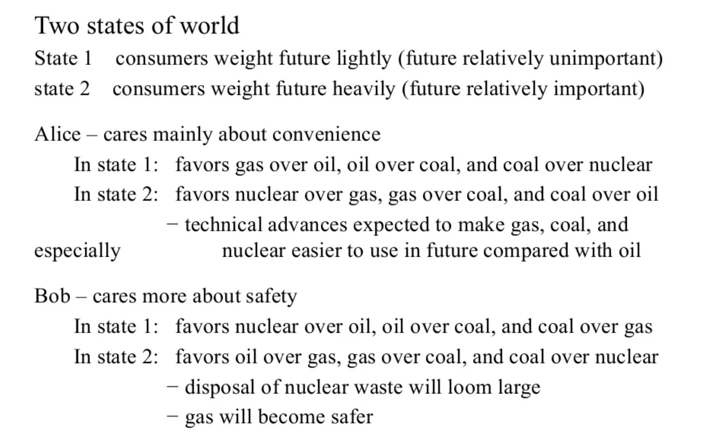
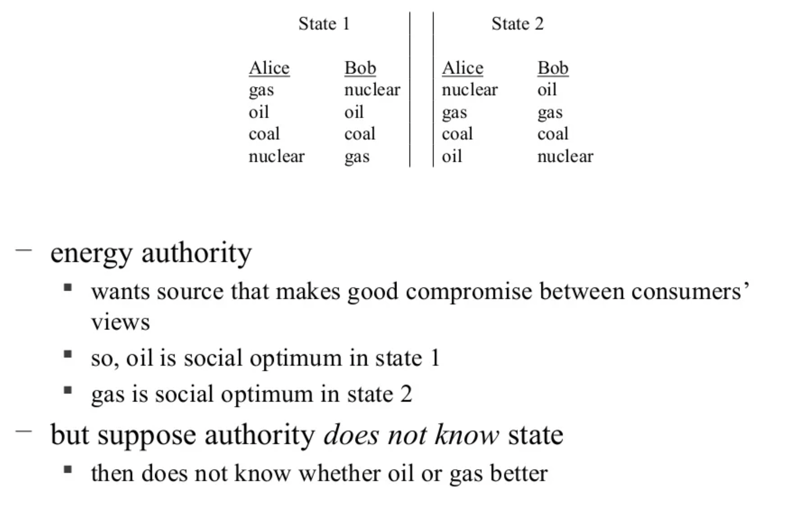
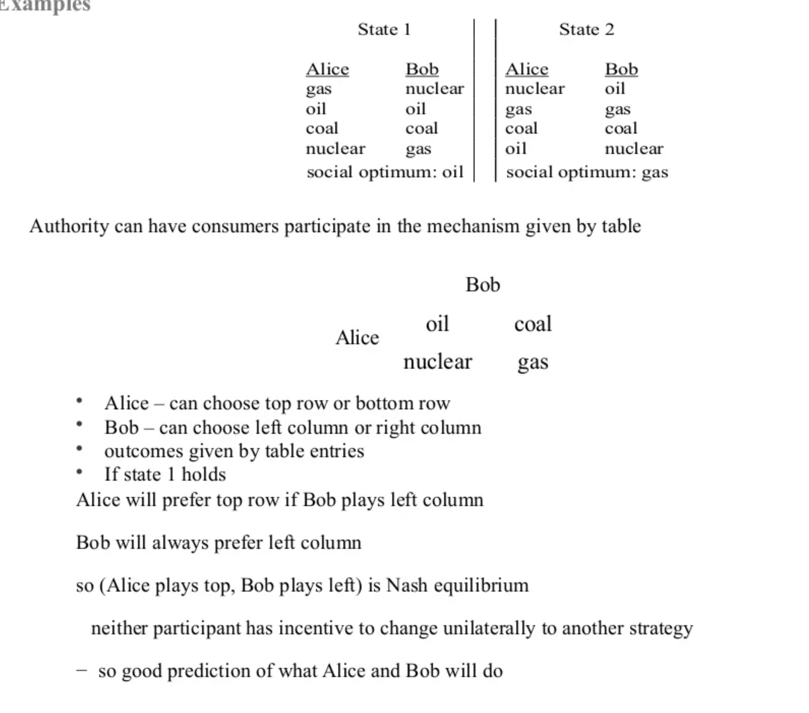
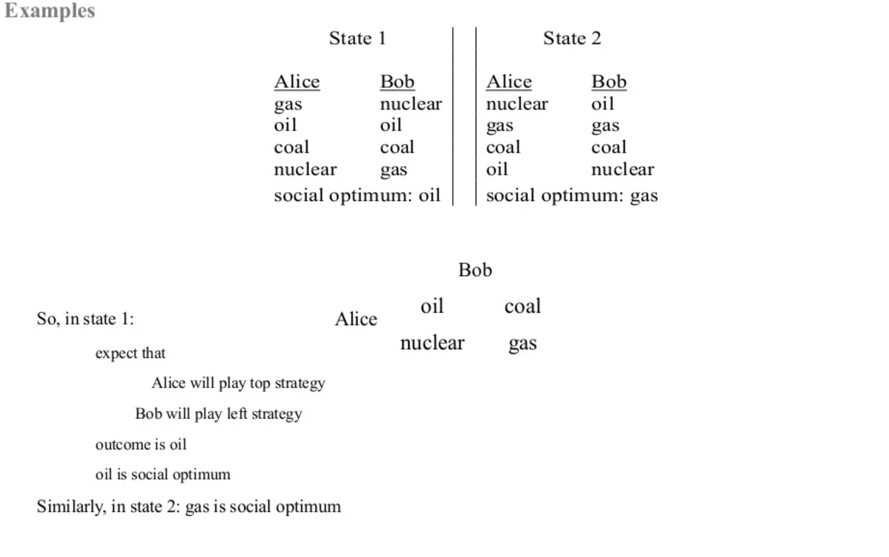

- [[Mechanism design]] theory
	- url: https://www.slideshare.net/stathisgrigoropoulos/mechanism-design-theory-examples-and-complexity-final
	- [[Game theory]], normal game
	  collapsed:: true
		- Players: **who** is involved?
		- Rules: **what** can the players do?
		- Outcomes: what will **happen** when players perform a certain **action**?
		- Preferences: what **players want the most** of the possible outcomes?
	- The [[design]] of institutions (Rules) can have a profound [[impact]] on the results (Outcomes) of interactions, [[System]]'s functioning.
	  collapsed:: true
		- Example: an auction with closed/sealed bids vs. open outcry can have an [[impact]] on what the bidders [[learn]] about other bidders' intentions.
	- Mechanism design vs economic theory
	  collapsed:: true
		- Economic theory
		  collapsed:: true
			- Tries to understand economic institutions
			- Explains outcomes that institutions generate
			- Positive, predictive
		- Mechanism design
		  collapsed:: true
			- Begins by identifying desired outcomes (goals)
			- Asks whether institutions (mechanisms) can be designed to achieve goals
			- If so, what forms would institutions take?
			- Normative, prescriptive
		- Simple example
		  collapsed:: true
			- Dividing a pie between two kids
			- How to achieve fair division?
			  collapsed:: true
				- Mother divides equally
				- Kids can see the cake differently
				- Age-old solution (Lot & Abraham => grazing land)
					- Actor [[1]] chooses how to divide => will divide equal in his eyes
					- Actor [[2]] chooses which piece to take => will choose the most suitable in his eyes
				-
					-
		- Energy example
		  collapsed:: true
			- Initial state
			  collapsed:: true
				- 
				- 
			- Example solution
			  collapsed:: true
				- 
				- 
	- Glossary
	  collapsed:: true
		- Monotonicity
		  collapsed:: true
			- https://en.wikipedia.org/wiki/Monotonicity_(mechanism_design)
			- If the [[social]] choice changes when a single player changes his valuation, then it must be because the player increased his value of the new choice relative to his value of the old choice.
	- Theorems
	  collapsed:: true
		- If a [[social]] rule is implementable, then it must be monotonic. Maskin, 1977
		- Suppose there are at least three individuals. If the [[social]] choice rule satisfies monotonicity and no veto power, then it is implementable.
	- Main takeaways
	  collapsed:: true
		- Mechanism designer doesn't know optimal outcomes in advance
		- So she must proceed indirectly through a mechanism
		  collapsed:: true
			- so the participants themselves generate information needed to identify optimal outcome
		- But participants don't care about the designer's goals, they only care about their objectives
		  collapsed:: true
			- so mechanism must be [[incentive]] compatible
		-
	- [[Computer science]] in MD
		- Deals with distributed settings are researched in CS in conjunction to MD
		- Those are about several computers performing computations to achieve a common outcome according to some algorithm
		- It is **assumed** the participants follow the protocol, however this is obviously not the case always.
		- Two example applications
		  collapsed:: true
			- Load balancing
			  collapsed:: true
				- In an ideal world, computing power would be honestly and optimally distributed across computing entities
				- In reality, resources belong to individual entities acting in a rationally selfish way, implying a necessity of some form of motivation to participate
			- Routing
			  collapsed:: true
				- Incentivizing self-interested routers to pass information
		- Shortest paths example
		  collapsed:: true
			- Consider a communication [[Network]], modeled by a directed graph
			- There is one source and one sink node
			- Every edge is an agent, whose type (private information) is t, the cost for sending a single message across this edge
			- The [[goal]] is to find the cheapest path from the source to the sink (single message)
			- Agent's valuation is 0 if its edge is not part of the chosen path and -t' otherwise
		- Problems
		  collapsed:: true
			- Output specifications are defined algorithmically
				- Input is information about the setting and participating agents
				- Output is the specific computed outcome, based on the information above
			- Description of agents' desires (preferences)
				- A valuation function for every agent, based on its type and outcome
				- A payment from the mechanism for participating, based on its type
			- The optimization version has an objective function as an outcome
		- Solutions
		  collapsed:: true
			- A problem is solved when the required output is obtained, while agents try to achieve their goals (maximize their utilities)
			- Agents have a specified family of strategies and the outcome depends on all these choices
			- Depending on its strategy, the mechanism provides a payment to each agent, which can be used to make the agents' desires compatible with the required outcome
			- Complexity matters
		- Defined characteristics of mechanisms
		  collapsed:: true
			- Implementations with dominant strategies
			  collapsed:: true
				- Every agent has some dominant [[strategy]]
				- Every set of dominant strategies yields a desired outcome
			- Truthful Implementation
			  collapsed:: true
				- All agents want to report their type (no manipulation)
				- Correctly reporting one's type is a dominant [[strategy]]
			- The revelation principle states that given a mechanism that implements a problem with dominant strategies, there exists a truthful implementation as well
			- Vickrey-Groves-Clarke mechanism
			  collapsed:: true
				- Originally defined for auctions (second-price)
				- VGC is a very useful type of mechanism, applied to maximization problems, where the objective is the sum of all agents' valuations
				- Intuitively, the payment defined by VGC for an agent is its contribution to social welfare
				- VGC mechanisms have been famously proven to be truthful (may even be the only truthful implementations)
				- Complexity matters a lot
		- Desired characteristics of mechanisms
			- Implementations with dominant strategies
				- Every agent has some dominant [[strategy]]
				- Every set of dominant strategies yields a desired outcome
			- Truthful Implementation
				- All agents want to report their type (no manipulation)
				- Correctly reporting one's type is a dominant strategy
			- The revelation principle states that given a mechanism that implements a problem with dominant strategies, there exists a truthful implementation as well