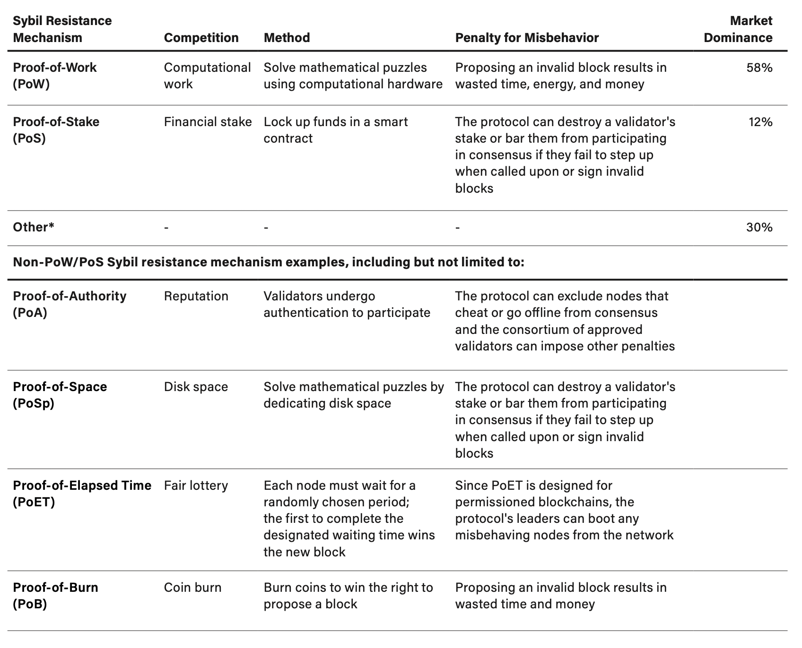

- # Proof-of-[[Work]] vs. Proof-of-Stake Securing the chain
	- url: https://t.me/BitLenta/10121
	- ## Theses
		- Every [[blockchain]] follows an underlying protocol that determines its block selection [[process]], how [[Network]] nodes validate transactions, transaction finality characteristics, [[supply]] issuance, supply distribution, and what determines the “true” state of the [[Network]]. Furthermore, the blockchain protocol provides an [[incentive]] structure for [[Network]] participants to behave honestly with each other while discouraging bad actors.
		- A Sybil attack is an exploit against an online [[Network]] whereby a small number of entities (as few as one) attempt to take [[control]] of the whole [[Network]] by leveraging multiple accounts, nodes, or computers. On [[social]] media platforms, a user can generate multiple accounts and spam the [[Network]], effectively "taking over" the conversation. On a blockchain, bad actors might run multiple nodes to achieve an overwhelming influence on the [[Network]].
		- The word "Sybil" comes from a case study about a woman named Sybil Dorsett, a pseudonym for Shirley Ardell Mason, who received treatment for dissociative identity disorder, or multiple personality disorder.[[1]] Once an attacker creates enough Sybil identities to disproportionately influence a [[crypto]] [[Network]], they can refuse to receive or transmit blocks, effectively preventing other users from the [[Network]].
		  
		  The most commonly-known Sybil attack in the [[crypto]] space is the "51% attack," where attackers take over most of the [[Network]] computing power, commonly referred to as “hash rate.” In such cases, they may theoretically influence the ordering of transactions, prevent the confirmation of new transactions, and double-spend their cryptoassets. Resistance to these attacks is essential for a well-functioning, [[decentralized]] blockchain.
		- The crux of a Sybil resistance mechanism is that it requires each validator or miner to have "skin-in-the-game" to participate in a [[decentralized]], cryptographic [[System]]. Sybil resistance mechanisms are also known as “block author selectors” because they designate a validator or miner to add a block to the chain. Readers should note that **these mechanisms are not cures** against Sybil attacks; instead, **they make it impractical** for an attacker to carry out a Sybil attack successfully by:
			- Encouraging participants to reach a [[consensus]] on the state of the blockchain through a competitive [[process]], such as mining or staking;
			- Punishing bad actors that try to stall the network from reaching a consensus; and
			- Rewarding some or all participants for behaving honestly and coming to a consensus (e.g., block subsidies, transaction fees).
		- ### Sybil resistance mechanisms
		  collapsed:: true
			- 
		- ## [[consensus]]
			- Blockchain [[consensus]] methods mitigate the challenge of achieving [[consensus]] in a globally distributed, digital world by enabling users to validate entries into the blockchain ledger, help synchronize data, and bolster the [[Network]]’s security. Such methods must ensure that all [[Network]] participants can agree on a single source of "truth," even if some nodes fail; put differently, they must be Byzantine Fault Tolerant (BFT).
			- The concept of BFT derives from the Byzantine Generals' Problem, a [[Game theory]] problem that describes the difficulty [[decentralized]] parties have in achieving [[consensus]] without relying on a trusted central party. Initially conceived in 1982 as a logical dilemma, a group of Byzantine generals must perfectly coordinate an attack with the added challenge that they cannot directly communicate with each other.
			-
		-