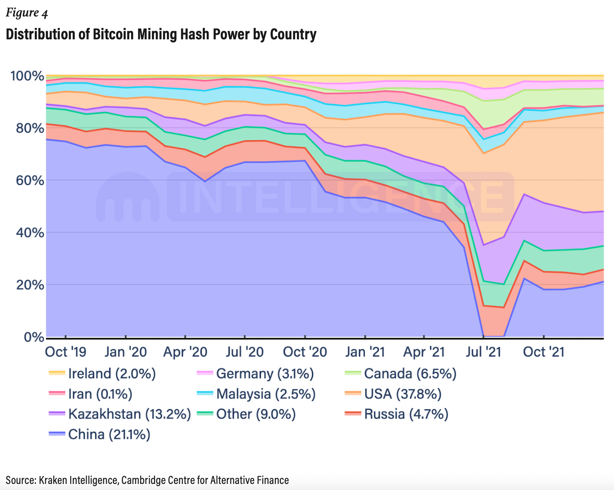
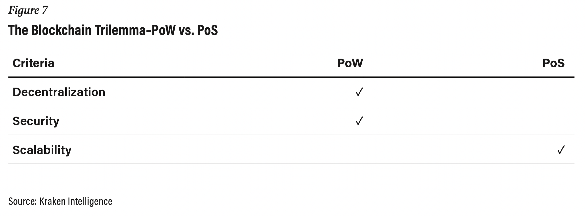

- # Proof-of-[[Work]] vs. Proof-of-Stake Securing the chain
  collapsed:: true
	- url: https://t.me/BitLenta/10121
	- ## Introduction
	  collapsed:: true
		- Every [[blockchain]] follows an underlying protocol that determines its block selection [[process]], how [[Network]] nodes validate transactions, transaction finality characteristics, [[supply]] issuance, supply distribution, and what determines the “true” state of the [[Network]]. Furthermore, the blockchain protocol provides an [[incentive]] structure for [[Network]] participants to behave honestly with each other while discouraging bad actors.
		- A Sybil attack is an exploit against an online [[Network]] whereby a small number of entities (as few as one) attempt to take [[control]] of the whole [[Network]] by leveraging multiple accounts, nodes, or computers. On [[social]] media platforms, a user can generate multiple accounts and spam the [[Network]], effectively "taking over" the conversation. On a blockchain, bad actors might run multiple nodes to achieve an overwhelming influence on the [[Network]].
		- The word "Sybil" comes from a case study about a woman named Sybil Dorsett, a pseudonym for Shirley Ardell Mason, who received treatment for dissociative identity disorder, or multiple personality disorder.[[1]] Once an attacker creates enough Sybil identities to disproportionately influence a [[crypto]] [[Network]], they can refuse to receive or transmit blocks, effectively preventing other users from the [[Network]].
		  
		  The most commonly-known Sybil attack in the [[crypto]] space is the "51% attack," where attackers take over most of the [[Network]] computing power, commonly referred to as “hash rate.” In such cases, they may theoretically influence the ordering of transactions, prevent the confirmation of new transactions, and double-spend their cryptoassets. Resistance to these attacks is essential for a well-functioning, [[decentralized]] blockchain.
		- The crux of a Sybil resistance mechanism is that it requires each validator or miner to have "skin-in-the-game" to participate in a [[decentralized]], cryptographic [[System]]. Sybil resistance mechanisms are also known as “block author selectors” because they designate a validator or miner to add a block to the chain. Readers should note that **these mechanisms are not cures** against Sybil attacks; instead, **they make it impractical** for an attacker to carry out a Sybil attack successfully by:
			- Encouraging participants to reach a [[consensus]] on the state of the blockchain through a competitive [[process]], such as mining or staking;
			- Punishing bad actors that try to stall the network from reaching a consensus; and
			- Rewarding some or all participants for behaving honestly and coming to a consensus (e.g., block subsidies, transaction fees).
		- ### Sybil resistance mechanisms
		  collapsed:: true
			- 
	- ## [[consensus]]
	  collapsed:: true
		- Blockchain [[consensus]] methods mitigate the challenge of achieving [[consensus]] in a globally distributed, digital world by enabling users to validate entries into the blockchain ledger, help synchronize data, and bolster the [[Network]]’s security. Such methods must ensure that all [[Network]] participants can agree on a single source of "truth," even if some nodes fail; put differently, they must be Byzantine Fault Tolerant (BFT).
		- The concept of BFT derives from the Byzantine Generals' Problem, a [[Game theory]] problem that describes the difficulty [[decentralized]] parties have in achieving [[consensus]] without relying on a trusted central party. Initially conceived in 1982 as a logical dilemma, a group of Byzantine generals must perfectly coordinate an attack with the added challenge that they cannot directly communicate with each other.
		- Thus, the Byzantine Generals Problem highlights a common problem among distributed networks: can independent participants of a distributed [[Network]] form an agreement?
		- Transactions finality is always “probabilistic” on Nakamoto-style [[consensus]] protocols because nodes come to a [[consensus]] around the longest chain. The [[node]] that proposes the transactions that go into a particular block is not predetermined like in BFT-style protocols, meaning it is never 100% guaranteed that a transaction is irreversible as a longer chain could exist. It is considered “probabilistic” because the probability of a transaction reversal decreases as a chain gets longer, providing near certainty in the transaction’s irreversibility after a certain period has passed.
		- On the other hand, transactions on BFT-style networks are “deterministic” because rules determine who can vote on a transaction and exactly how many votes are needed before everyone can agree the transaction is 100% final. Once a transaction achieves finality, there is no way a longer chain can exist, as there is no uncertainty in the [[process]].
		- ### Blockchain [[consensus]] mechanisms
		  collapsed:: true
			- 
			- [Gossip mechanism](https://en.wikipedia.org/wiki/Gossip_protocol)
	- ## PoW
	  collapsed:: true
		- In PoW blockchains, miners must gather information and try to guess a solution to a cryptographic puzzle. Once miners solve the puzzle, they share their results with other nodes to verify their "[[Work]]" before adding the block to the chain. Because miners must consume energy in the PoW [[process]] and nodes can easily verify any block's validity, malicious miners who try to add an invalid block waste time, energy, and resources. Conversely, the protocol rewards honest miners that successfully mine a valid block.
		- ### PoW 51% attack requirements
		  collapsed:: true
			- 
		- ### PoW hash power distribution by country
		  collapsed:: true
			- 
		- Block size and the number of bytes (and hence, transactions) that can fit into a block, primarily determines throughput, not the time between blocks. For example, a blockchain designed to produce one block per second with 1000 transactions per block could have the same throughput as a blockchain that produces one block per minute that is large enough to fit 60000 transactions.
		- Spam and DDoS attacks have historically plagued zero- and low-fee networks like Nano and Solana due to low barriers to entry when conducting a transaction, causing [[Network]] nodes to lose synchronization.
	- ## PoS
	  collapsed:: true
		- Rather than relying on computers racing to generate the appropriate hash, the act of locking up coins, or staking, determines participation in a PoS protocol. This mechanism attempts to reduce the computational cost of PoW schemes by selecting validators in proportion to their quantity of staked holdings in the associated cryptoasset. Using a set of factors determined by the protocol, the PoS mechanism pseudo-randomly selects a validator [[node]] actively staking to propose the next block to the blockchain. When the mechanism elects a validator [[node]], the [[node]] must verify the validity of the transactions within the block, sign it, and propose the block to the [[Network]] for further validation.
		- ### Benefits
			- Achieving Sybil resistance requires virtually no energy consumption. For reference, [[ethereum]] developers estimate that its transition to a PoS [[System]] will reduce energy consumption by more than 99.9%. Moreover, thanks to the low energy requirement, less native coin issuance is required to incentivize participation in the validation [[process]].
		- ### Slashing
			- For example, the [[ethereum]] [[2]].0 protocol includes a “correlation penalty” where validators forfeit [[ETH]] rewards if they fail to participate when called upon, and the protocol destroys, or “slashes,” their existing stake if they propose multiple blocks in a single slot or submit contradictory votes. The amount of [[ETH]] slashed depends on how many dishonest validators the protocol slashes around the same time.
		- ### Considerations
			- Not as extensively tested as PoW, which has secured billions of dollars worth of value for nearly a decade. Particular implementations of PoS could introduce black swan attack vectors, decreasing the overall security of the blockchain.
			- PoS is potentially more vulnerable to centralization than PoW because [[capital]] ownership determines [[Network]] [[control]], which is more centralized than [[Labor]] and cheap energy. In a BFT-style PoS [[Network]] worth $100 billion, where users stake 10% of tokens, any party able to allocate more than $33 billion (>33%) can take over the [[Network]] by locking their assets in a staking contract. In a PoW [[Network]] using Nakamoto-style [[consensus]], attacks require most of the mining equipment and [[Labor]]. Attacking a [[Network]] with $10 billion of security would require acquiring specialized hardware, space, and energy contracts to mine at a larger scale than the entire [[Network]] and deploy the [[Labor]] to execute the attack.
			- #### Minimal number of validators for a 33% attack
				- 
			- #### PoS stakes & PC requirements
				- 
			-
	- ## PoW vs PoS
	  collapsed:: true
		- ### Blockchain trilemma
		  collapsed:: true
			- Decentralization—retaining low barriers to entry for participation and a sufficiently distributed voting [[System]].
			- Security—ability to conduct attacks against or manipulate the [[Network]].
			- Scalability—transaction efficiency and ability to adapt to a growing, global audience.
			- 
		- Blockchain networks should generally adhere to a PoW mechanism if they want to retain the ethos of [[crypto]]: decentralization and security. PoW is generally more secure than PoS in that it is more extensively vetted, has fewer potential attack vectors (e.g., bribery attacks), requires the use of both [[capital]] and [[Labor]] to misbehave on the [[Network]], and discourages constant forking (i.e., nothing-at-stake). The mechanism is also more [[decentralized]] than PoS in that it inherently encourages miners to distribute globally in search of cheap energy sources.
		- Thus, for use cases such as hard [[money]], PoS likely is undesirable because the possibility of the wealthiest [[Network]] participants gaining an overwhelming share poses significant problems for an asset whose value derives from its decentralization, security, and scalability, among others.
		- PoS-based blockchains have more potential to scale because block [[production]] does not consume energy, honest nodes can bar dishonest nodes from the validation [[process]], and the lack of mining allows for a faster validation [[process]] with less block variance. For use cases including mediums of exchange or smart contract platforms, PoW is potentially less desirable than PoS because [[Network]] efficiency and scalability are paramount.
		- **Figures**
		  collapsed:: true
			- PoW transaction volume
			  collapsed:: true
				- 
			- PoW transaction count
			  collapsed:: true
				- 
			- PoS transaction volume
			  collapsed:: true
				- 
			- PoS transaction count
			  collapsed:: true
				- 
		- 
	- ## Final points
	  collapsed:: true
		- Blockchains should adhere to a PoW mechanism if they want to retain the ethos of cryptoassets: decentralization and security. For use cases such as hard [[money]], PoS is likely less desirable because the possibility of the wealthiest users gaining an overwhelming share poses significant problems for an asset whose value derives from its decentralization, security, and scalability, among others. Decentralization and security should take precedence in these blockchains if they are to scale globally.
		- For use cases including mediums of exchange or smart contract platforms, PoW is potentially less desirable than PoS because [[Network]] efficiency and scalability are paramount if these types of blockchains are to resist long-term scaling issues. Thus, the choice between PoW and PoS is not black and white. It requires a nuanced understanding of the two and their trade-offs to determine which Sybil resistance mechanism is better suited for a particular blockchain.
- # War and Interest Rates
	- author: Credit Suisse [[economics]], [[1]] Aug 2022
	- War is inflationary.
	- There are hot wars, cold wars, and what Pippa Malmgren calls [hot wars in cold places](https://drpippa.substack.com/p/a-hot-war-in-cold-places) – cyberspace, space, and deep underwater
	- Thus, with slight exaggeration, the low inflation world stood on three pillars:
		- first, cheap immigrant [[Labor]] keeping service sector wages stagnant in the U.S.;
		- second, cheap goods from China raising living standards amid stagnant wages;
		- third, cheap Russian gas powering German industry and the EU more broadly.
	- Central banks went from waging a war against deflationary impulses coming from the globalization of cheap resources ([[Labor]], goods, and commodities), to “cleaning up” the inflationary impulses coming from a [[complex]] economic war.
	- Think of Russia as a “G-SIB of Commodities” and China as a “G-SIB of Factories” that are the world’s biggest producers of commodities and consumer goods, respectively, providing two pillars of the low inflation world we described above.
	- By extension, Russia and China have been the main “guarantors of macro peace”, providing all the cheap stuff that was the source of deflation fears in the West, which, in turn, gave central banks the license for years of [[money]] printing (QE).
	- **Economic war.** A war, where East and West are engaged in unrestricted economic warfare to tip and to maintain, respectively, the global balance of power in three domains: the military domain; the [[Technology]] domain; and, lastly, the [[production]] domain, which links commodity producers, [[production]] facilities, and shipping companies in the East to consumers in the West through a [[complex]] web of supply chains.
	- Getting right where [[inflation]] goes from here is basically a matter of perspective: do you see inflation as cyclical (a messy re-opening after [[COVID]], exacerbated by excessive stimulus) or structural (a messy transition to a multipolar world order, where two great powers are challenging the might and hegemony of the U.S.). If the former, inflation has peaked. If the latter, inflation has barely started, and could actually be understood as an outright instrument of war, for as Lenin said, “the [[best]] way to destabilize the capitalist [[System]] [is] to debauch the currency”.
	- First, an observation from Pippa Malmgren: “Peter Drucker delayed publishing his book, The End of Economic Man: The Origins of Totalitarianism, until 1939 because he was frightened to say that WWII was about to begin. I feel his angst as I [[write]] of my belief that we have already entered WWIII. But before you jump out of your skin, try to [[remember]] that war is changing: the confrontations and conflicts of our time may be [[different]] from what we experienced before. [...] **New theaters of conflict are no longer exclusively about physical territory and humans on a front line, but about cyberspace, space and the high seas**,” as well as pipelines, interbank messaging systems (SWIFT), ASML machines, currencies, commodities, and inflation as described in our opening essay above.
	- Today, it’s time to think more about the risk of [[inflation]] staying higher for longer due to economic warfare, and less about inflation being driven by a messy re-opening [[process]] and stimulus.
	-