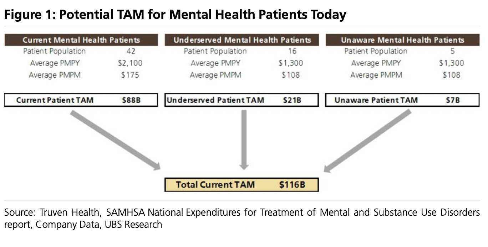

- [[Lithium]]
	- The top four players, SQM, Albemarle, Ganfeng and Tianqi will continue to dominate [[Lithium]] supply for a few more years. The number five & six players in vertically integrated [[Lithium]] chemicals [[production]], Livent and Allkem, together equal less than half of the chemical [[production]] of the smallest “Big 4” player. Hopefully that changes soon.
	- Now that annual demand is growing at > 200K MT of LCE per year, it is easy to see why the “Big 4” needs to morph into the “Big 8” or more very soon. Spoiler alert: a “Big 8” is highly unlikely before 2030. Developing [[Lithium]] projects is much more time intensive than building battery capacity.
- # Piecing The Puzzle: Profiling Private Companies in Behavioral [[Health]]
	- We believe there is little debate on the significant TAM (over $100B), unequal access to mental care, provider shortage, significantly fragmented landscape and [[COVID]]-spurred acceleration push to the virtual channel. Yet, there is also a tremendous amount of supply (20k [[mental health]] apps today) of point solutions, highlighting the need for differentiation (we believe well-run studies, a dossier of health outcomes data and partnership with payors are instrumental to success).
	- Behavioral Health lends itself to greater [[telehealth]] penetration by offering a convenient, cost-effective, and confidential setting to deliver care. Given the ability to scale quicker with modest [[capital]] requirements, we expect further consolidation as payors demand more bundled/multiple point solution platforms.
	- Tech- powered names provide value to the [[System]] by applying [[big data]] to patient assessment and connection, tracking outcomes, coordinating behavioral health and primary care, and at times, triaging patients and resources to manage demand and supply. Per Rock Health, despite a cooling [[market]], financing for mental health topped the digital health leaderboard with $[[1]].3B in total venture funding out of $10.3B in U.S. Digital Funding in 1H22 (vs. $[[1]].5B and $14.7B, respectively, in 1H21).
	- The outpatient behavioral health [[market]] has grown at a sizeable double-digit rate over the past 4 years, even prior to [[COVID]], with an increase in diagnosis and mental health episodes particularly among the 12-50 year old age cohorts (per the SAMHSA National Expenditures for Treatment of Mental and Substance Use Disorders report, Major Depressive Episodes increased 8.[[1]]% between 2016 and 2019 in the US for those under the age of 50).
	- There is an ample number of outpatient psychotherapists and clinical [[social]] workers in the US to address patient demand (particularly in urban locations, though per our due diligence with industry experts, there is a broad shortage of psychiatry supply in the [[market]]). However, true access for many patients is very challenging given 45% of psychiatrists do not accept insurance and the marketplace is very fragmented with psychiatrists twice as likely to venture into solo practice. Further, mental health coverage has lagged physical health coverage with states often having [[different]] laws around coverage. Commercial payors also have established high barriers to entry for coverage, requiring burdensome credentialing and contracting for many practices unwilling to deal with the protocol. On this point, patients in need of mental health support are often reluctant to seek care given fear of exorbitant out-of-pocket costs.
	- 
	- [[COVID]] significantly hastened the push to telehealth by removing structural barriers to coverage(telehealth and in-person reimbursement parity)and prodded otherwise reluctant providers to switch to in-person appointments. Prior to the pandemic, telehealth utilization was less than [[1]]% of outpatient care for mental health. As of 1Q22, telehealth use for mental health/substance abuse comprised 36% of outpatient visits vs. a pandemic peak of 40%.
	- ## Measuring the success
		- We believe successful tech-enabled behavioral health players will be differentiated in a variety of ways:
			- [[1]]. clinical validation
			- [[2]]. high digital engagement score
			- 3. discernible outcomes (e.g. health outcomes or other measures such as a reduction in
			  suicidal ideation)
			- 4. high level of patient compliance (e.g.lower no show rates)
			- 5. improved care coordination with other stakeholders such as primary care providers
			  (e.g. seamless physician referral [[System]])
			- 6. solving the affordability conundrum-in-[[Network]] coverage is key
			- 7. high clinician retention rates
			- 8. for some providers, there is an increased demand for one-stop solutions with plan
			  sponsors preferring to use one vendor across multiple disease/wellness areas. In this case, scale would be crucial.
-