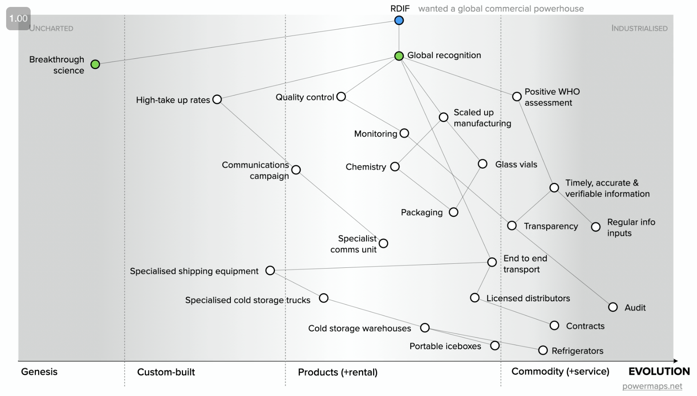
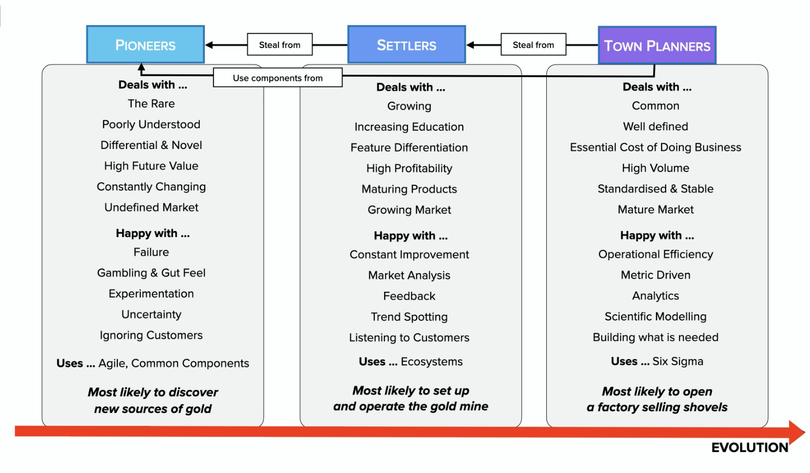
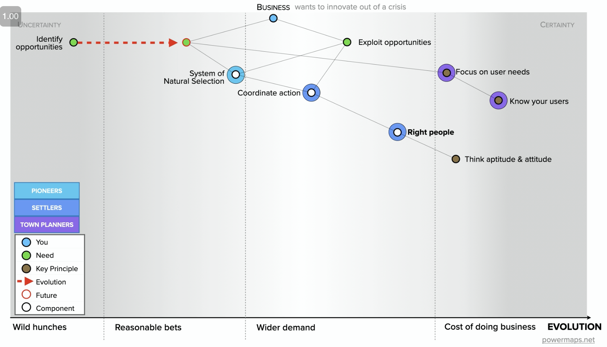
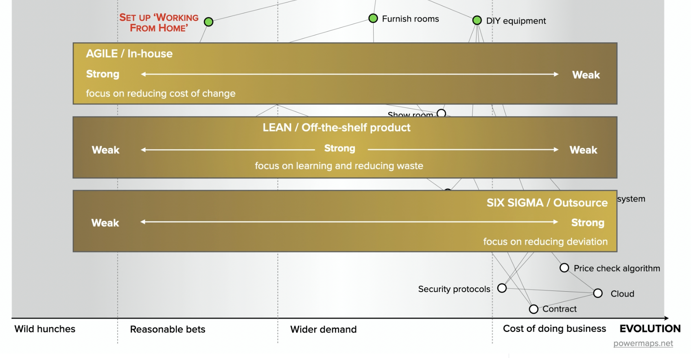

- # The Energy Affordability Crisis: Quantification, Solutions, Implications
  collapsed:: true
	- author: Goldman Sachs
	- At current forward prices, we estimate that energy bills will peak early next year at c.€500/month for a typical European family, implying a c.200% increase vs. [[2021]]. For Europe as a whole, this implies a c.€[[2]] tn surge in bills, or c.15% of GDP, we estimate.
- # Making Lemonade: 9 Moves for Innovating Out of a [[Crisis]]
	- ### Moves
	  collapsed:: true
		- Focus on user needs
		- System of natural selection
		- Coordinate action made by right [[People]] with aptitude and attitude
		- Clear mission-setting
		- Monitoring progress, preferably real-time
		- Effective communication
		- ~~Wardley maps~~
		- Horizon scanning with wisdom of the crowds and inducting from small details
		- Use the rules of the game
	- ## ==Part One==
	  collapsed:: true
		- url: https://vimeo.com/709073029
		- What looks awesome to a business may look terrible to users. Focus on user needs and get their feedback. Start with customer needs and work back -> technology. Don't admire your products.
		- People don't want a quarter-inch drill, they want a quarter-inch hole. Pr. Theodore Levitt. HBR
		- A variety of ideas increases your chances of stumbling upon "that idea" in any market.
		- Design your experiments to be small enough, as there will be a lot of failure; and the whole experiment portfolio needs to be survivable.
		- The surviving experiments will stay as natural selection. Creating a system of natural selection for experiments is the second move.
		- Coordinated action for bringing innovations and experiments into life and to market -> Right people -> With right attitude and aptitude
	- ## ==Part Two==
		- url: https://vimeo.com/715930797
		- Russia is the pioneer in most of the scientific innovations, yet a [[market]] leader in almost none. It could be from a lack of coordinated action.
		  collapsed:: true
			- 
		- In every organization there are [[People]] on the spectrum innovators/risk-takers -> optimizers/operating officers
		  collapsed:: true
			- Pioneers
			- Settlers
			- Town planners
			- 
			- The further the evolution, the more we shift from pioneers to town planners.
			  collapsed:: true
				- 
					-
	- ## ==Part Three==
		- url: https://vimeo.com/717534989
		- Move four: setting clear missions
		- Military | [[Business]] commonalities
			- [[Competition]] (with others)
			- [[Uncertainty]] (about how others will act)
		- A **doctrine** for any group of [[People]] working together in a confusing or threatening environment
		  collapsed:: true
			- Clausewitz, von Moltke, von Schlieffen
				- Set a mission
				- [[focus]] on the mission
				- Intuitive feel
					- Right path is not always clear, use your intuition and [[gut]] feel -> if you've chosen right, it will give you an advantage.
				- Mutual trust
					- Built through recruitment and [[training]]
					- No one will punish you for any [[idea]]
		- Traits of working through the map/progress
		  collapsed:: true
			- Pioneers -> settlers -> town planners
				- 
				-
	- ## ==Part Four==
	  collapsed:: true
		- url: https://vimeo.com/717952191
		- **Effective communication** is one of the moves enabling coordinate action
		- When you *challenge assumptions*, some team members may treat that as *challenging them*, a personal attack
		- Use a **common language**, again, for effective communication and coordinate action
	- ## ==Part Five==
	  collapsed:: true
		- url: https://vimeo.com/722543188
		- ## **Think small (know the details)**
		- ### Wisdom of the crowds
		  collapsed:: true
			- Involving the right [[People]] (some [[knowledge]] of the situation) -> move 3
			- [[focus]] [[People]]'s attention on the problem, not influence and power -> move 7
			- Skin in the game, intrinsic motivations -> move 4
		- ## Rules of the game
			- Everything evolves through demand and [[supply]] competition
			- [[Efficiency]]/low transaction costs enables [[innovation]]
			- Higher order [[systems]] create new sources of [[value]]
			- Success breeds inertia
			- No [[choice]] over [[evolution]]
			- Characteristics change as components evolve
			- No single method fits all
			-
			-