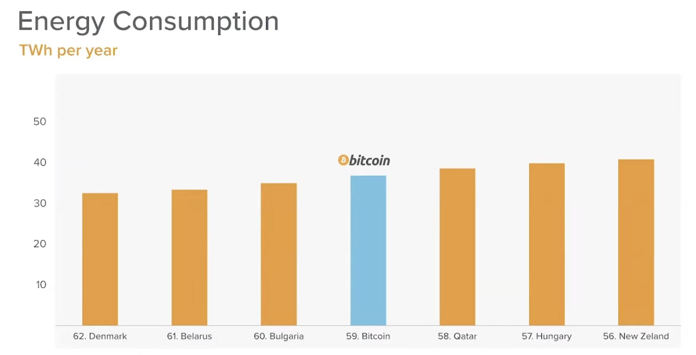

- ## [[Mechanism design]] 101
  collapsed:: true
	- https://www.youtube.com/watch?v=gCFlGLbI_kE
	- Incentives are produced by economic games that can be crafted and engineered.
	- By designing economic games appropriately, we can force selfish humans to exhibit useful behaviours.
	- Incentives are often more powerful than the moral frameworks of players in economic games.
	- Decentralised protocols enforce games that cannot be terminated or updated, rendering errors potentially fatal. These two factors, combined with human error, can lead to catastrophic events.
	- 
	- Designing an economic game
		- Choose a goal (i.e. *securely store data, forever*)
		- Choose a reward mechanism (i.e. *Users contribute funds to an endowment when they add data to the network. Miners are rewarded from the endowment over time*)
		- Choose a reward function to match it (i.e. *proof of access => *)
		- Tips
			- Maximize network security to avoid double spending
			- Tokens distributed relative to security contribution of each miner
			- Proof of work and block production, acceptance, and fork avoidance
- ## [[Business Model]]s and [[value]] Capture
	- https://www.youtube.com/watch?v=AI1N6dY8vSQ
	- html://https://a16z.com/wp-content/uploads/2020/05/Ali_Yahya-Crypto_Business_Models_Defensibility.pdf
	- The layers most value is created, 2 (Smart contracts) and 1 (Consensus) are an example of Multi-sided platform
	-