- ## Towards a practice of [[token engineering]] #learn #tokenomics
  collapsed:: true
	- https://getpocket.com/read/2094298133#:~:text=23%20min-,View%20Original,-Methodology%2C%20Patterns%20%26%20Tools
	- We can frame **token design as [[optimization]] design**, then use optimization design methodology.
	- **Simulation, verification, and design space exploration (CAD tools) **for circuit design have helped engineers analyze, design, and verify wickedly complex chips. We can look forward to similar tools for tokenized ecosystems.
	- When you have an appropriately timed force applied to a system in resonance, the amplitude of the resonance *grows *over time.
	- However, it turns out that if you zoom in on [[Mechanism design]] with a [few practical constraints](https://medium.com/blockchannel/a-crash-course-in-mechanism-design-for-cryptoeconomic-applications-a9f06ab6a976), you end up with Optimization Design! People doing Optimization Design have a tremendous amount of practical experience deploying optimizer systems over the years.
	- 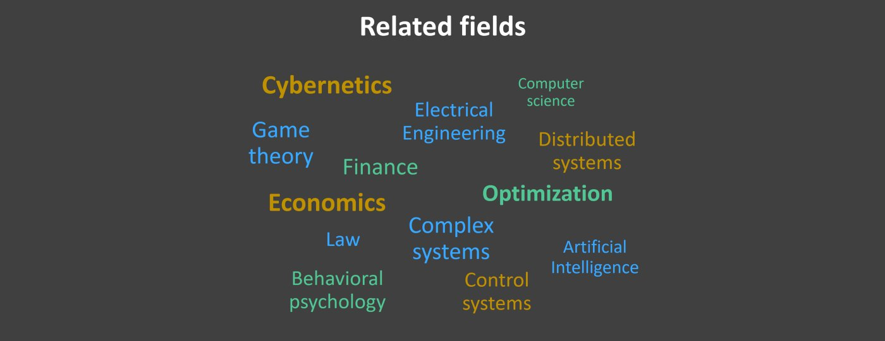
	- 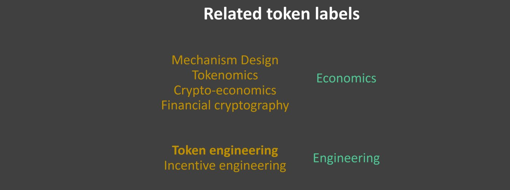
	- 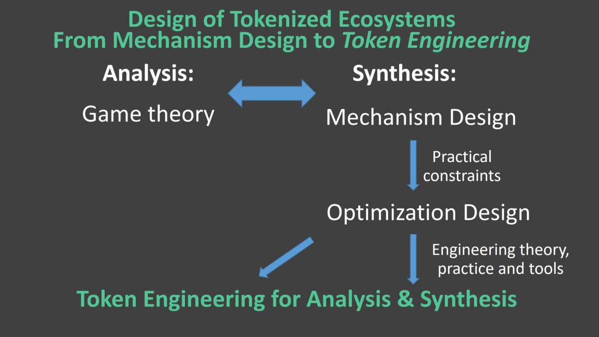
	- Token design is like optimization design: at a high level, you encode intent with a block rewards function aka objective function, and you let it fly. As is often the case, [Simon de la Rouviere](https://medium.com/@simondlr) [saw this one first](https://hackernoon.com/history-is-rhyming-fitness-functions-comparing-blockchain-tokens-to-the-web-3c117239f4c).
	- It gets more specific than that. Token design is *especially *like evolutionary algorithms (EAs), where there are many agents “searching” at once and there is no top-down control of what each agent does. Agents live and die by their block reward or fitness.
	- With such similarities, *we can use best practices from optimization / EA to when doing token design*. This is great news, because many people are Jedis in designing EAs and optimization systems.
		- 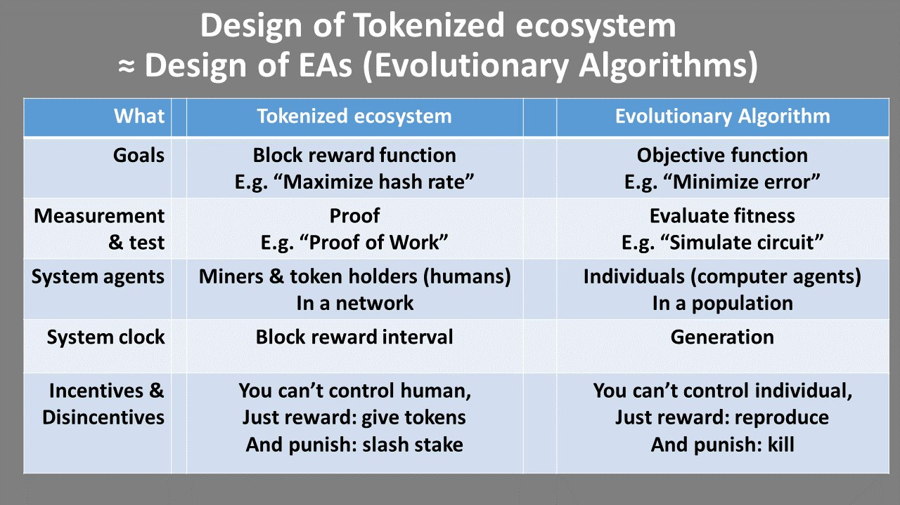
		- Goals
			- Both tokenized ecosystems and EAs have **goals**, in the form of **objectives **(things to maximize or minimize) and **constraints **(things that must be met). To get fancy, this can even be stochastic.
			- The tokenized ecosystem might give block rewards for an [[objective function]] of “maximize hash rate” whereas an EA objective might be “minimize error” in training a deep net. Constraints might be “must have stake ≥threshold to participate” or “deep network layers=100” respectively.
			- Variants include single-objective optimization (1 objective, 0 constraints), constraint satisfaction (0 objectives, ≥1 constraints), and multi-objective constrained optimization (≥2 objectives, ≥1 constraints).
		- Measurement and test
			- To **test / measure **success against the goals (objectives & constraints), a tokenized ecosystem relies on **proofs **and an optimizer measures **fitness **using e.g. a **simulator**.
			- For example, a Bitcoin node proves that a user was hashing by verifying that the user’s supplied nonce solves the the cryptographic puzzle.
			- An optimizer might test the goodness of a circuit by running a SPICE simulation of the circuit’s differential equations; [[simulation]] results can be verified by testing whether they indeed solved Kirchoff’s Current and Voltage Laws.
		- System agents
			- In both systems, **agents **run about “doing things”.
			- In a tokenized ecosystem, **network stakeholders **such as **miners (**or **users **more generally) do whatever it takes to earn block rewards. They jostle about, doing what it takes to get more token rewards. For example, in Bitcoin some agents might design, build, and run ASIC chips to get higher hash rate. Other agents might pool their existing compute resources. The system does not need to explicitly model all stakeholders in the ecosystem. For example, Bitcoin doesn’t have specific roles for banks or nations or companies; it’s mostly all about the miners.
			- In an EA, you have **individuals **in a** population. **If they’re “good” they have higher fitness. For example, an individual may be a vector of 10,000 weights for a [[neural network]] . “Actions” of individuals are basically when they survive and have variants made of them, via operators like crossover (e.g. interpolation) or [[mutation]] (e.g. randomly perturbing each parameter).
		- System clock
			- Each system has a **clock**, implying a **time dimension** by which **progress **is made / **convergence **is happening.
			- **Batches. **Typically, agents are processed in batches or epochs. A tokenized ecosystem periodically generates a **new block** and gives block rewards. The new block points to the old block; and new work in the system will add to the new block; and so on. This linked list of blocks implies a Lamport-style logical clock. In EAs, each batch is a **generation **where a whole population of individuals gets updated at once. Each generational loop might include: evaluate individuals, select the best, let them make children, repeat.
			- **Continuous.** In some systems, agents are processed more **continuously** rather than batches. These systems usually takes a bit more work to conceptualize, but may lead to better properties for some problems. For example in tokenized ecosystems, a Stellar transaction only needs validation from quorum slice participants, or another node gets added to a DAG ([[directed acyclic graph]]) like in Iota. In EAs, we have steady-state evolution where one individual at a time is replaced.
		- [[Incentives]] and disincentives
			- The system itself cannot control how the agents behave. (Or at the very least, it shouldn’t *need *to control them.) As such, **top-level behavior must be an emergent property of bottom-up actions by agents**. This is necessary for tokenized ecosystems; otherwise they’d be centralized! It’s not an absolute must for EAs, but nonetheless a broad set of EAs take this approach for simplicity / elegance or meeting other design goals.
			- This means the system can only reward or punish behavior, aka carrots or sticks, aka **incentives **and **disincentives**. In designing the system, we *design* what rewards or punishments to give, and how to give them.
			- In tokenized ecosystems, rewards take the form of block rewards, and punishments by slashing stake. The former is typically the objective function; the latter is some (but not all) constraints.
			- In EAs, reward and punishment both come down to which individuals are selected to be parents for the next generation. Examples: randomly choose two individuals and keep the best, repeating until full (tournament selection); and chance of selection is proportional to fitness (roulette wheel selection). Crucially, the EA does *not *need to steer the individuals by e.g. providing a derivative. This is why a tokenized ecosystem is most like an EA, versus gradient-based optimizers that give top-down directives (using gradients to choose new individuals).
	- But practitioners of the algorithms all do something very similar. They want to ship optimizer systems that *just work*. They follow the following steps. Some do it implicitly, though the pros do it systematically:
		- **Formulate the problem:** They assume that the algorithm “just works” and they focus on formulating the problem in terms of** objectives and constraints **(goal) and design space (where can the optimizer explore, which is really just constraints).
		- **Try an existing solver: **Then they run the algorithm against those goals and let it “solve”. Code for optimization algorithms are often simply called “**solvers**”. If this doesn’t work, practitioners will iterate by trying different problem formulations, or different solvers and solver parameters.
		- **New solver? **If the previous solving step doesn’t work, even after repeated tries on various formulations, then practitioners consider rolling their own solver, i.e. designing a new optimization algorithm.
	- Formulating a problem in objectives, constraints, and design space is not easy. In fact, after all these years, it’s still an art that takes a lot of creativity. (Which means it’s fun!) There are often many ways to formulate a problem; and all are not equal . Fortunately, you can get better with practice. I watch friends in the EA community and circuit computer-aided design (CAD) community who have supreme skills in the art of formulating problems. You know who you are;)
	- Block rewards are a manifestation of the network’s **objective function** — the thing you want to minimize or maximize. This generalizes. Token design is like design of optimization algorithms. Therefore: We can approach token design as optimization design.
		- **Formulate the Problem:** write down the objectives and constraints for your tokenized ecosystem. This means asking: who are my potential stakeholders, and what do each of them want? What are attack vectors? Then translating those into objectives and constraints that you can measure.
		- **Try An Existing Pattern: **Identify if there is an existing solver, i.e. tokenized network design pattern that can solve your problem. For example, if you’re looking for a list of “good” actors/assets/etc, will a [token curated registry](https://medium.com/@ilovebagels/token-curated-registries-1-0-61a232f8dac7) (TCR) do? I elaborate on this later. If this doesn’t work, try different problem formulations, different solvers or solver parameters. For example, it converges to unwanted behavior, so you add a constraint to prevent that behavior.
		- **New Pattern?** If needed, roll your own solver, i.e. design your own tokenized network. Of course when doing this, use existing building blocks where possible, from TCRs to arbitration.
	- Building blocks
		- **Curation. ***Binary *membership: [Token Curated Registry](https://medium.com/@ilovebagels/token-curated-registries-1-0-61a232f8dac7) (TCR), e.g. to maintain a list of good actors. A sub-block of TCRs is [risk-staking](https://github.com/oceanprotocol/whitepaper/raw/master/whitepaper.pdf) to reduce onboarding friction. *Discrete-valued* membership: [Stake Machines](https://medium.com/@DimitriDeJonghe/curated-governance-with-stake-machines-8ae290a709b4), e.g. for promoting an actor. *Continuous-valued* membership: [Curation Markets](https://medium.com/@simondlr/introducing-curation-markets-trade-popularity-of-memes-information-with-code-70bf6fed9881) (CM) for popularity of an asset, defined by its bonding curve with design guidelines [here](https://hackernoon.com/how-to-make-bonding-curves-for-continuous-token-models-3784653f8b17). *Hierarchical* membership: each label gets a TCR (like [here](https://github.com/oceanprotocol/whitepaper/raw/master/whitepaper.pdf)). *Work *tied to membership: [Curated Proofs Market Market](https://github.com/oceanprotocol/whitepaper/raw/master/whitepaper.pdf) (CPM). Curation on non-fungible tokens: [Re-Fungible Tokens](https://medium.com/@billyrennekamp/re-fungible-token-rft-297003592769) (RFT).
		- **Identity. ***Lower level:* public key, decentralized identifiers ([DIDs](https://w3c-ccg.github.io/did-spec)). *Medium level*: TCR. *Higher level*: e.g. [uPort](https://www.uport.me/), [Civic](https://www.civic.com/), [Sovrin](https://sovrin.org/), [Authenteq](https://authenteq.com/), [Taqanu](https://www.taqanu.com/), [Estonia E-Residency](https://e-resident.gov.ee/). *Identity of machines: *e.g. [Spherity](http://spherity.com/)
		- **Reputation. **Reputation systems are at the intersection of curation and identity.
		- **Governance / software updates. **This can be a mix of [ZeppelinOS](https://zeppelinos.org/), [Aragon](https://aragon.one/), [Colony](https://colony.io/), and more. Maybe eventually [automated](https://medium.com/@miles2045/deep-dreams-of-g%C3%B6del-machines-16c85cf9697f)?
		- **Third-party arbitration.** E.g. [Mattereum](https://mattereum.com/).
		- **Proofs of human or compute “work”. **For data, compute, and more. This the evaluation of the objective function. It can be can *human work* like in [Steemit](https://steemit.com/steemit/@alwillis/steemit-s-breakthrough-subjective-proof-of-work) or [Augur](http://www.augur.net/), or *machine work* like in most other systems. Machine work may be solving an (arguably) less-useful puzzle like in Bitcoin, or more “useful” work like [FileCoin’s Proof of Space-Time](https://filecoin.io/filecoin.pdf). Here’s a breakdown of useful work (“service integrity”) grouped by *data *and *computation* (from [here](http://www.oceanprotocol.com/#papers)).
	- 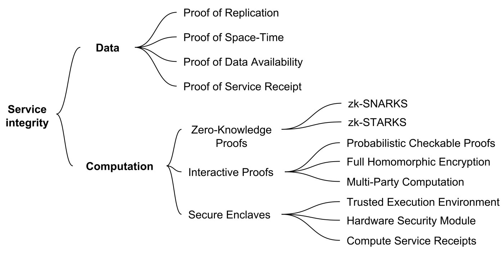
	- Other building blocks
		- **How tokens are distributed. **This includes releasing coins for “work”, according to a [controlled supply schedule](https://en.bitcoin.it/wiki/Controlled_supply); 100% pre-mining; [burn-and-mint](https://medium.com/@kylesamani/new-models-for-utility-tokens-d26c12ec00c5); [bounty ICOs](https://medium.com/@jjmstark/bounty-icos-61232e73370b); and more.
		- **Ethereum token standards**, such as [ERC20 fungible token](https://github.com/ethereum/eips/issues/20) and [ERC721 non-fungible token](https://github.com/ethereum/eips/issues/721). Billy Rennekamp’s [**token lexicon**](https://medium.com/@billyrennekamp/token-lexicon-b4ed9a4ce363) is helpful.
		- **How tokens are valued. **As a means of exchange, store of value, and unit of account, by [Chris Burniske](https://www.amazon.com/gp/product/1260026671/ref=as_li_tl?ie=UTF8&tag=trentmc002-20&camp=1789&creative=9325&linkCode=as2&creativeASIN=1260026671&linkId=2ff67ea09ebe44d39c1581941638ad23).
		- **How keepers are grouped. **For gatekeeping, arbitrage, or resource transaction, by [Ryan Zurrer](https://medium.com/@rzurrer/keepers-workers-that-maintain-blockchain-networks-a40182615b66).
		- **How the compute stack is organized. **Processing, storage, etc. This has variants by [Fred Ehrsam](https://medium.com/@FEhrsam/the-dapp-developer-stack-the-blockchain-industry-barometer-8d55ec1c7d4), [Stephan Tual](https://blog.stephantual.com/web-3-0-revisited-part-one-across-chains-and-across-protocols-4282b01054c5), and [myself](https://blog.bigchaindb.com/blockchain-infrastructure-landscape-a-first-principles-framing-92cc5549bafe).
		- **Level-1, level-2, level-N infrastructure. **The core chain is level 1. The higher levels are to help scale without having to reconcile the main chain on every transaction. [Link](https://medium.com/l4-media/making-sense-of-ethereums-layer-2-scaling-solutions-state-channels-plasma-and-truebit-22cb40dcc2f4).
		- “[**Cryptoeconomic primitives**](https://medium.com/@jacobscott/the-emergence-of-cryptoeconomic-primitives-14ef3300cc10)” by Jacob Horne. Another label for token design patterns or building blocks. [Published after initial publication of this work.]
	- Important
		- One option is to *not *try modeling [black swans](https://www.amazon.com/gp/product/081297381X/ref=as_li_tl?ie=UTF8&tag=trentmc002-20&camp=1789&creative=9325&linkCode=as2&creativeASIN=081297381X&linkId=37fd31844ed3bb762816fd63517bc987), but simply minimize potential negative impacts if they do occur.
		- Or, we could have humans in the loop as part of the “simulator” where they are incentivized to come up with attacks. This formalizes an existing practice: people doing token design get their friends to dream up new attacks, then they update the constraints list then the design accordingly.
		- Simulation will never be perfect. So, we should ensure that the system itself is *evolvable*, towards the intent of the community. The tools for this are governance, staking, and more. Governance may be as simple as hard forks, for example to change the objective function or add constraints. Staking helps convert zero sum to positive sum for the community of token holders.
		- “ **Extrinsic motivation** is encouragement from an outside force; behavior is performed based on the expectance of an outside reward [to convince] someone into doing something that they would not do on their own. …
		- Intrinsic means innate or within; hence **intrinsic motivation** is the stimulation or drive stemming from within oneself. … Intrinsic motivation is often associated with intrinsic rewards because the natural rewards of a task are the motivating forces that encourage an individual in the first place.” [[Link](http://webshare.northseattle.edu/fam180/topics/praise-rewards/problems.htm)]
		- For tokenized ecosystems, we must be similarly careful. Extrinsic motivation works for some goals like “maximize security” or “maximize sharing of data”. But it can be dangerous in some places. Let’s say you’re building a decentralized reputation system. Directly tokenizing reputation would incentivize people to game their reputation for money, leading to all sorts of poor behavior. It can also be controlling, like we’ve seen with [China](https://en.wikipedia.org/wiki/Social_Credit_System). Just say no to [Whuffie](https://en.wikipedia.org/wiki/Whuffie) (please).
		- One possible answer is for the system to support intrinsic motivation rather than extrinsic. In the classroom, this means [tactics like](http://webshare.northseattle.edu/fam180/topics/praise-rewards/problems.htm): provide choices, minimize pressure, allow alternative solutions, encourage originality, and promote success. Some of these might translate to token design. One example is to simply filter out the bad actors with economic stake, e.g. with a TCR. Or, we could promote success via stake machines.
		-
- ## Engineering ethics in web3 [[token engineering]] #learn #tokenomics
  collapsed:: true
	- https://getpocket.com/read/3295725845
	- 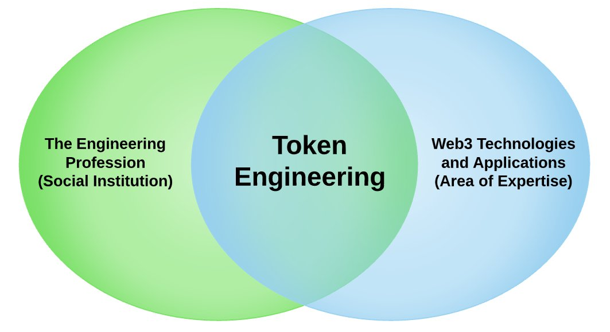
	- As with any emerging technology there is still a lot of uncertainty around the practice of engineering web3 enabled systems but **it is already clear that these systems are deeply entangled with social and economic systems, and thus have the potential for a deep and long standing impact on social institutions.** With this in mind, our community coalesced around a shared commitment to the values upheld by the broader institution of professional engineering.
	- Engineering Values according to **Martin, M. & Schinzinger, R. Ethics in Engineering. NY: McGraw-Hill, 1983**:
		- (1) a primary obligation to protect the safety of and respect the right of consent of human subjects;
		  (2) a constant awareness of the experimental nature of any project, imaginative forecasting of its possible side effects, and a reasonable effort to monitor them;
		  (3) autonomous, personal involvement in all steps of a project; and
		  (4) accepting accountability for the results of a project.
	- Engineering Values according to **Pinkus, R. L. B, Shuman, L. J., Hummon, N. P., Wolfe, H. Engineering Ethics: Balancing Cost, Schedule, and Risk — Lessons Learned from the Space Shuttle. Cambridge: Cambridge University Press, 1997.**
		- “The ethical engineer is one who is competent, responsible, and respectful of Cicero’s Creed II. Cicero’s Creed, engineering’s oldest ethic, directed engineers to place the safety of the public above all else.”
	- Engineering Values according to **Wike VS. Professional engineering ethical behavior: a values-based approach. 2001**
		- “Instead, I prefer a third scheme that focuses squarely on what is to be valued and not on questions of methodology or technical expertise. This scheme proposes that professional engineers (and for that matter, any professionals) share a commitment to these six values: **integrity, respect for persons, justice, compassion, beneficence/non-maleficence, and responsibility**.”
	- Another interesting tension arises in the pursuit of agency: in a network, participants are connected, so often one’s right to control their own actions can negatively impact others. At one level, protocols can be said to address this directly by providing an explicit specification of what actions are and are not acceptable within the network. However, at the level of governing these networks the boundaries of these rights are non-obvious.
	- The Ethereum hard fork after [TheDAO hack](https://medium.com/swlh/the-story-of-the-dao-its-history-and-consequences-71e6a8a551ee) is an example where the Ethereum Institution (humans) split over differences in values. The Ethereum Classic Community upholding a principle that the “code is law” and that actions taken in bad faith (exploiting a flaw in code to take someone else’s money rather than taking action to see the code secured) were to be upheld because the code itself was the deciding factor. The broader Ethereum community took extreme measures to reverse the malicious activity and initiated an irregular state transition, effectively removing the hackers funds to be redistributed to the affected parties. Neither was right in any absolute sense but the event was a very public exercise of a values judgement on the part of leaders in the Ethereum community.
	- At first glance, these value systems are in conflict. Simply, the authority of a traditional engineer is derived from the power of the nation-state to regulate its territory — most jurisdiction limit engineering activities that could affect public wellbeing to licensed professionals. However, the web3 value system is native to the internet, the social institution is extra-national and openly rejects the authority of the state to regulate it. Adherents to the web3 value system adhere to regulations out of pragmatism rather than in deference to those regulatory authorities.
	- Though it may take time, we believe history tells us that people want to enjoy the benefits of new technology while the underlying complexity is abstracted away from them. This is only practical if their interests are safeguarded through social institutions like the token engineering commons (TEC).
	- Upholding a value system is a journey not a destination; it can never be totally reduced to a set of methods and procedures but drawing on methods and procedures is a good place to start.
	- In **cyber-physical systems**, physical and software components are deeply intertwined, able to operate on different spatial and temporal scales, exhibit multiple and distinct behavioral modalities, and interact with each other in ways that change with context.
	- Another authoritative source on Cyber-physical systems is the [Ptolemy Project out of UC Berkeley](https://ptolemy.berkeley.edu/projects/cps/). The CPS concept map makes clear how closely the considerations match with those of web3. It helps identify the areas that need the most development.
		- 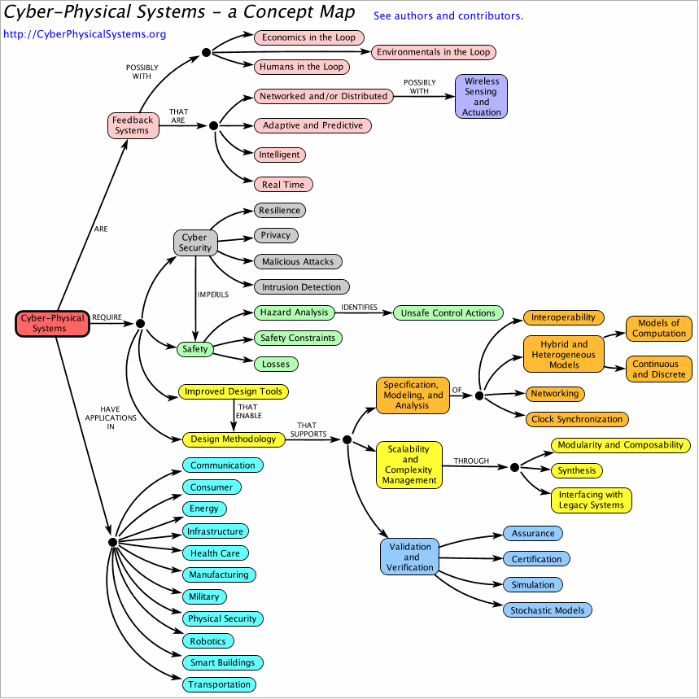
		- **Cyber-Physical Systems (CPS)** are integrations of computation, networking, and physical processes. Embedded computers and networks monitor and control the physical processes, with feedback loops where physical processes affect computations and vice versa. The economic and societal potential of such systems is vastly greater than what has been realized, and major investments are being made worldwide to develop the technology. The technology builds on the older (but still very young) discipline of embedded systems, computers and software embedded in devices whose principle mission is not computation, such as cars, toys, medical devices, and scientific instruments. CPS integrates the dynamics of the physical processes with those of the software and networking, providing abstractions and modeling, design, and analysis techniques for the integrated whole.
		- In [**Voshmgir S, Zargham M. Foundations of cryptoeconomic systems, 2020**](https://epub.wu.ac.at/7782/1/Foundations%20of%20Cryptoeconomic%20Systems.pdf)**,** a case is made that following the definition of Cyber-Physical Systems, the web3 internet native social and economic infrastructure projects should be approached as Cyber-Physical systems. While CPS predates web3, it is also plagued by ethical questions as algorithms take the role of administering policies which directly impact human activities.
		- In [**Zargham, M, Nabben, K., Algorithms as Policy, 2020**](https://kelsienabben.substack.com/p/algorithms-as-policy)**, **comparisons are drawn between algorithm design in online platform and policy making activities. Although, these are new digital infrastructures, it is traditionally the role of (civil) engineers to represent the public in settings where policy manifests as technology, (historically in the form of physical infrastructure).
		- On an even grander scale, our existing public institutions have visibly failed to address systemic challenges such as global warming and acute public health crises.
	- # Cryptonetwork Governance as Capital
		- https://www.placeholder.vc/blog/2019/2/19/cryptonetwork-governance-as-capital?utm_source=pocket_mylist
		- 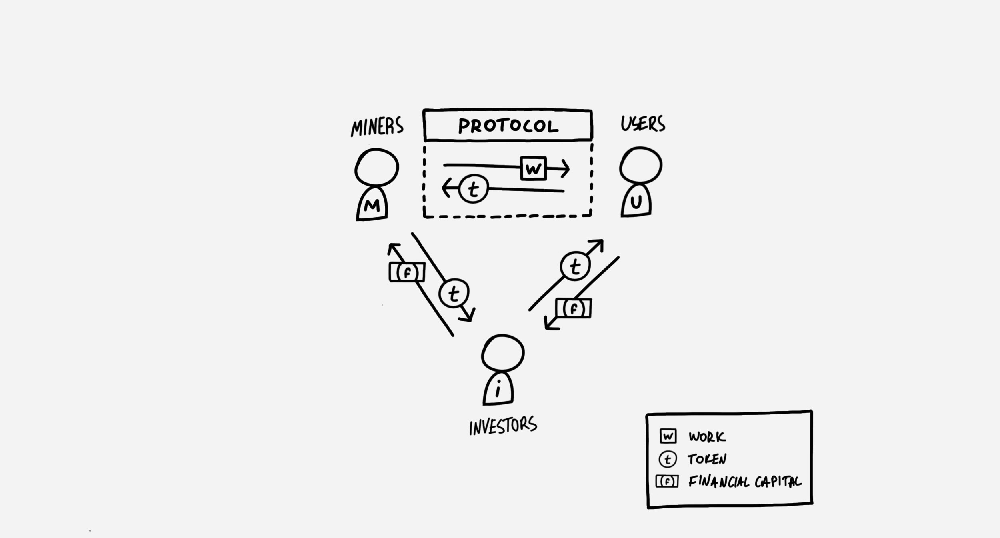
		- The two pillars of trust of a cryptonetwork are its **cryptoeconomic** and **governance** models. The cryptoeconomic model defines ‘the rules’ of the system (what is the unit of work, how do users pay, how miners are compensated, the token supply model, etc.), while the governance model defines who has the *power* to change those rules, and under which conditions.
		- If capital is the power to organize economic resources, then the power to change the rules of a cryptonetwork forms its capital. And when that power takes the form of a token, it can be traded, priced and modeled by market. In this context, a network’s ‘assets under power’ include
			- the token itself, which is controlled by the cryptoeconomic policy,
			- productive resources, as controlled by the definition of ‘work’ (e.g. the consensus protocol), and
			- flows of value, as controlled by regulating payment mechanics and other incentives for miners, users and investors.
		- And as the value of these resources grows, so does the value of the capital which governs them.
	-
- ## Foundations of Cryptoeconomic Systems #learn #tokenomics
	- [[token engineering]]
	- https://research.wu.ac.at/ws/portalfiles/portal/19008630/Foundations+of+Cryptoeconomic+Systems.pdf
	- [[Complex systems]] differ from other systems in that the *system level behaviour cannot be inferred from the local state changes induced by individual network actors* [Parrott and Lange 2013]. Modeling approaches that ignore such difficulties will produce models that are not useful for modeling and steering those system.
	- Properties such as *emergence, nonlinearity, adaptation, spontaneous order, and feedback loops* are typical to [[Complex systems]] [Bar-Yam 2002].
	- 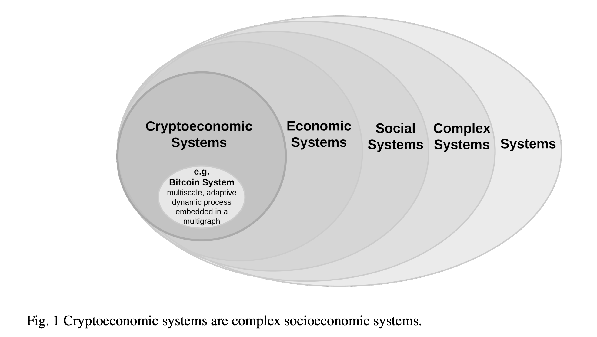
	- **Systems theory** can contribute tools for the analysis of how the relationships and dependencies between a cryptoeconomic systems’ parts can determine system-wide properties. It allows for the discovery of system’s dynamics, constraints, conditions, and principles of cryptoeconomic networks with the aim to understand, model, and steer them.
	- A cryptoeconomic system such as the Bitcoin network can be described as a special class of complex socioeconomic system that is dynamic, adaptive, and multi-scale. **Cryptoeconomic networks** are
		- *dynamic* due to the flow of information and assets through the network;
		- *adaptive* because their behaviour adjusts in response to their environment, either directly in the case of the Bitcoin difficulty controller or more broadly through decisions on the part of node operators;
		- *multi-scale* because they are specified by local protocols but are defined by their macro-scale properties, as is the case with the local ”no double spend” rule guaranteeing a globally conserved token supply [Zargham, Zhang and Preciado 2018].
	- Their design requires a strong interdisciplinary approach to develop resilient protocols that account for the spatial and temporal dynamics of those networks [Liaskos, Wang and Alimohammadi 2019].
	- In the context of **cryptoeconomic systems**, we have identified the following disciplines as relevant: Industrial and *Systems Engineering, AI, Optimization and Control Theory, Computer Science and Cryptography, Economics and Game Theory, Psychology and Decisions Science, Political Science, Institutional Economics and Governance, Philosophy, Law and Ethics, as well as Operations Research and Management Science.* The wide range of disciplines may seem arbitrary but they are in fact bound by a central concept: **allocation of resources.**
		- 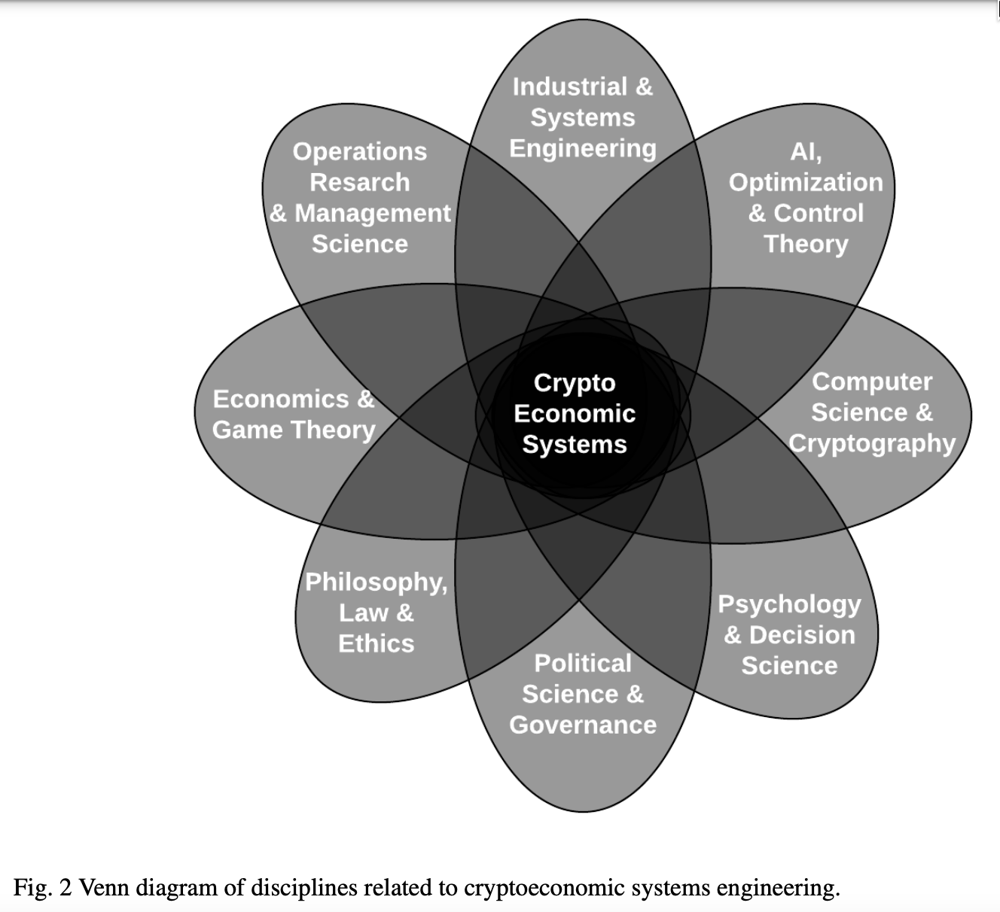
	- Envisioning, designing and governing cryptoeconomic systems requires the following questions to be considered:
		- *Who gets to make which decisions*, under which circumstances, and to whom are they accountable for those decisions? Furthermore, how does this change over time?
		- *How do individuals make decisions* given knowledge of the rules of the system, and subject to uncertainty about the decisions of others?
		- *How can a system be engineered* to processes individual decision making into collective decision making such that system may be interpreted as coordinating toward a shared purpose?
	- 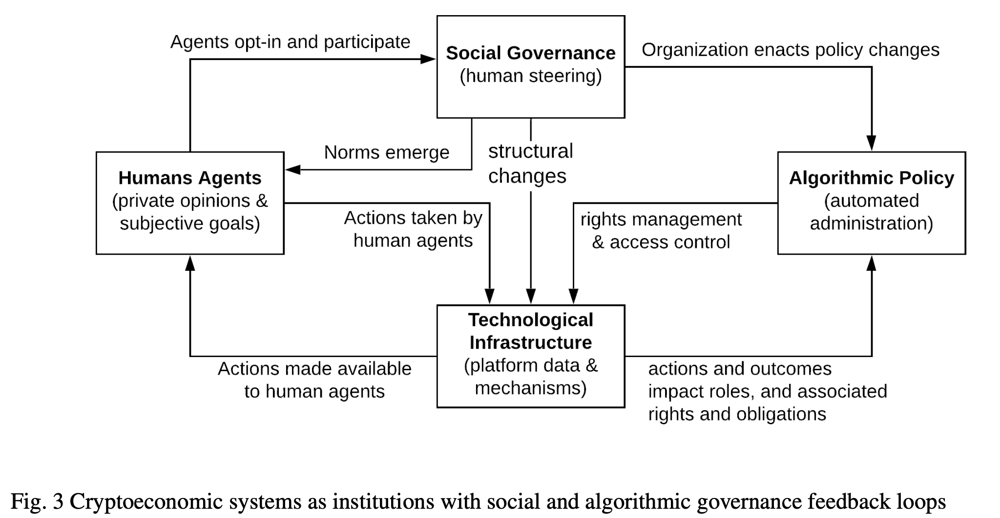
	- Cryptoeconomic networks enable more fluid organizations to formalize over the Internet - around a specific economic, political, or social purpose - commonly referred to as a “Decentralized Autonomous Organizations” or “DAOs” by the crypto-community [Buterin 2014], [Wright and De Filippi 2015]. They reinvent the institutional composition of the Internet, allowing distributed Internet tribes to self-organize and coordinate in a more autonomous way - steered by purpose-driven tokens. The network protocol and/or the smart contract code formalize the governance rules of the network, regulating and enforcing the behavior of all network participants.
	- As institutional infrastructure, **cryptoeconomic networks resemble nation states much more than they resemble companies.** Their protocols are comparable to the constitution and the governing laws of a nation state [Lessig 2009], in a combination of **formal** (on-chain) and **informal** (off-chain) rule sets. The network protocols and smart contract represent the computational constitution, while the adaptive social decision processes represent a body of values and rules which govern the collective decision-making process [Zargham et al. 2020], [Voshmgir 2020].
	- Common mathematical and game theoretic arguments about cryptoeconomic networks are based on the canonical results on the evolution of cooperation in an iterative prisoners dilemma [Axelrod and Hamilton 1981], [Rapoport, Chammah and Orwant 1965]. These results demonstrate that **coordination is possible (sufficient condition) in the presence of selfish actors**, not that it is ‘only possible’ (necessary conditions) in the presence of selfish actors.
		- 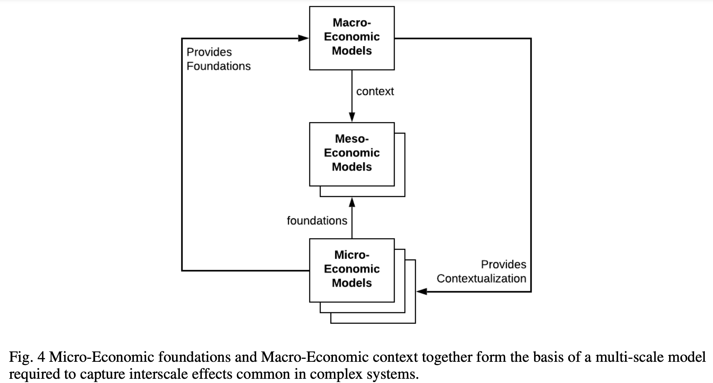
	- Therefore, it is entirely possible and actually more likely that **cryptoeconomic systems exist as a result of a mixture of strategies,** also referred to as norms as in more recent work on the evolution of cooperation [Yamamoto et al. 2017], [Peters and Adamou 2019]. The iterated prisoner’s dilemma is an approximation of a complex social phenomena, [Axelrod 1997], and continued study has provided additional insights around concepts such as indirect reciprocity [Nowak 2006] and meta-incentives [Okada et al. 2015], which are directly relevant to the study of cryptoeconomics, in so far as it is viewed as means to engineer incentives that make cooperative norms resistant to invasion by selfish ones in cryptoeconomic networks.
	- Through the multiscale perspective, it is possible to study interscale phenomena such as emergence. *“Emergence (...) refers to the arising of novel and coherent structures, patterns and properties during the process of self organization in complex systems. Emergent phenomena are conceptualized as occurring on the macro level in contrast to the micro level components and processes out of which they arise.”* [Goldstein 1999].
		- 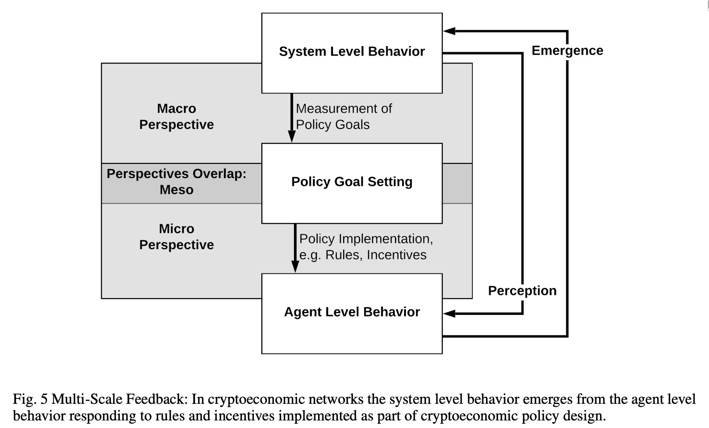
	- *Emergence closes the feedback loop of the macro, meso and micro level activities* where policy makers measure phenomena on a macro level, decide over new policies on a meso level, and implement these policies impacting agent behavior a micro level, which in turn result in systemic effects that can only be measured on a macro level. An example of **Multi-scale feedback in the Bitcoin Network is the interaction between the proof-of-work game being played between the agents (miners), and the Bitcoin Network itself.** By introducing a feedback loop to correct the difficulty and maintain the ten minute block time, the system itself becomes part of the game
	- Another **example of multiscale dynamics in cryptoeconomic systems are bonding curves** [De La Rouviere 2017], including liquidity pools such as Bancor [Hertzog, Benartzi and Benartzi 2017] and Uniswap [Angeris et al. 2019]. A detailed analysis of bonding curves shows that they encode nontrivial configurations spaces [Zargham, Shorish and Paruch 2019], wherein **simple behaviors on the part of individual agents can collectively induce emergent changes to the global state.** The **interplay between local agent and global system state** are explored further in [Zargham, Paruch and Shorish 2020]. This line of mathematical and computational research is consistent with multi-scale systems in robotics, [Kia et al. 2019], [Tsitsiklis 1984].
	- Applying [[graph theory]] and networked dynamical systems to study social and economic networks is called [[network science]] [Barabasi et al. 2016] and therefore relevant in the context of analyzing and modeling cryptoeconomic systems.
	- As networks grow the **number of relationships between entities grows exponentially** compared to the number of entities in the network [Dorogovtsev and Mendes 2004]. Furthermore, the **topology of the network itself can have significant influence on processes playing out within the network** [Newman 2010] [Boccaletti et al. 2006].
	- The **interactions between the parts of the system, including agent behaviors, and between the system and its environment often result in unexpected emergent properties,** which in practice necessitates some form of human governance for cryptoeconomic networks [Voshmgir 2017]
	- A cryptoeconomic system like a blockchain network is a **multigraph** because it has different types of vertices and edges which include labeling maps for the vertices and edges. Depending on the type of network the vertices can be:
		- **nodes** representing computer software in the peer to peer computation and communication network,
		- **accounts** are addresses in the financial network,
		- **entities** are identities of people and organizations in an off-chain socioeconomic network.
		- 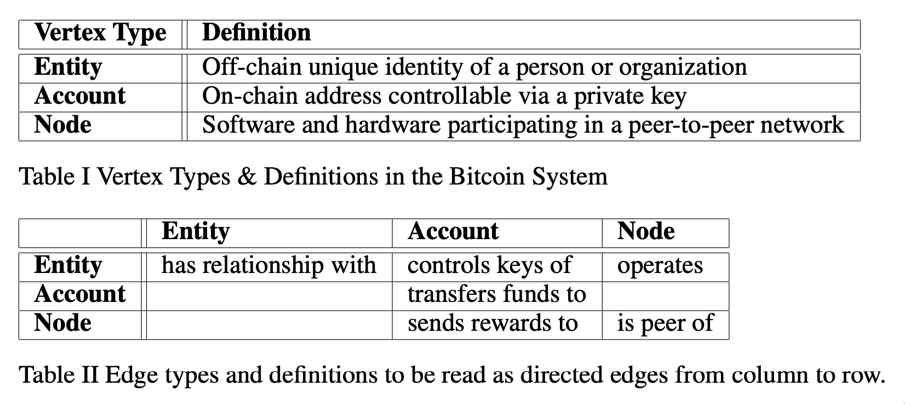
	- A cryptoeconomic network consists of three interconnected networks:
		- **computation and communication network** comprised of nodes that leverage a peer-to-peer protocol to validate transactions by mining new blocks,
		- **financial network** comprised of Bitcoin addresses, which may sign transactions and transfer funds,
		- **off-chain socioeconomic network** representing people and organizations that control the tokens in the financial network and operate those nodes in the computation and communication network.
		- 
	- **Tokens represent a part of the state of any cryptoeconomic system** and can be seen as their atomic unit [Voshmgir 2020]. The term state refers to a unique set of data (the ledger) that is collectively managed by all nodes in the network. Tokens are a representation of an individualized state of an economic system, including a specific right to change the system state. The existence of a universal state makes tokens provable and durable, and is a solution to the double spending [Nakamoto 2008] of digital values over the public networks.
	-