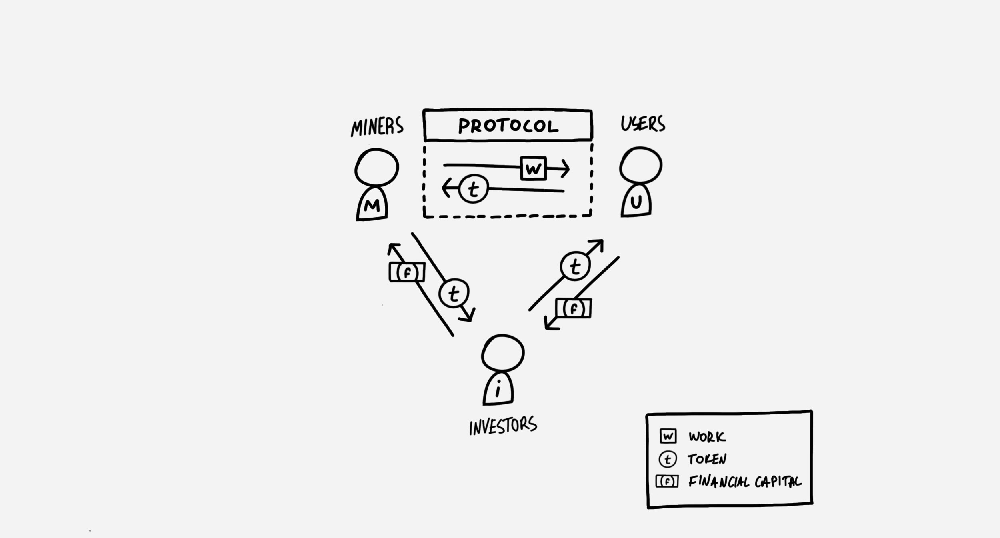

# Cryptonetwork Governance as Capital
collapsed:: true
	- [[tokenomics]] [[token engineering]] #learn
	- https://www.placeholder.vc/blog/2019/2/19/cryptonetwork-governance-as-capital?utm_source=pocket_mylist
	- 
	- The two pillars of trust of a cryptonetwork are its cryptoeconomic and governance models. The cryptoeconomic model defines ‘the rules’ of the system (what is the unit of work, how do users pay, how miners are compensated, the token supply model, etc.), while the governance model defines who has the *power* to change those rules, and under which conditions.
	- If capital is the power to organize economic resources, then the power to change the rules of a cryptonetwork forms its capital. And when that power takes the form of a token, it can be traded, priced and modeled by market. In this context, a network’s ‘assets under power’ include (1) the token itself, which is controlled by the cryptoeconomic policy, (2) productive resources, as controlled by the definition of ‘work’ (e.g. the consensus protocol), and (3) flows of value, as controlled by regulating payment mechanics and other incentives for miners, users and investors. And as the value of these resources grows, so does the value of the capital which governs them.