- [[associative data]] [[graphs]]
- https://iacis.org/iis/2009/P2009_1301.pdf
	- Two of the relatively well-known database models are the ==hierarchical and network models.== Hierarchical models involve “a data structure in which the elements of the structure have only one-to-many relationships with one another”
		- 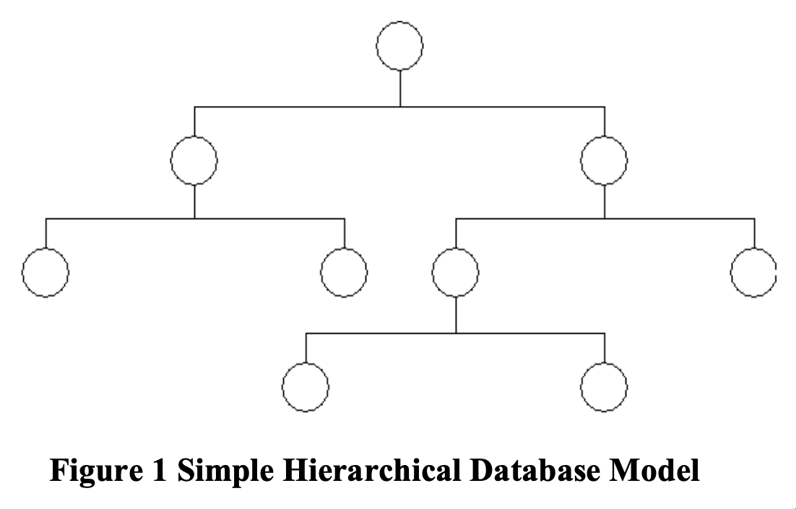
	- Similarly, Kroenke [11] defines a network database structure is one “in which at least one of the
	  relationships is many-to-many.”
		- 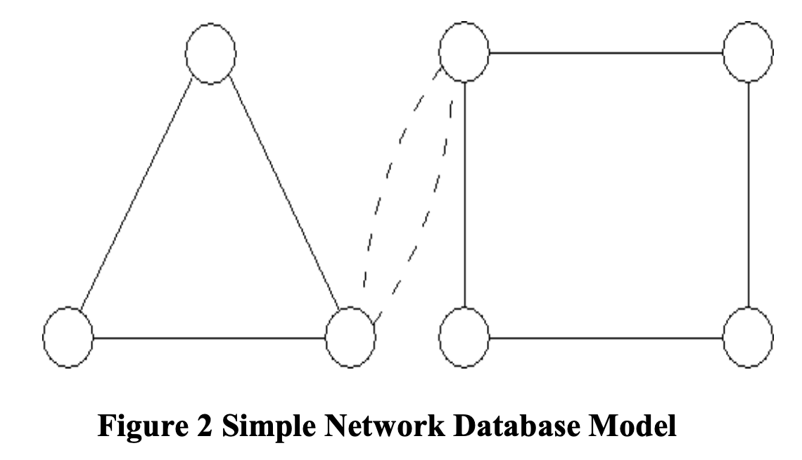
	- One of the most commonly used database structures is the ==relational database model==. As the name implies the relational database model “has the relation at its heart, but then a whole series of rules governing keys, relationships, joins, functional dependencies, transitive dependencies, multi-valued dependencies, and modification anomalies” [14 The Relational Data Model, para. 1].
		- 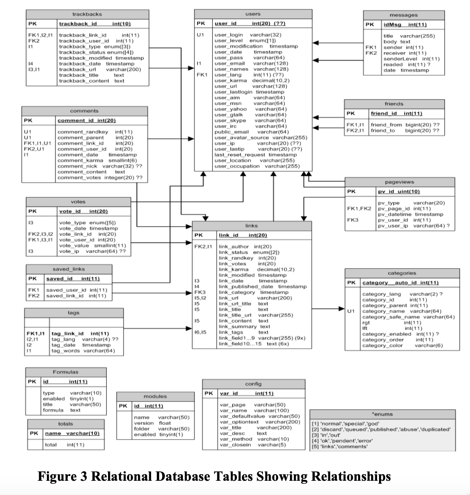
		- 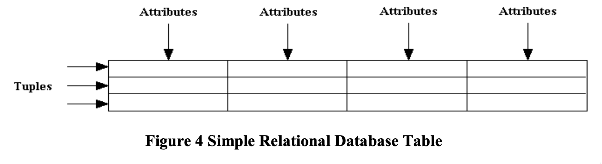
	- Normalization is a major challenge in RDBMS design. Kroenke [10] defines normalization as “a
	  process for converting a relation that has certain problems to two or more relations that do not have these problems.” Much is written about tips for normalizing a database and many authors note that an RDBMS is not the best database design for all types of data. Even in more recent writings by the father of the RDBMS, Codd [5] admits that a “relational database is best suited to data with a rather regular or homogeneous structure” and that more research is needed to determine if an RDBMS can sufficiently handle “heterogeneous data” such as “images, text, and miscellaneous facts.”
	- The ==associative database model== is claimed to offer advantages over RDBMS and other database models. While an RDBMS and other database models are record-based – with data stored in rows and columns in tabular representations shown in figures 4 and 5 – all data in the associative database model is modeled as discrete independent data elements.
	- Relationships between data elements are modeled as **associations**. Griffiths [7] describes these *“two fundamental data structures” as “„**Items**‟ and a set of „**Links**‟ that connect them together.”* Williams [17] introduces the associative database model as having two types of data structures, Items which have *“a unique identifier, a name and a type”* and Links which have *“a unique identifier, together with the unique identifiers of three other things, that represent the source, verb and target of a fact that is recorded about the source in the database.”* He further notes that *“each of the three things identified by the source, verb and target may each be either a link or an item.”*
		- 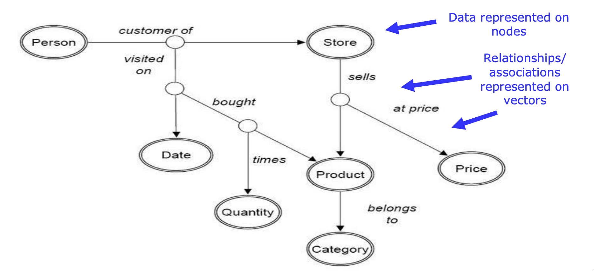
	- 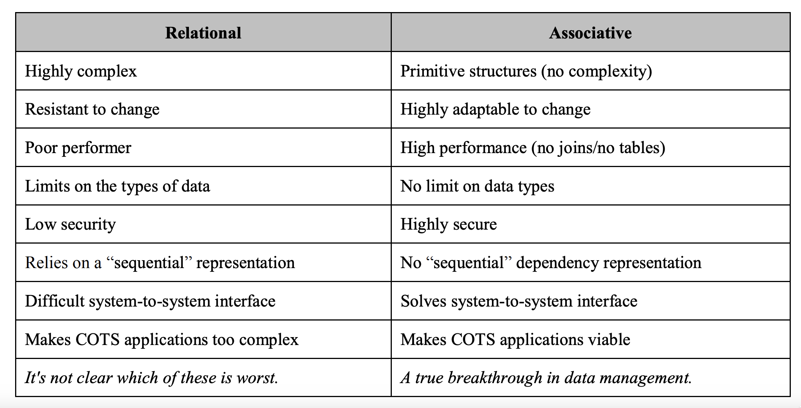
	- ADBMS that may make it more attractive to future users is its inherent security features. The content (data) and index (associations) can be stored together or separately in different places. If a hacker were to access one or the other, Aysola [1] notes that “nothing more than an unlimited character string” is revealed.
- https://web.archive.org/web/20220518204118/https://link.springer.com/content/pdf/10.1057/palgrave.jdm.3240049.pdf
	- Brains do not need new thought processes to think about new things — why do computers? Every new relational application needs a new set of programs developed from scratch, because a program written to use one set of tables cannot be reused with a different set. This creates a need for a never-ending supply of new programs, the development and maintenance of which is labour-intensive, expensive and wasteful.
	- Users do not all need the same functions — why is customisation so difficult? Relational 
	  applications offered by ASPs (Application Service Providers) and package vendors can only be tailored to the needs of large numbers of individual users through complex parameterisation or through customisation which renders subsequent upgrades more difficult. Finding a way to support the customisation of applications for individual users is one of the main challenges faced by early players in the burgeoning ASP marketplace.
	- All customers are not the same — why store the same information about each one? Relational applications cannot record a piece of information about an individual thing that is not relevant to
	  every other thing of the same type. Consequently, applications have to store the same information about every customer, order, product and so on. This limits marketers’ ability to continually improve the quality of customer service, because applications cannot record and take account of the needs of individual customers.
	- All databases store data — why can they not work together more easily? Information about identical things in the real world is structured differently in every relational database, so it is difficult and expensive to amalgamate two databases. The cost of integrating systems
	  is now a major impediment to mergers and acquisitions. Extracting useful information from across several databases demands expensive data warehousing and mining projects.
	- It is no longer necessary to write every new application from scratch. The same set of programs can be used to implement many different associative applications without being altered or
	  rewritten in any way, allowing users to create new applications from existing ones. The saving in software development costs afforded by this capability will be substantial. Applications can be tailored for individual users.
	- Associative applications can permit features to be used or ignored selectively by individual users without the need for parameterisation or customisation. Data sets can be similarly partitioned with precise granularity, to be visible or invisible to individual users. This approach is ideally suited to the needs of ASPs and application package vendors alike. The information needed about each customer can be stored precisely. An associative database can record information that is relevant only to one thing of a particular type, without demanding that it be relevant to all other things of the same type. With this capability, we can continue to enhance the quality of customer service and hone competitive edge.
	- Databases can be integrated without extra programming or data warehousing tools. Separate associative databases can be readily correlated or merged without extra programming, and multiple databases distributed across many servers can be accessed by applications as though
	  they were a single database. These capabilities significantly reduce the cost of amalgamating databases, and allow information to be readily extracted from across multiple databases without the need for data warehousing.
	- Many people who hear the term ‘relational’ for the first time assume that it derives from relationships between the things stored in the database. In fact, it comes from the mathematical concept of a ‘relation’: ‘Given sets S1, S2, . . ., Sn, R is a relation on these n sets if it is a set of
	  n-tuples, the first component of which is drawn from S1, the second component from S2, and so on’. The proper term for the tables described here is ‘relations’.
	- Every new relational database application needs a new set of programs written from scratch, because a program written for one application cannot be reused for another. This creates a need for a never-ending supply of new programs, the development of which is labour-intensive, time-consuming and expensive. Why is this so? Programs are designed around tables. Under the relational model, every table is structured differently — that is, it has different columns and column headings — and the programs are designed around the tables. It is impossible to write an
	  efficient program that is capable of accessing a table whose structure is not known when the program is written, just as it is impossible to make a key that will open any lock. Every program has
	  to be written by someone with precise knowledge of the tables that it will use, and a program that uses one set of tables cannot be used with a different set. In commercial applications, each entity type — customers, products, orders and so on — is represented by at least one table, and most applications involve between 50 and 500 entity types, so each new application needs somewhere between 500 and 5,000 new programs to be written from scratch.
	- One of the stated goals of object-oriented programming was the re-use of program code. Some 20 years after the first object-oriented languages were developed, however, almost no true
	  re-use has been achieved. Some development tools automate the process of writing programs by re-using program designs, but such tools demand higher levels of skill and training and thus
	  greater up-front investment than traditional programming techniques, so despite their impressive productivity levels their use is not widespread. Most programs developed today are still
	  hand-coded from scratch in a highly labour-intensive manner. Re-use has failed not because programming languages and tools are deficient or because programmers are not clever
	  enough, but simply because data are not stored in a way that permits it
	- Parameterisation fuels complexity. Historically, the behaviour of each installation of an application package has been determined by parameterisation: the application checks a set of parameter
	  values as it executes to determine precisely how its code should behave. This approach has drawbacks arising from the exponential increase in complexity as new options are added
	  over time. The code itself becomes extremely complex: different pieces of business logic need to check different parameters to determine whether they are invoked, and as the number of
	  options increases, new functions are more difficult to add, and testing the full range of configurations created by different combinations of parameters becomes more difficult. Also, deploying the package becomes very costly for customers. The lion’s share of the cost of
	  installing a sophisticated package goes on the specialist assistance needed to implement it. A major component of this is the time and know-how involved in setting up the package to achieve the desired behaviour.
	- Modified packages are difficult to upgrade to new releases. Users who require functionality not provided by the core package must modify their copy to create the behaviour that they require.
	  This greatly increases the difficulty of upgrading to new versions of the package provided by the vendor, which often contain important new functionality that the customer would wish to exploit. A small industry of source code comparison, configuration management and impact analysis skills and tools exists to cater for precisely this need, but even so, typically fewer than 50 per cent of major application package users implement new releases for this reason.
	- Every column of every row must be occupied. The relational model dictates that every row must have a value in every column. If the value is unknown, the column must contain a special mark called a ‘null’. For a relation to store a piece of information that relates to only one row, an entire column in every single row would be have to be set aside to cater for it, and the empty column in every other row would have to contain a null. In commercial applications, it is not unusual for a relation to contain many thousands or even millions of rows. If a customer table contained 10,000 customers, setting aside a column to record a piece of information unique to one customer would entail storing 9,999 nulls. To store information unique to just 10 per cent of customers would add 1,000 columns to the table, and entail storing almost 10m nulls. The overhead of storage space and processing time to do this renders it impractical.
	- It is impractical to merge tables from two databases. The simplest case involves two tables that perform the same function: such as the two customer tables. The rows cannot simply be added from one customer table to the other, because every row in a relation must have the same columns, and inevitably there will be at least one pair of columns that do not match. So both tables have to be examined and the corresponding columns matched up. Even when columns whose functions match are found, often they will contain different types of data: one designer may have chosen to identify customers by a number, and the other by a code using both letters and numbers. One must be chosen, new values assigned to the other, and then trawled the entire database through replacing old values with new ones. All this work deals with just one column in one pair of matching tables, but the nature of the relational database design process means that many of the tables in one database will have no direct equivalent in the other, so the process just described will often be the tip of the iceberg. Even when marketers stop short of merging databases — perhaps only a simple question needs answering, such as how many customers the two subsidiaries share in common — marketers have to go through this cross-referencing exercise before they can begin to find the answer to the question.
	- Bank accounts are object-oriented. A bank account is a good analogy for an object. A bank customer cannot change anything about their bank account directly: instead they send it messages in the form of cheques, deposits, balance inquiries and so on. A bank account’s methods are ‘pay a cheque’, ‘receive a deposit’, ‘produce a statement’ and so on. A particular bank account is an instance of the class ‘bank account’
	- Object orientation is first and foremost a better way to write programs. In the context of transaction processing, object databases are burdened with some irrelevant concepts. One such is encapsulation, whereby each data item is in the protective custody of an object and may be changed only by submitting a procedural request to that object. This is a good way to ensure the integrity of variables in a multitasking environment, but it is irrelevant to a general ledger table containing several million rows of data, and it makes the process of querying data more cumbersome and inefficient than it need otherwise be
	- Real-world things are entities or
	  associations. The associative model
	  divides the real-world things about
	  which data is to be recorded into two
	  sorts:
		- entities are things that have discrete,
		  independent existence. An entity’s existence does not depend on any
		  other thing
		- associations are things whose existence
		  depends on one or more other things,
		  such that if any of those things ceases
		  to exist, then the thing itself ceases to
		  exist or becomes meaningless.
	- Examples
		- — a person is an entity, while a person’s
		  roles as a customer, an employee, a
		  spouse, a salesperson, a shareholder, a
		  team member and so on are
		  associations
		- — an enterprise is an entity, while an
		  enterprise’s roles as a customer, a
		  supplier, a contractual party, a tenant,
		  and so on are associations
		- — a consumer good, such as a car or a
		  television, is an entity, while its
		  various roles as the end product of a
		  manufacturing process, a production
		  schedule line item, the subject of a
		  warranty agreement, and so on are
		  associations
		- — a building is an entity, while its
		  various roles as a corporate
		  headquarters, a workplace, the
		  location of assets are associations.
	- An association may depend upon another
	  association: for example, a sales order
	  may depend on a customer, which is
	  itself an association. Similarly each line of
	  a sales order depends on the sales order
	  itself
	- 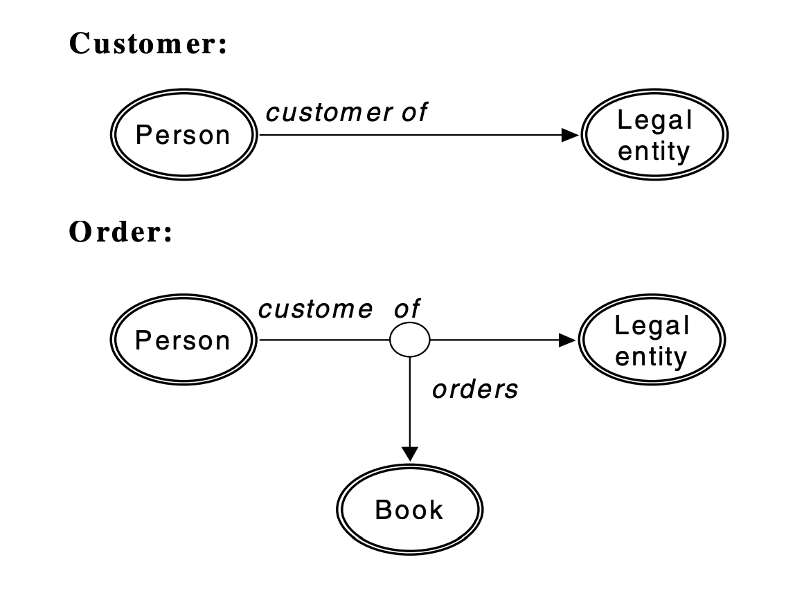
	- By
	  classifying real-world things as entities
	  and associations, the associative model
	  separates two ideas: on one hand, the
	  idea of something that has discrete,
	  independent existence, and on the other
	  hand the idea of the various ways in
	  which such a thing interacts with other
	  things. Each such interaction is a thing
	  in its own right, about which marketers
	  may want to record information. A
	  real-world association is represented as an
	  association between two other things,
	  each of which might itself be an entity
	  or an association.
	- The associative model distinguishes
	  entities and associations for a simple and
	  fundamentally important reason: data
	  models constructed by following this
	  principle are closer to reality, and thus
	  easier to comprehend, better able to
	  respond to change, and better able to
	  integrate readily with other data models.
	  Such data models will serve users better
	  and prove more cost-effective, in both
	  the short term and, more importantly,
	  over the long term.
	- Specifically, the relational model does not distinguish entities and associations, on the grounds
	  that both entities and associations have, in Codd’s words, immediate properties. Items and links
	- An associative database comprises two data structures:
		- set of items, each of which has a unique identifier, a name and a type.
		- a set of links, each of which has a unique identifier, together with the unique identifiers of three other things, that represent the source, verb and target of a fact that is recorded
		  about the source in the database. Each of the three things identified by the source, verb and target may be either a link or an item.
	- 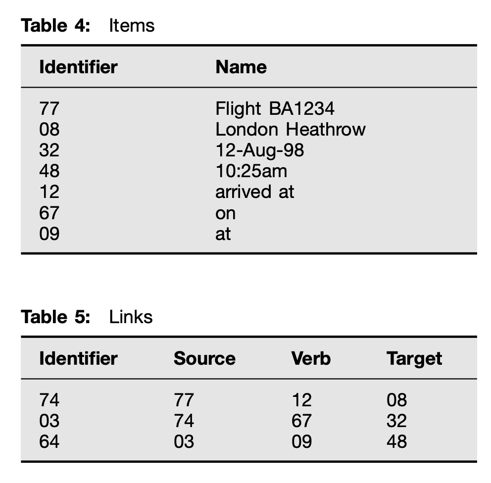
	- How the associative model would use
	  these two structures to store the piece of
	  information ‘Flight BA1234 arrived at
	  London Heathrow on 12-Dec-98 at
	  10:25am’ is now described. There are
	  seven items: the four things ‘Flight
	  BA1234’, ‘London Heathrow’,
	  ‘12-Dec-98’ and ‘10:24am’, and the
	  three verbs ‘arrived at’, ‘on’ and ‘at’.
	  Three links are needed to store the data.
	  They are:
	  Flight BA1234 arrived at Heathrow
	  Airport
	  . . . on 12-Aug-98
	  . . . at 10:25am
	  Each line is one link. The first link uses
	  ‘arrived at’ to associate ‘Flight BA1234’
	  and ‘Heathrow Airport’. The second link
	  uses ‘on’ to associate the first link and
	  ‘12-Aug-98’. (A link that begins with an
	  ellipsis ‘...’ has the previous link as its
	  source.) The third link uses ‘at’ to
	  associate the second link and ‘10:25am’.
	- When writing links, instead of using
	  new lines to show each link, sometimes it is more convenient to keep going in a
	  long string. When this is done, brackets
	  are put around each link. Written this
	  way, the example would look like this:
	  ((Flight BA1234 arrived at Heathrow
	  Airport) on 12-Aug-98) at 10:25am
	- 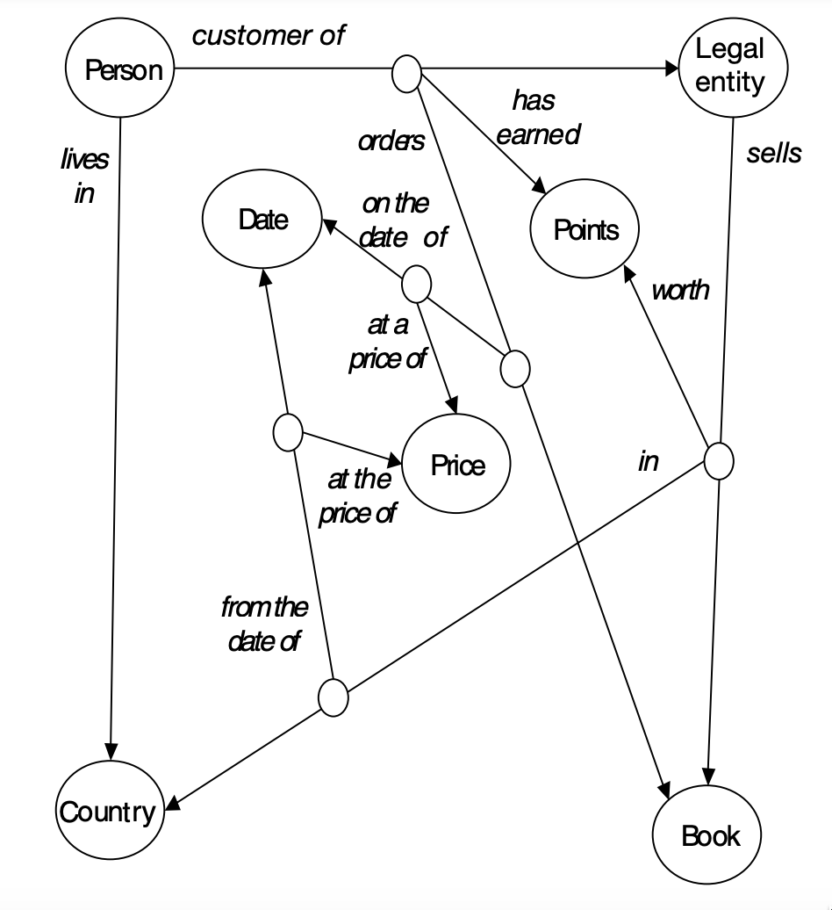
	- 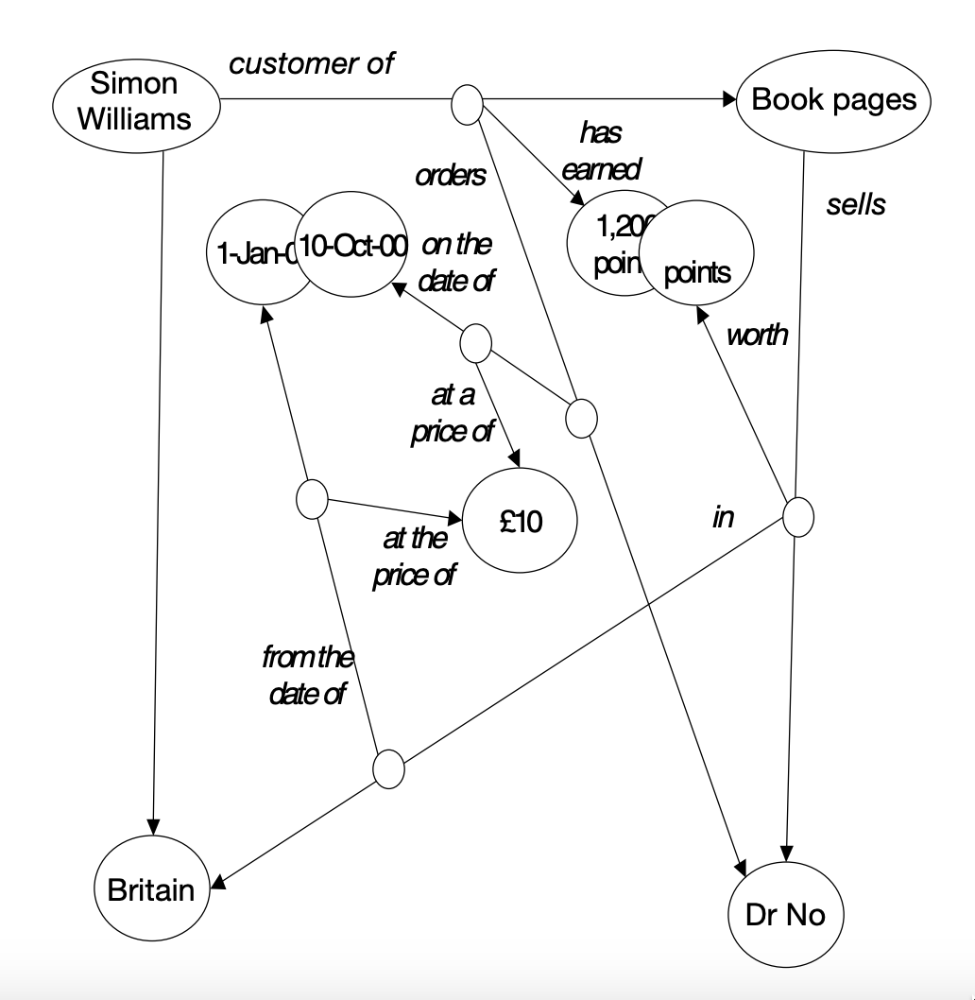
	- 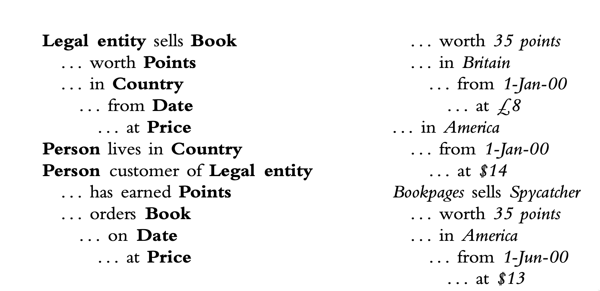
	- 
	- 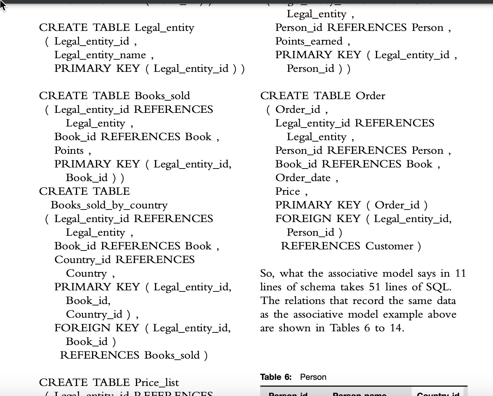
	- Relational model disadvantages
		- ==One program, many applications==
		  Every relational program must be
		  designed around the tables that it uses.
		  As seen earlier, each new relational
		  application needs a new set of programs
		  written from scratch, because a program
		  written for one application cannot be
		  reused for another. Every table is
		  structured differently — that is, it has
		  different columns and column headings
		  — and the programs are designed around
		  the tables. How does the associative
		  model avoid this?
		  The information that describes how
		  data are stored in a database is called
		  ‘metadata’. Metadata describe the
		  structure and permitted state of data in a
		  database. Structure is concerned with the
		  different types of data that a database
		  may contain, and how the different types
		  of data interrelate. State is concerned
		  with the rules which govern the values
		  that data items may take, both
		  individually and with respect to other
		  data items. The metadata that describe a
		  single database are called a schema.
		  In a relational database, a schema
		  comprises the names of tables and
		  columns and the domains on which the
		  columns are based, information about
		  which columns are keys, and ‘referential
		  integrity’ rules that describe how some
		  data items depend on others.
		- Every program that uses a database
		  needs a schema to tell it how the data in
		  the database are structured. Programs
		  obtain schemas in two ways: either the
		  schema is known before the program is
		  written and the program is designed to
		  use the specific schema, or the program
		  reads schemas as it goes and is able to
		  interpret and act on anything that it
		  finds. A program that is written to use
		  one predetermined and unchanging
		  schema is called ‘unicompetent’. A
		  program that is able to use any and
		  every schema is called ‘omnicompetent’.
		  A good example of an omnicompetent
		  program is a spreadsheet application such
		  as Excel or Lotus 123.
		  It is difficult to write omnicompetent
		  programs for relational databases.
		- With the exception of a few
		  specialised tools such as report writers,
		  the overwhelming majority of application
		  programs that access relational databases
		  are unicompetent.
		  By contrast, the associative model
		  stores all data and schemas side-by-side
		  in the same simple, consistent form. This
		  means that it is easy to write
		  omnicompetent programs using a form of
		  abstract programming called ‘metacode’
		  that is part of the associative model.
		- Metacode allows programs to be written
		  that can operate on any and every
		  business entity without modification.
		  This substantially reduces the number of
		  new programs needed for a new
		  application. Also, as more applications are
		  deployed, the proportion of new
		  requirements that can be fulfilled by
		  existing programs increases, so the
		  number of new programs that have to be
		  written decreases still further. Today,
		  programmers continually have to
		  re-invent the wheel by rewriting familiar
		  programs to work with new tables.
		  Breaking this cycle will significantly
		  reduce the cost of computing.
		- ==Different behaviour for different
		  needs==
		- Relational
		  database applications can only be tailored
		  to the needs of individual customers via
		  parameterisation or customisation. The
		  first route leads to increasing complexity,
		  and the latter makes the upgrade path
		  more difficult. Both options fail
		  adequately to meet the needs of ASPs.
		  The associative model provides a natural
		  and unobtrusive way to solve these
		  problems that does not compromise
		  functionality or increase complexity.
		- Each user’s view of an application can
		  be tailored through a profile. An
		  associative database comprises a number
		  of chapters. A user’s view of the database
		  is determined by their profile, which contains the list of chapters that they
		  currently see. During the development of
		  a schema, designers are free to place
		  elements of the schema into any chapter
		  that they choose, and that piece of the
		  schema will be operative or inoperative
		  depending on whether the chapter
		  containing it is included or excluded
		  from the user’s profile. Similarly, during
		  execution, changes that the user makes
		  to the database may be directed into any
		  of or several of the chapters in the user’s
		  profile.
		- Chapters may be added to
		  and removed from a user’s profile at any
		  time, without deleterious effects on the
		  integrity of the database. Of course, the
		  user’s view of the database may be
		  radically altered by the addition or
		  removal of chapters to or from their
		  profile, and the ability to amend profiles
		  is a privileged operation to which many
		  users would not be authorised
		- 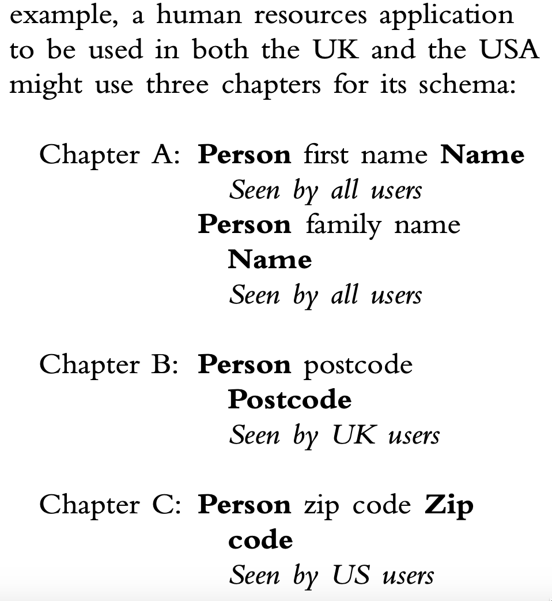
		- The profile mechanism works
		  for two reasons:
		  — the associative model is highly
		  granular. Individual items and links exist in peer networks in individual
		  chapters. When chapters are collected
		  together in a profile, the items and
		  links in each chapter simply form a
		  wider peer network, and chapters
		  become transparent. When links are
		  created between items in different
		  chapters, if either the source or target
		  of the link is not visible in the
		  current profile, neither is the link
		  itself
		- changes and deletions are effected
		  solely by additions to the database. A
		  deleted association is not physically
		  removed, but acquires an association
		  (a ‘stop link’) which asserts that it is
		  deleted. Thus the association may
		  appear to be either deleted or not
		  according to whether the chapter
		  containing the stop link is part of the
		  user’s profile. Similarly, a renamed
		  entity is not physically renamed, but
		  acquires a link to its new name. Thus
		  the new name or the old name is
		  presented according to whether the
		  chapter containing the new name is
		  part of the user’s profile.
		- an application is to be used by both
		  English and French-speaking users. It
		  is developed in English. A new
		  chapter is added to the translator’s
		  profile as the recipient for all schema
		  changes made by the translator. The
		  translator then changes the name of
		  every schema element to its French
		  equivalent. Users who wish to see the
		  application in French include the new
		  chapter in their profiles: users who
		  wish to see it in English omit it
		  — a salesperson using a CRM
		  application wishes to record the
		  birthdays of their key customers’
		  children. A new chapter is created
		  containing only the schema changes
		  necessary to implement this
		  functionality, and only the salesperson
		  who requires the functionality will
		  see it
		  — a package vendor is developing a new
		  release of its package. The developers’
		  profile includes the chapters
		  containing the current release, plus a
		  chapter for the new release into
		  which schema changes are directed.
		  To install the new release, customers
		  simply add the new chapter to their
		  existing profiles. To run the two
		  releases in parallel for a test period,
		  customers use a new chapter to
		  capture data that instantiates types
		  contained in the new release and
		  work normally. They can flip-flop
		  between the old and new releases by
		  moving the two new chapters into
		  and out of their profile to assess the
		  impact of the new release
		- ==Different information for different
		  customers==
		- The relational model limits the
		  marketer to storing the same data about
		  each customer because it is uneconomic to set aside a column in every row to
		  store a piece of information in just one
		  row, and because a programmer needs to
		  modify the programs every time a new
		  column is added.
		- Under the associative model, pieces of
		  information about a customer are
		  arranged vertically as a list of sentences
		  instead of horizontally as the columns of
		  a row in a table. So 15 sentences can be
		  kept about one customer and ten about
		  the next without implying that the
		  second customer has five sentences
		  missing. Unlike the relational model,
		  there is no need to keep five null values
		  for the five ‘empty’ columns: there are
		  simply five fewer sentences. Addresses
		  provide an example of how the
		  associative model wins. Addresses may
		  have one or two or three lines before
		  city, state or county and zip or post
		  code. In a relational database, the
		  number of columns allowed for address
		  lines is always a trade-off between clarity
		  and waste. If three columns are allowed
		  and a customer has only one address line,
		  two nulls must be stored to say that the
		  second and third lines are missing. If one
		  column is allowed and the customer has
		  three address lines, chances are their
		  deliveries will go astray. In an associative
		  database, each customer simply has the
		  correct number of address lines: if a
		  customer has two address lines, two are
		  stored, and the third is not in any sense
		  missing: it simply does not exist.
		- When it is decided to store a new piece
		  of information about a certain type of
		  entity, the marketer simply adds to the
		  schema. The need to modify programs
		  each time a column is added then goes away: the new information can be
		  immediately understood and processed by
		  the omnicompetent programs
		- 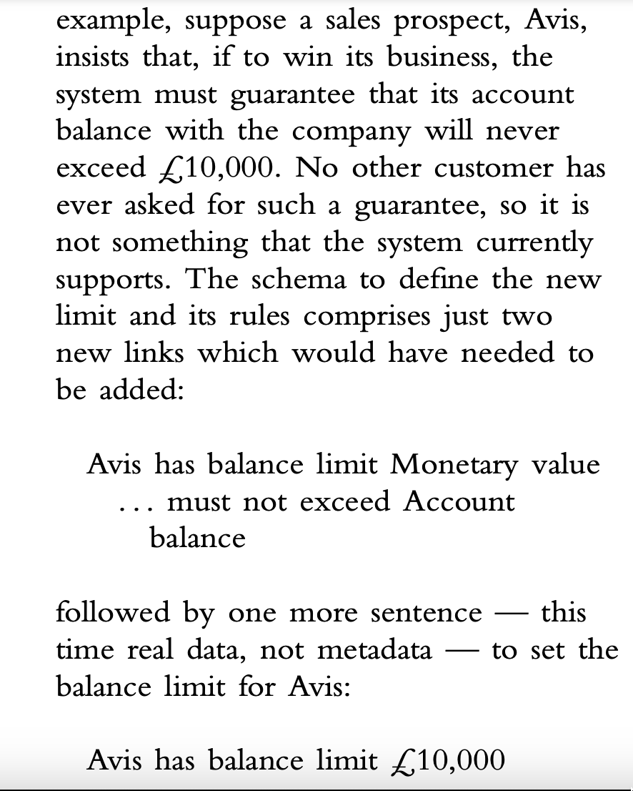
		- The metacode in the programs already
		  understands ‘Monetary value’ and ‘must
		  not exceed’, so the task is done and Avis
		  can be given the guarantee that it needs.
		  In the relational world, an enhancement
		  like this for a single customer would
		  simply be uneconomic, so the Avis
		  account would be lost. In the associative
		  world, a moderately sophisticated user
		  could readily use Sentences in this way
		  to solve their problem and win a new
		  customer without any need to involve a
		  programmer
		- ==Many databases, one data world==
		- Associative databases may be readily
		  combined. Combining two relational
		  databases is like trying to combine two
		  books written in different languages:
		  before starting on the useful work one of
		  them has to be translated into the
		  language of the other
		- before even beginning to combine two
		  different relational databases matching
		  tables and columns must be found and
		  compared, differences resolved, and
		  decidsions made about what to do about
		  tables and columns that simply do not
		  match. By contrast, combining two
		  associative databases is like putting
		  together two documents both written in
		  English on the same word processor.
		  One can immediately be added to the
		  other with no preparation. The result
		  will be perfectly comprehensible, and
		  will answer more questions than did
		  either text on its own. If the two
		  databases are to remain as one, the user
		  can then can edit and enhance the
		  combined whole to establish common
		  definitions and remove ambiguities
		- Every associative
		  database has the capability of being
		  self-defining: that is, of carrying its own
		  definition within itself. Where two
		  databases use dissimilar names — perhaps
		  in different languages — for identical
		  types of data or individual data items,
		  users can associate equivalent types and
		  data items to resolve ambiguity simply by
		  adding extra links:
		  Customer is equivalent to Client
		  Delivery address is equivalent to
		  Shipping address
		  BT is equivalent to British Telecom
		  Entity types that perform essentially the
		  same function will usually have different
		  sets of data items in each database, but,
		  unlike the relational model, the
		  associative model does not insist that all
		  entities of one type have the same set of
		  data items and does not allocate space for
		  missing data items, so this is not an issue
		-
-