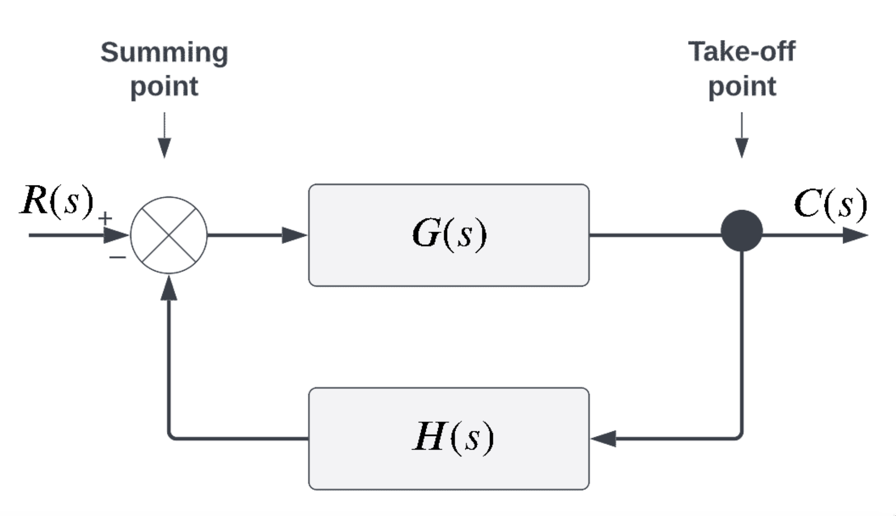

- [[tokenomics]] [[token engineering]] Module 2
	- The first step in the token engineering process is the discovery phase.
	- Seven steps for translating the client's vision into a workable form:
		- Defining the System **Goals**
			- Each system has a **design objective**, a *raison d’etre* that drives its creation. All subsequent phases of our work will be focused on achieving this objective, so we need to be very sure that we know what we are aiming for.
			- After we have identified the overall objective, we can then define specific system goals. These goals help make our objective more concrete and measurable. Often, there will be several different system goals, some of which are in tension with each other, and we will not be able to optimize all of these goals simultaneously.
			- It helps to locate these goals in various categories (like e.g. technical, economic, etc.) to understand the trade-offs between them. Doing so will lead to recommendations and guide decision makers through the process. Discussing the system at these levels also allow us to look for parallels that exist in other projects or domains, allowing us to borrow these ideas for our projects.
			- Before we can build the technical parts of the system, we need to have a clear mental model of how the component parts interact.
			- Determining the ==**design objective**== for a system is a crucial first step. In the context of cryptoeconomic systems, the objective is to build an infrastructure for economic interactions between agents so that the system will achieve the objectives of all participants over the system’s full life cycle.
			- Generally speaking this objective has to guide the project in the right direction and make it aligned with the system’s mission or purpose.
			- After defining the overall objective, we define **==system goals==**.
			- Typically, the system goals are more concrete than the overall objective, which can be somewhat abstract. Often, there will be several different system goals, and it may not be possible to simultaneously fulfill them all.
			- Since Cryptoeconomic systems are Cyberphysical Systems - connecting humans and technology - there are two natural categories of goals: technical and economic.
				- **Technical goals** have to do with an ecosystem’s functionality, interoperability, and technical infrastructure. A cryptoeconomic system will have limitations based on both hardware or software components, including things like computing precision in different coding languages, as well as the physical restrictions of memory on various storage devices. Here the main target is to guarantee that the technical infrastructure of the system can support the mission over the full life cycle of its components. Sometimes these issues will be of a very technical nature, requiring a high degree of intensive troubleshooting.
				- **Example of a technical restriction: **For example, working on Ethereum, we have limited storage space for single variables. In Ethereum, numbers can be stored as uint256, that is, positive integer numbers up to 2256−1. If the system we are building overshoots this limit, it can cause serious problems. Engineering will work to avoid or mitigate this issue.
				- **Economic goals** are related to the financial aspects of the system. A system has to be affordable in its operation compared to market alternatives (cf. costs of cash payments vs digital transactions),. The system it has to be economically appealing to all its participants.
				- First, it is a good idea to look at what economic incentives and foundations will attract what participants. As the same parameters and its properties will affect different participants differently, a balance has to be found for where the accumulated utility is the highest (which imposes the questions: *what is aggregated utility and who gets to decide this?* This is related to the idea of Economic theory on social choice).
				- For instance, in an automated market maker, we would want to have a stable trading fee which will engage liquidity providers while not scaring off traders. Liquidity providers might even see lower trading fees as an advantage, since a larger trading volume will generate more returns.
				- Second, the **business economics** of the system need to be calculated in order to see how much it costs to operate the system. Each interaction on the blockchain incurs gas fees, since calculations have to be performed and smart contracts have to be executed.
			- ==Stability== is also a desired economic goal in many cases. If the system reacts too strongly to changing market conditions and shocks, it may become unusable. For the system to survive economically, it is crucial that there are control policies that can bring it back to favorable conditions.
			- When we set goals, we also need to think about how we will know if those goals are met. It is common to define ==Key Performance Indicators (KPIs)==, which are numerical variables whose measurements should tightly track into the system being designed.
			- **How Token Engineers determine the system's goals. **
				- Understanding **Stakeholders**: We communicate with stakeholders to get a clear picture of their view of the system.
					- Talk to Stakeholders
					- Ask Them Questions
						- **Open Questions**: have no predefined answers. e.g. "How important is speed to your system?"
						- **Closed Questions**: have limited options. e.g. "How many types of tokens should be allowed in a pool?"
					- Another useful strategy is to find metaphors for the different modules and parts of the ecosystem. For instance, we might think of the system as a machine, culture, organism, or political system.
					- It can be helpful to compare an Automated Market Maker to a traditional money exchange, a metals market, or a balance scale.
					- Another common step is to evaluate the market and competitors - who they are and what they do. One common framework is known as *SWOT*
					- Another common framework for this type of analysis is *Porter's Five Forces*, which looks at:
						- the threat of new entrants
						- the bargaining power of buyers
						- the threat of substitutes
						- the bargaining power of suppliers
						- the rivalry among existing competitors.
				- Understanding the **System**: We understand the system when we can communicate it in concrete "real-world" terms.
				- Understanding the **Market**: We use analytical tools (e.g. SWOT, Five Forces) to get a feel for the market landscape.
			- Several specific goals for an **Automated Market Maker**
				- Economic Goal => Low Cost of Operation
				- Economic Goal => Low Market Risk
				- Technical Goal => Reliable Operation
				- Technical Goal => Secure Code
				- Agent Goal => Traders desire cheap and effective token exchange with low price slippage
				- Agent Goal => Liquidity providers want the value of fees earned to exceed any impermanent loss
			- Often, the **metrics** are not clear from the beginning but emerge during designing the system. Despite that, it is important to start with some good ideas about possible metrics and think about how they can be quantified and measured.
		- Defining the System **Requirements**
			- The  requirements will influence many other aspects of system design, including: **states****,** **eligible actions****, *mechanisms*, and**** parameters**
				- 
			- To derive the requirements, we need a precise statement of what **functionalities** the system needs, and what **properties** are required for these functions.
			- We distinguish between different types of **properties**:
				- **variable** properties (such as constraints), such as requiring  the amount swapped by the trader be less than or equal to the trader’s asset holdings
				- **invariant** properties (such as requiring the prices of assets after an add liquidity event have to be the same as before the event). Often, invariant properties are expressed through mathematical equations.
					- One type of invariant function would be a constant sum market maker, where x and y would always be related by the equation x + y = T, for some constant T.
						- 
					- Another type of invariant curve is represented by requiring that the product of the amounts of assets is held constant.
						- 
		- **Stakeholder** Definition and Analysis
			- Laying the foundation of a new ecosystem relies on a thorough understanding of all **stakeholders** who impact the system, both internally and externally.
			  This analysis typically leads to  questions such as
				- For whom are we designing the system?
				- What is it that they desire?
				- What will these agents do if put in this environment?
			- Two key aspects:
				- the **underlying incentives** behind agents' choices and decisions, leading to
				- **potential system evolution** resulting from the aggregated actions of individual agent.
			- We can also think about:
				- what **incentives** we can offer the agents so their behavior will help guide the system's evolution towards desired outcomes
				- **ways to improve the general system performance**, as well as to **reveal hidden value added** and **new opportunities**
			- A starting point is to determine **all stakeholders**, whether they are directly or indirectly influencing operations. To do this, we can use the [ecosystem members and agents diagram](https://github.com/villeeloranta/ecosystem-design-toolkit/blob/master/aalto_ecosystemdesigntoolkit_v01jan20_200122v1_ve.pdf)
				- 
			- Once all the stakeholders are identified and mapped, we need to do a detailed profiling of the roles
				- The first step is to **group stakeholders with similar attributes together** to define their role.
				- Then, we can take a closer look at them using templates such as the one shown in the figure above, which can be used to **identify the characteristics, assets and capabilities** of each role.
				- Additionally, we can **consider the incentives and motivations** associated with each role. This will allow us to **pin down the key drivers behind the incentives** of each role and **analyze the value transfer** between stakeholders in the next stage.
				- In the process of **creating multiple member profiles**, we generate a strong understanding of the characters in the system.
				- This step of the discovery can additionally be used to ***create *new roles** which can help to bring the ecosystem in balance, or align it with its mission.
				- Asking: *`What roles are necessary to fulfill the requirements while staying in in line with the system mission?"*  helps to close the gaps in the existing structure.
			- **Roles**
				- In our context we discuss roles as the functions that can be undertaken by different agent. A role makes it possible to combine attributes such as:
					- **incentives**
					- **eligible actions**
					- **goals and preferences** to facilitate understanding of different classes of entities in the system.
				- **Agents vs. Roles** => An agent can play various roles in a system. Conversely, many different types of agents may be capable of fulfilling the same role.
				- Example: **Liquidity Provider Role in an AMM**
					- **Actions** => provide liquidity in return for pool shares, and redeem owned pool shares in exchange for pool liquidity
					- **Goals & preferences** => allocate their capital most efficiently across the market matching their risk-reward profile
					- **Incentives** => high trading volume and high trading fees promise bigger returns. Liquidity mining rewards are an  additional incentive for liquidity provision.
				- ### Incentives and Disincentives
					- In a system which uses proof-of-stake, a holder of 51 percent of network tokens could record a fallacious block on the blockchain. The security of a proof-of-stake mechanism relies on creating incentives and disincentives so this do not happen.
					- **Technical Disincentive** - Collateral Function
					  The first mechanism is technical: the collateral function associated with staking.
					- **Economic Disincentive** - Sheer Cost
					  The second disincentive is economic: the acquisition of 51 percent of tokens will be expensive.
					-
		- Definition of **Interactions** and **Value Transfers**
		  collapsed:: true
			- Once we have a solid overview of the members in the system, we look at **how they interact with and transfer value** to each other.
			- [Ecosystem Motivation Matrix](https://github.com/villeeloranta/ecosystem-design-toolkit)
				- **We assume that all members are contributing something positive to the system -- if they are not, they should be removed. **
				- **The members are placed in both rows and columns in the same order, generating a grid. Each box contains the motivation from the member in the column towards the member in the row.**
				- 
			- **Mapping Workshop** is another method for gaining insight into the connections and interactions between actors
				- Identifying all **possible stakeholders** => Using a variety of ideation methods, we ensure we have a comprehensive list of all stakeholders that will interact with our system.
				- Identifying Key Stakeholder **Properties** => Defining and analyzing the stakeholders, their roles, and their relationships to each other.
				- **Whiteboard** the system as a pathway/network => Here, we draw and position the present relationship and prioritize them based on impact.
			- Using information from the Stakeholder Mapping, a Token Engineer can begin to formulate a ==**system of value exchange.**==
				- **Use results from Value Mapping Workshop**
				- **Explore how each actor benefits from the system.** => This can be through both monetary and non-monetary rewards. The idea is that everyone in the ecosystem should benefit.
				- **Illustrate the value exchanges between various stakeholders.** => It may help to use tactile and visual representations, such as whiteboarding and post-it notes.
				- **Look for Other Sources of Growth and Revenue** => This is an opportunity to see additional revenue streams beyond what we've initially identified.
				- **Make a Comparative Analysis** => Consider both direct competitors and the whole market to determine the strengths and weaknesses of existing systems.
				- **Hypothesise, design, iterate, and refine an initial prototype of the system.** => This will help the team realise if the system is economically and technically viable in the long term.
				- **Find the unique core of the system** => What does this product have that makes it unique? What is its foundational idea or concept? These are the things that can be emphasized to promote market success.
			- The next step is to design an ==*incentive structure*== for the system. The Token Utility Canvas helps in designing that structure.
				- **Connecting Goals to Incentives** => At this point, we as the system designers have laid the foundation. 
				  We know
					- the stakeholders,
					- their potential roles
					- how value can be transferred between them
					- what influences their decisions.
				- Now, we need to figure out how to use these factors to trigger specific actions and behaviors that we view as desirable. In other words, we want to design an* incentive structure* for the ecosystem.
				- ==Network design== => Our goal in using the Token Utility Canvas is to look at two aspects: the *market layer* and the *ledger layer.*
					- **Market layer** => This is where the token is used to create an efficient ecosystem, with participants  incentivized towards desired behaviors and disincentivized away from undesired behaviors.
					- **Ledger layer** => This layer is focused on what is happening on the blockchain and how to ensure that secure and inexpensive transactions can be executed and recorded.
				- **Token Utility Canvas** helps to answer four important questions for both the  market layer and ledger layer:
					- **1. What roles are different participants taking in each layer?**
					- **2. What undesired behavior can occur on each layer?**
					- **3. What are the desired behavior of different roles at each layer?**
					- **4. What incentives can be used on each layer to promote the desired behaviors?**
				- 
			- #read [Token Ecosystem Creation](https://outlierventures.io/wp-content/uploads/2021/06/Token-Ecosystem-Creation-Outlier-Ventures-PDF.pdf) by Outlier Ventures
		- **Metrics** Definition and Analysis
		  collapsed:: true
			- How do we know if the system is *actually doing what we want it to do*? **Metrics** are a key tool in tracking how well the system is meeting its goals.
			- There is no one right metric, or even one right process for determining metrics.
			- ### Some Metrics for AMMs
				- Capital Efficiency => measures how effective a given quantity of assets is with respect to the achievement of desirable performance metrics of an AMM (slippage, impermanent loss). An AMM1 is said to be more capital efficient than AMM2 if with the same amount of assets lower impermanent loss and lower slippage can be obtained.
				- **Return on Investment.** => This is the amount of gains made by traders, usually measured monthly or yearly.
				- **Impermanent Loss.   ** => Here we track the difference between providing the liquidity to a pool vs. simply holding the two assets in a wallet.
				- **Slippage. ** => The difference between the quoted price and the actual price as determined by a trade - is considered by traders before making a trade at chosen exchange.
				- **Trading Volume.  ** => The total value of all trades made during a given period (e.g. one day).
		- **Causal Relationships** and **Systems Thinking**
		  collapsed:: true
			- **An important step in our system design process is to *identify causalities*.** This important process leads to an understanding of **how different inputs or events will influence other parts and the overall state** of the system, giving strong intuition about **how the states may change over time.**
			- How can we clearly **define these causalities?**
				- In systems thinking, a system is broken down into constituent parts, which are then connected by their relationships to one another. These relations can be modeled using a *causal loop diagram.*
					- A causal loop diagram consists of the **variables in the system, and their links to one another.**
					- We label an edge from one variable to another with a "+" if an increase in the first tends to cause an increase in the second, and use a "-" label for negative influences.
					- The diagram also represents whether there is a **positive or negative effect** between the variables and the overall polarity of the system.
					- 
				- #### Creating a causal loop diagram
					- Define **Variables** Present in the System => For each variable, we create a node (circle) representing that node
					- Assign **Arrows Between the Variables** => Arrows should go from the cause to the effect.
					- Determine **Sign of Cause** => Attach a sign (+/-) to every arrow, reflecting whether there is a positive or negative impact.
					- Recognize and Label **Feedback Loops** => Also put a sign in the middle of the diagram that represent the overall polarity of the feedback loop. A loop can be reinforcing or balancing.
						- This property is determined based on the amount of negative signs found in the loop.
						- An even number will mean that the loop is reinforcing, and an odd number means that the loop is balancing and will therefore stabilize itself.
					-
				- Like any tool, causal loop diagrams have **limitations**, and it's important to be aware of some risks:
					- 1. Using and trusting the diagram without testing and simulation.
					- 2. Failure to distinguish between information and non-information flow.
					- 3. They account only for the feedback and not the dynamics.
					- 4. Inability to represent system parameters, hidden loops, and non-linear relationships within the system.
			- #### Open and closed systems
				- In an **open system,** the inputs influence the outputs, but not vice versa.
				- In a **closed system,** the outputs can exert influence on the inputs, leading to feedback loops.  These loops are characterized in two types:
					- In a **reinforcing feedback loop**, one of the variables in the loop tends to increase or decrease in proportion to itself. This causes the system to move away from its current state, either through growth or decline.
						- 
					- The nature of these reinforcing feedback loops and their tendency to escalate need to be managed. This can be done through control policies, that aim to increase or decrease an effect.
						- 
					- **Negative feedback loops** instead have stabilizing effects, helping to reach the desired state of the system. While these have stronger resilience towards shocks, they can sometimes cause systems to oscillate.
					- One common pattern for balancing feedback loops is **oscillation**
						- **Sustained oscillating patterns** normally have one cycle per time period, repeated indefinitely. The pattern does not change. Here, equilibrium is never reached and the system will therefore proceed to oscillate.
							- 
						- **Dampened oscillation** occurs when a system is moving towards the a stable equilibrium state, which can occur through friction in physical systems and information smoothing in social systems.
							- 
						- The **exploding oscillation** displays an amplitude that increases over time, while the periodicity stays the same. As this behavior is *not sustainable*, it is typically *rarer in physical systems*; a system displaying exploded oscillation will eventually either *break down or return to a different type of oscillation.* *This behavior can be observed in social systems*, such as a nation alternating between increasingly extreme political candidates of opposite views in a sequence of elections.
							- 
						- **Chaotic oscillation** is characterized by its rather *random pattern* where both amplitude and time period are impossible to predict. This type of oscillation can be found in certain difficult-to-predict natural systems, such as the weather for a given locale.
							- 
			- **Causal loop** for an AMM
				- "As fees go up, ROI for Liquidity Providers will also go up, which will lead to more liquidity, which will lead to less slippage, which would tend to lead more to trading volume."
				- "As fees go up, trading volume will tend go down, which will lead to less ROI for Liquidity Providers, which will lead to less liquidity, which will lead to higher slippage, which will lead to less trading volume."
				- **On the one hand, Fees will decrease Trading Volume directly. On the other hand, Fees will tend to indirectly increase Trading Volume through the causal chain of Return on Investment, Liquidity, and Slippage. **
				- 
		- Identification of **Stocks** and **Flows** in the System
		  collapsed:: true
			- In addition to **Causal Loop Diagrams**, other types are **Stock-and-Flow** Diagrams and **Block** Diagrams.
			- #### Stock-and-Flow
				- In a typical diagram, stocks are represented by blocks or cylinders, with arrows representing flow into or out of the stock.
				- In general, a **stock** represents *how much we have of a given quantity*. A stock has **memory**. What is in a stock will never diminish or disappear without an outflow to another stock.  This can be considered a *law of conservation.*
				- **Flows** inform us how the quantity of stocks change over time through inflows and outflows. An **inflow** of stock refers to an accumulation or increase in stock while an **outflow** is the diminish of resources. The **difference** of these flows will determine whether the stock is increasing or decreasing over time.
				- The flows, or changes in the state, are triggered by **actions and mechanisms** present in the system. These can be performed by **users**, the **environment**, or the **system** itself.
				- Assets can flow through *state transitions.* The flows are changes happening in stocks, caused by user actions and followed by system mechanisms.
				- 
				- 
			- #### Block
				- **Block diagrams** are used to visualize control systems and provide comprehensive yet simple overview of the system. These diagrams serve as a summary of the system, as they provide information that can be used to define the state space and its transitions.
				- The main **components** of the block diagram are:
					- blocks
					- summing points
					- take-off points
				- Within blocks, **transfer functions** can be represented. These transfer functions theoretically model the output of (sub-)systems for all possible inputs.
					- Transfer Functions with **Input** and **Output**
						- If the **input** to a block is $X(s)$, and the **output** of the block is $Y(s)$, we can represent the transfer function $G(s)$ as the *ratio* $Y(s)/X(s)$. In other words, to find the output of a block, we can multiply the value of the input by its transfer function.
						- 
					- **Summing Points**
						- A summing point is represented with the ⊗ symbol and is used to represent an algebraic operation of the inputs. This can be *addition*, *subtraction*, or *both* depending on the polarity of the inputs.
						- A summing point has several inputs and one output. In the illustration, the input signals $A$ and $B$ are added to combine the signal Y. However, we could other situations, including
							- B incoming as a negative signal, producing $Y = A - B$, or
							- multiple signals combined, such as $Y = A + B + C$
						- 
					- A **take-off point** is a junction in the diagram where the same signal can be branched off in multiple directions. In this way the same signal can serve as input for different (sub-)systems represented as blocks.
						- 
					- Alternatively a take-off point can be put after block elements to *circle back* outputs into summing points before block elements. This creates **closed-loop systems.**
						- 
					-
				- 