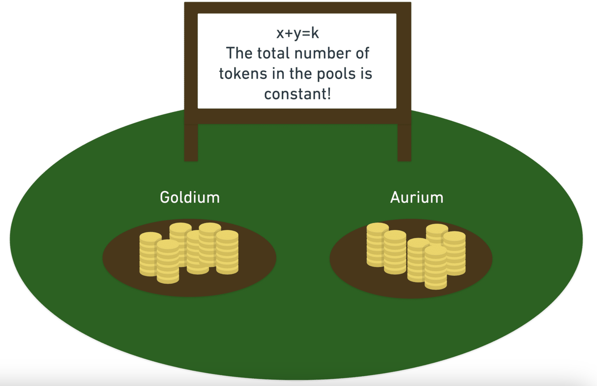

- [[tokenomics]] [[token engineering]] Module 3: Design Phase
	- In the **Discovery Phase**, we identified business requirements and the structure of our system. In the ==Design Phase== we *translate this information into precise mathematical variables*, so we analyze objectives and system optimization in a precise way.
	- The goal here is to find a mathematical **state space** representation of the system, which encodes all quantities in variables. These variables give a total description of the system at any moment in time.
	- Constant sum AMM
		- **The total number of coins in the pool is constant. Additionally, you express this in a simple way: ***x + y = constant.*** **
		- **Now, everyone knows exactly how to make their trades, without changing the conditions of the pool.**
		- 
		-