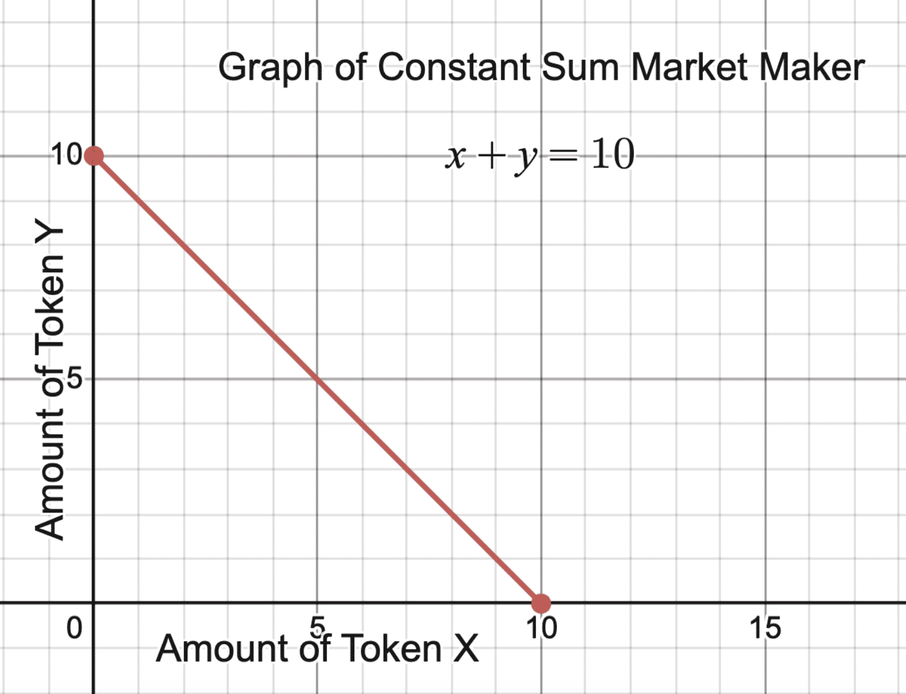
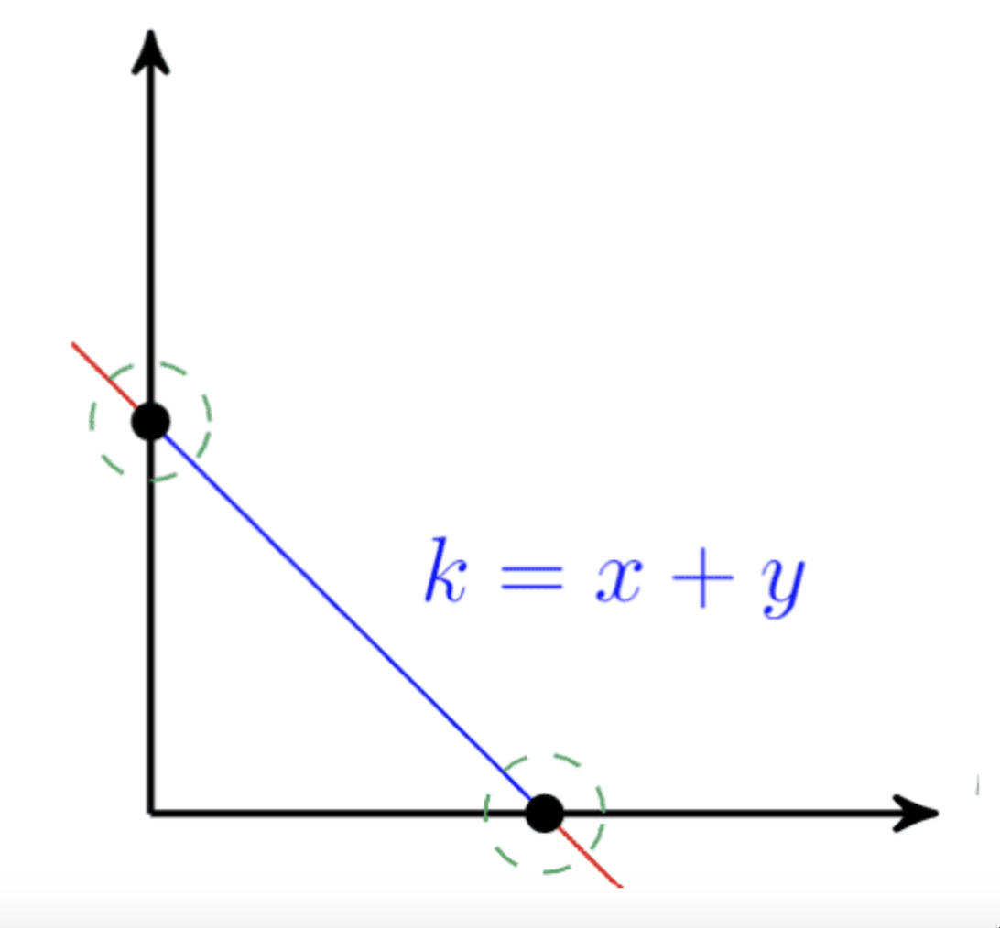
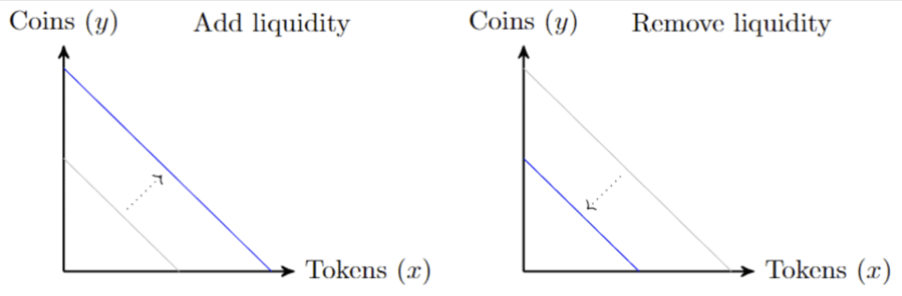
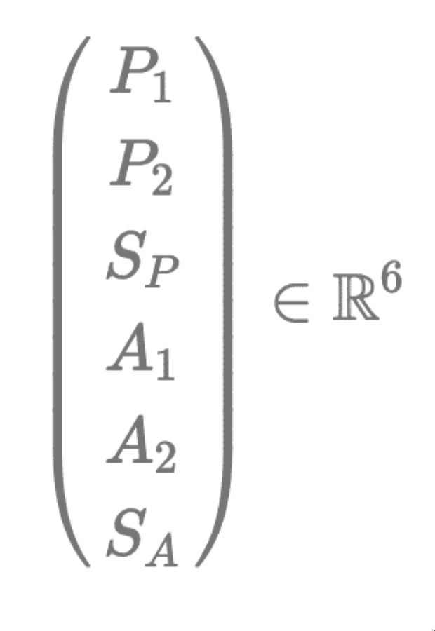
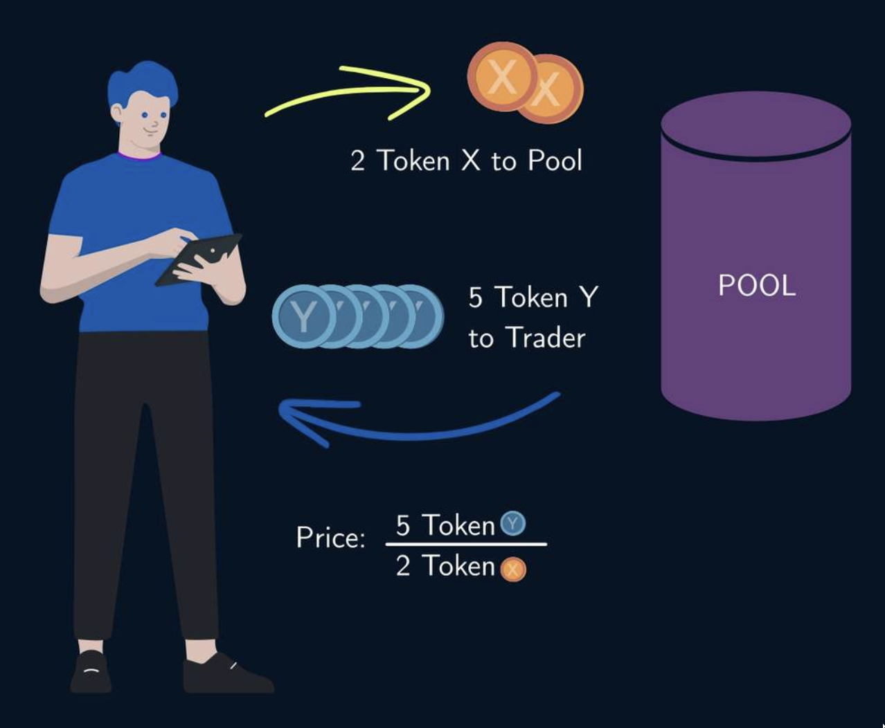
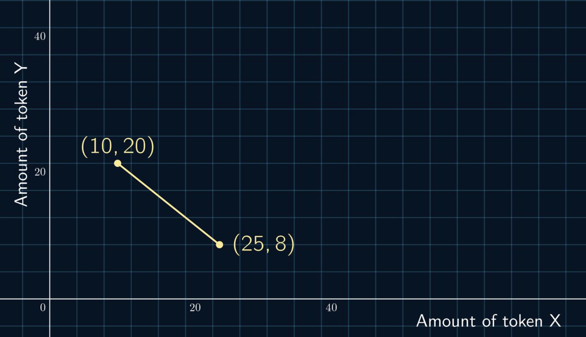
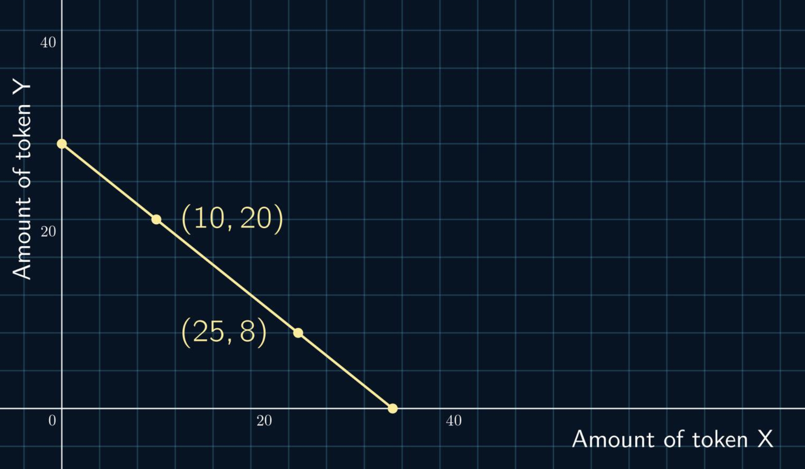
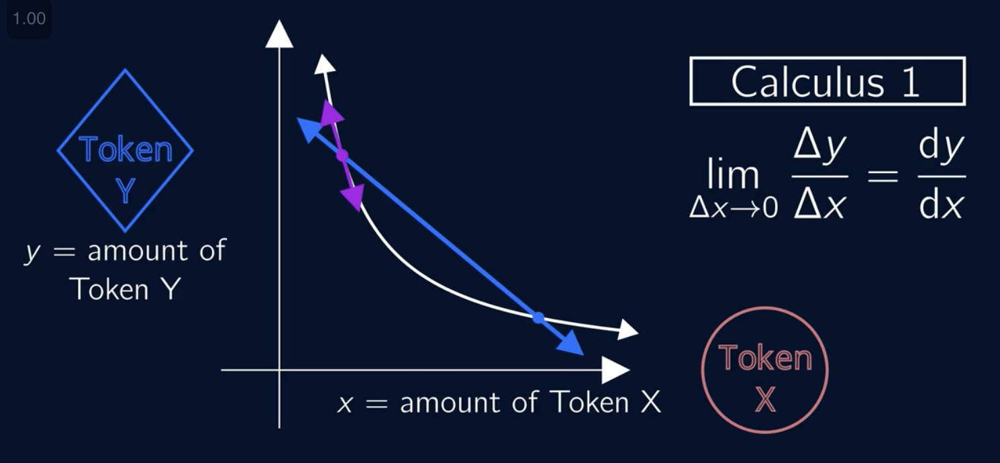
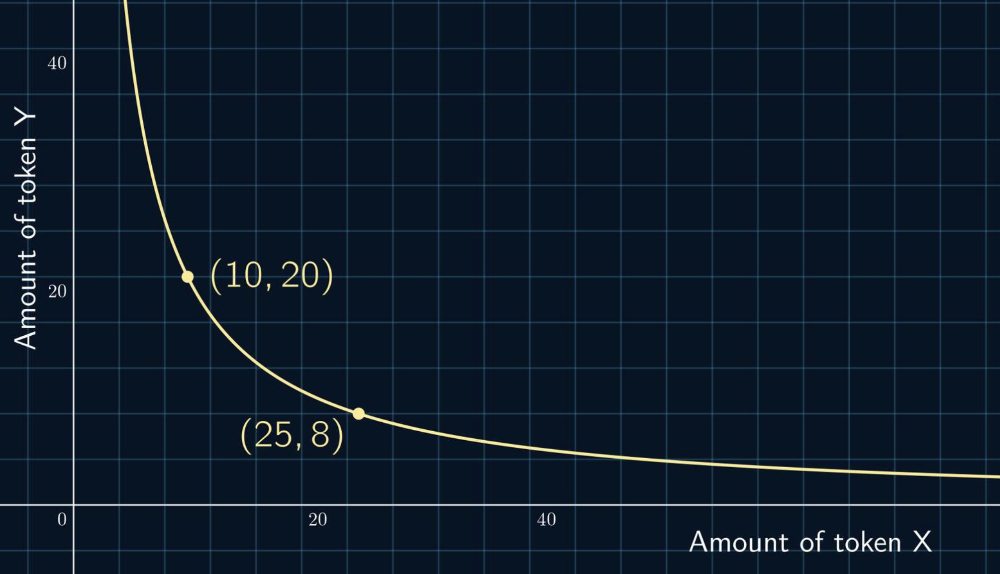

- [[tokenomics]] [[token engineering]] Module 3: Design Phase
	- In the **Discovery Phase**, we identified business requirements and the structure of our system. In the ==Design Phase== we *translate this information into precise mathematical variables*, so we analyze objectives and system optimization in a precise way.
	- The goal here is to find a mathematical **state space** representation of the system, which encodes all quantities in variables. These variables give a total description of the system at any moment in time.
	- ### Constant sum AMM
	  collapsed:: true
		- **The total number of coins in the pool is constant. Additionally, you express this in a simple way: ***x + y = constant.*** **
		- **Now, everyone knows exactly how to make their trades, without changing the conditions of the pool.**
		- 
		- In this case, $Token X = Aurium$ and $Token Y = Goldium$. The constant value is 10 for this graph; however, the constant value would depend on the initial amount of each Token.
		- Starting at 0 $Aurium$, you would have the full amount of $Goldiu$m, and vice versa. An increase of either of the two tokens will cause a decrease in the other quantity.
		- You realize you need to address the liquidity and demand issues;  that there is a fundamental problem with your rule, especially in the green circles (on the graph) when liquidity of one of the coins is almost empty. It's possible for the constant-sum system to run out of one type of coin, which makes large trades impossible if demand for one coin grows too large.
		- 
		- 
		- You realize something about the *curve* that you have drawn, the slope can be used to determine the price of the tokens. This is done by setting the *price* equal to the opposite of the *slope* of the curve.
		- What would we do if the demand for the coins changed, so that one Goldium and one Aurium were no longer equivalent? We could switch to a ***weighted constant sum market maker, ***of the form*** ax + by = constant.***
	- ### Variable Definitions and Prices
		- To implement our system, we need to have a *mathematical description* that reflects the *goals* and *requirements*.
		- In moving to a mathematical model, each variable corresponds to a measurable quantity in the real world. The variables we use should be represented by the stocks in our stock-and-flow diagrams. 
		  We need to keep track of things like
			- the amount of each token **in the pool**
			- the amount of each token **in each trader's wallet**
		- #### Variable examples
		  collapsed:: true
			- Let’s suppose we have Token X and Token Y **in the pool**
			  collapsed:: true
				- *x *to represent the amount of *Token X* in the pool
				- *y* to represent the amount of *Token Y* in the pool
			- We need to track the same things **for our trader**, so let’s use
			  collapsed:: true
				- $A_x$ for the amount of *Token X* the trader has in their wallet
				- $A_y$ for the amount of *Token Y* the trader has in their wallet
			- We also need to track the **total pool shares** held by the pool, and by the agent.
			  collapsed:: true
				- $S_P$, for the total shares *in the pool*
				- $S_A$, for the total shares held *by the agent*
			- Tracking these six variables makes the state of our system a six-dimensional real vector which lives in the real vector space $ℝ^6$ , which would also be called the *state space* of this system.
			- 
		- 
		- Price is a relationship between two assets. In a traditional market, when a trade is made, it defines the latest price.
		- #### Price as ratio
			- **A Trade Is Represented Between Two Points**
			  collapsed:: true
				- 
			- Suppose the pool initially consists of 10 Token X and 20 Token Y, and after a trade it consists of 25 Token X and 8 Token Y.
			- We can visualize this movement by drawing a line segment between the points (10,20) and (25,8).
			- The price (and the slope) would be -(20-8)/(10-25) = 0.8 Token X per Token Y.
			- **A Weighted Constant-Sum Market Maker**
			  collapsed:: true
				- 
			- It wouldn't be possible for this trade to happen in a true *Constant-Sum Market Maker*, since $10 + 20 ≠ 25 + 8$. However, it could happen in a Weighted Constant-Sum Market Maker, given by the equation $ax + by = k$, for the values $a = 4, b = 5, k = 140$.
			- **A Constant-Product Market Maker**
			  collapsed:: true
				- If this trade occurred in a Constant Product Market Maker, it would tell us that the curve is $x*y = k$. We can still visualize the slope using a line segment.
				- 
				- 
		- Therefore when you reach the places respectively one of the currencies would be depleted, you change your  equation: from $x+y=k$ to either $2x+y=k$ (if you are at the red point) or $x+2y=k$ (if you are at the green point)
			-