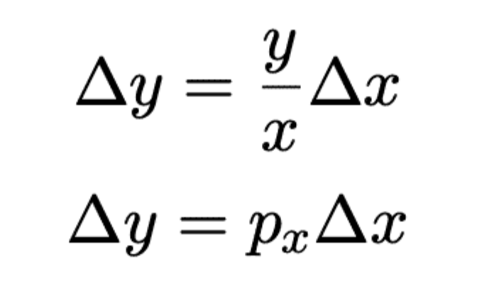

- [[tokenomics]] [[token engineering]] Module 3: Design Phase
	- In the **Discovery Phase**, we identified business requirements and the structure of our system. In the ==Design Phase== we *translate this information into precise mathematical variables*, so we analyze objectives and system optimization in a precise way.
	- The goal here is to find a mathematical **state space** representation of the system, which encodes all quantities in variables. These variables give a total description of the system at any moment in time.
	- ### Variable Definitions and Prices
		- To implement our system, we need to have a *mathematical description* that reflects the *goals* and *requirements*.
		- In moving to a mathematical model, each variable corresponds to a measurable quantity in the real world. The variables we use should be represented by the stocks in our stock-and-flow diagrams. 
		  We need to keep track of things like
			- the amount of each token **in the pool**
			- the amount of each token **in each trader's wallet**
		- #### Variable examples
		  collapsed:: true
			- Let’s suppose we have Token X and Token Y **in the pool**
			  collapsed:: true
				- *x *to represent the amount of *Token X* in the pool
				- *y* to represent the amount of *Token Y* in the pool
			- We need to track the same things **for our trader**, so let’s use
			  collapsed:: true
				- $A_x$ for the amount of *Token X* the trader has in their wallet
				- $A_y$ for the amount of *Token Y* the trader has in their wallet
			- We also need to track the **total pool shares** held by the pool, and by the agent.
			  collapsed:: true
				- $S_P$, for the total shares *in the pool*
				- $S_A$, for the total shares held *by the agent*
			- Tracking these six variables makes the state of our system a six-dimensional real vector which lives in the real vector space $ℝ^6$ , which would also be called the *state space* of this system.
			- 
		- 
		- Price is a relationship between two assets. In a traditional market, when a trade is made, it defines the latest price.
		- #### Price as ratio
			- **A Trade Is Represented Between Two Points**
			  collapsed:: true
				- 
			- Suppose the pool initially consists of 10 Token X and 20 Token Y, and after a trade it consists of 25 Token X and 8 Token Y.
			- We can visualize this movement by drawing a line segment between the points (10,20) and (25,8).
			- **Constant sum AMM**
			  collapsed:: true
				- **The total number of coins in the pool is constant. Additionally, you express this in a simple way: ***x + y = constant.*** **
				- **Now, everyone knows exactly how to make their trades, without changing the conditions of the pool.**
				- 
				- In this case, $Token X = Aurium$ and $Token Y = Goldium$. The constant value is 10 for this graph; however, the constant value would depend on the initial amount of each Token.
				- Starting at 0 $Aurium$, you would have the full amount of $Goldiu$m, and vice versa. An increase of either of the two tokens will cause a decrease in the other quantity.
				- You realize you need to address the liquidity and demand issues;  that there is a fundamental problem with your rule, especially in the green circles (on the graph) when liquidity of one of the coins is almost empty. It's possible for the constant-sum system to run out of one type of coin, which makes large trades impossible if demand for one coin grows too large.
				- 
				- 
				- You realize something about the *curve* that you have drawn, the slope can be used to determine the price of the tokens. This is done by setting the *price* equal to the opposite of the *slope* of the curve.
				- What would we do if the demand for the coins changed, so that one Goldium and one Aurium were no longer equivalent? We could switch to a ***weighted constant sum market maker, ***of the form*** ax + by = constant.***
			- The price (and the slope) would be -(20-8)/(10-25) = 0.8 Token X per Token Y.
			- **A Weighted Constant-Sum Market Maker**
			  collapsed:: true
				- 
			- It wouldn't be possible for this trade to happen in a true *Constant-Sum Market Maker*, since $10 + 20 ≠ 25 + 8$. However, it could happen in a Weighted Constant-Sum Market Maker, given by the equation $ax + by = k$, for the values $a = 4, b = 5, k = 140$.
			- **A Constant-Product Market Maker**
			  collapsed:: true
				- If this trade occurred in a Constant Product Market Maker, it would tell us that the curve is $x*y = k$. We can still visualize the slope using a line segment.
				- 
				- 
			- Therefore when you reach the places respectively one of the currencies would be depleted, you change your  equation: from $x+y=k$ to either $2x+y=k$ (if you are at the red point) or $x+2y=k$ (if you are at the green point)
			  collapsed:: true
				- 
			- **Constant product AMM**
			  collapsed:: true
				- 
	- ### Agent Actions, part 1 - Trading Tokens
	  collapsed:: true
		- In a previous section, we defined the variables that we would need to track for an Agent and a Pool in a constant-product Automated Market Maker system.
		  collapsed:: true
			- $x$: the amount of Token X held in the pool
			- $y$: the amount of Token Y held in the pool
			- $S_P$: the total supply of the pool tokens
			- $A_x$ : the amount of Token X held by the Agent
			- $A_y$: the amount of Token Y held by the Agent
			- $S_A$: the total supply of the pool tokens held by the Agent
		- From the variables tracked in the state space variables, we can calculate all other information we would want. Let's begin with the *stateful metrics.*
		  collapsed:: true
			- 
		- When an action changes the value of one of the variables, we use a subscript *"new"* to indicate the new amount of the variable.
		  Also, we use a Greek letter *delta Δ* in front of a variable name to indicate the change in that variable.
		- If the Agent sends 2 Token X to the Pool and receives 5 Token Y in exchange, we would have:
			- $x_{new} = x + 2, Δx = +2$
			- $y_{new}  = y - 5, Δy = -5$
		- Our task is now to identify the relation of these changes to one another. First we have to ensure that the **invariant and the prices behave in the way we want.**
		- When an agent makes a trade with the pool, swapping one token for another, it **does not impact the number of pool shares** in the pool or in the agent's wallet. A trade **will only affect the number of each token** that the pool and the agent each possess.
		- The key to understanding the mathematics of a token swap is to rely on the constant product formula $x•y = k$.
		- If we know $x, y, \Delta x$, we can derive $\Delta y$
		  collapsed:: true
			- We begin by setting the new product and previous product equal to each other, since they should each be equal to the invariant.
			- Then, we distribute algebraically and subtract the $xy$ term from both sides.
			- Our goal is to solve for $Δy$, so we isolate all of the $Δy$ terms to one side. Then we factor out $Δy$.
			- Finally, we divide to isolate $Δy$ as its own variable.
			- 
	- ### Agent Actions, part 2 - Changing Liquidity
		- The variables in the state-space representation of the system will change in response to agents' actions.
		- In a previous section, we defined the variables that we would need to track for an Agent and a Pool in a constant-product Automated Market Maker system.
			- $x$: the amount of Token X held in the pool
			- $y$: the amount of Token Y held in the pool
			- $S_P$: the total supply of the pool tokens
			- $A_x$ : the amount of Token X held by the Agent
			- $A_y$: the amount of Token Y held by the Agent
			- $S_A$: the total supply of the pool tokens held by the Agent
		- The process of adding tokens to a pool is referred to as *adding liquidity*, while the opposite process of removing tokens is referred to as *removing liquidity*.
		- In Uniswap, these processes are not allowed to change the prices *p**x* and *p**y*, but only increase or decrease the value of the invariant *k*.
		- Also, when an agent provides liquidity (Token X and Token Y) to the pool, new *pool shares* or *pool tokens* are minted, which the agent now owns.
		- **Changes in Liquidity Will Not Change the Price**
		  collapsed:: true
			- We assume that the change of Token X in the pool, that is $Δx$, is given and need to determine $Δy$ so that neither $px$ nor $py$ are changed.
			  collapsed:: true
				- 
			- We multiply both side of the equation for $px$ by $x + Δx$ to obtain the new equation on the left.
			  collapsed:: true
				- 
			- A centralized entity maintains the order book and matches the bid orders (offering buy prices) with the ask orders. When a match between two orders is found, the trade occurs.
			  collapsed:: true
				- 
			- If we know $Δx$, the amount of Token X being added, we need to set $Δy$ (the amount of Token Y being added) so that $Δy = px Δx$. This will make sure that the prices in the pool do not change, which is what we want.
			  collapsed:: true
				- 
		- **Changes in Liquidity Will Change The Invariant**
			- To get the new invariant $k_{new}$ , we notice that it must satisfy: $x_{new} ⋅ y_{new} = k_{new}$
			- We have $x_{new} = x + Δx$ and $y_{new} = y+ Δy$, so this becomes $(x + Δx) ⋅ (y+ Δy) = k_{new}$
			- Applying basic distribution, this becomes $x ⋅ y + y ⋅ Δx  + x ⋅ Δy+ Δx ⋅Δy = k_{new}$
			- Now we know that the original invariant was the product of the original amounts, so solving this: $k + y ⋅ Δx  + x ⋅ Δy+ Δx ⋅Δy = k_{new}$
			- Increases in pool liquidity will show up **geometrically in our curve as a decrease in the curvature of the curve.**
			  collapsed:: true
				- 
			- In addition to changing the invariant, adding or removing liquidity will result in the **minting or burning of pool tokens.**
		- **Minting and burning pool tokens**
		  collapsed:: true
			- In Uniswap version 2, not all pools contained ETH, so a different approach must be used.
			- The amount of new pool shares created for the agent who creates the pool and deposits $x_0$ Token X and $y_0$ Token Y is given by the square root of the product $x_0 • y_0$ .
				- 
			- If an agent is adding liquidity to a pool that already exists, then the ratio of pool shares created to existing pool shares will be equal to the ratio of new Token X being deposited to existing Token X in the pool.
			  collapsed:: true
				- 
			- Using the previous formula, we can calculate how many new pool shares there will be based on the current amount of Token X and the number of Token X being inserted (or equivalently, the amount of Token Y in the pool, plus the amount of Token Y being inserted).
				- 
	- ### Performance indicators
	  collapsed:: true
		- One advantage of giving a precise mathematical representation of the system is the ability to track other variables, such as slippage and impermanent loss.
		- An Automated Market Maker actually has two kinds of price: **spot** price and **effective** price.
		- The difference between effective price and spot price is called slippage. Slippage is undesirable for traders.
		- The trader would like to have as much liquidity in a pool as possible, since liquidity reduces slippage.
		- **Slippage Formula**
		  collapsed:: true
			- 
		- **Impermanent Loss**
		  collapsed:: true
			- It is common to speak of a *numeraire, *an underlying asset* *through which the value of other assets is measured* *(often fiat currency issued by a nation-state, such as US Dollars or Euros). If we agree on a numeraire for tracking value, we would simply do the simple calculation
			- *Value = (Numeraire Price Token X) (Amount Token X) + (Numeraire Price Token Y) (Amount Token Y)*
			- It simplifies our life a bit if we just assume that Token Y ***is*** the numeraire currency, in which case the Numeraire Price of Token Y is always equal to 1. This lets us simplify the formula for value of a pool.
			- Value = (Price Token X) (Amount Token X) + (Amount Token Y)*
			- We will write V for value and $p_x$  for the price of Token X (in terms of Token Y), giving us the very useful formula => $V = p_x · x + y$
			- 
			-
		- The traders don’t really like fees, since it costs the money. However, the fees attract liquidity providers, who reduce slippage, and this makes the traders happy. The question is – what is the right trade-off? How can we set up the fee so that it provides enough liquidity that the slippage is reduced to the trader’s satisfaction, without making the fee so high that the trader refuses to pay it?
		- 
		- Finding the right value for the fee is an **optimization problem**
	- ### Fees
		- Once we introduce fees into an Automated Market Maker, it changes the dynamics in an important way: the *constant* product formula $xy = k$ **no longer holds.** Instead, as x and y change due to incoming trades, we will need to calculate a new constant k each time.
		- **Example**
		  collapsed:: true
			- What the trader really cares about is how much of Token Y they will receive for their trade.
			  They will receive the change that is necessary to make the new amount of Token Y in the Pool be 400/295, so they receive 2 - 400/295 or approximately 0.644067796 Token Y.
			- For Comparison's Sake, in a pool with no fees, they would have received exactly 2/3 (approximately 0.666666 coins). They've lost about 0.02 Token Y by trading with a Pool that has a 5% fee.
			- 