- # Что такое венчурный фонд и как он работает?
  collapsed:: true
	- https://www.youtube.com/watch?v=MhuG_K-Crh0
	- https://t.me/ask_vc_analyst/22
	- 
	- 
	- 
	- 
	- 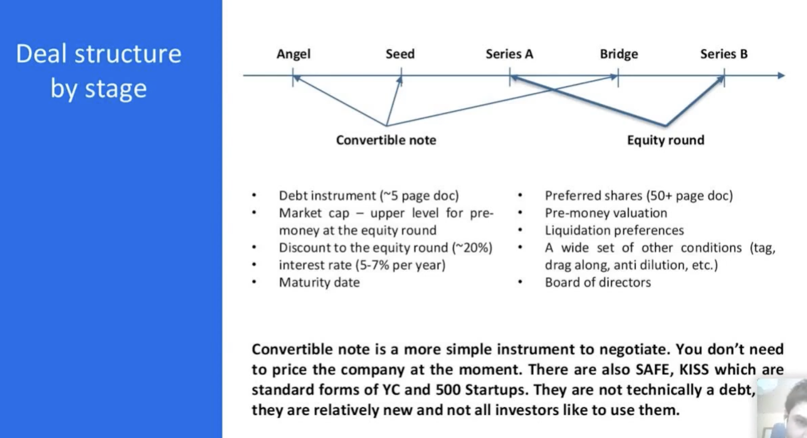
	- 
	- 
	- 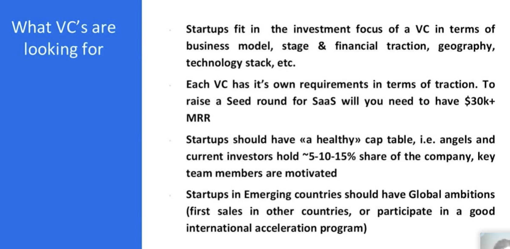
	- 
	- 
	- 
	- 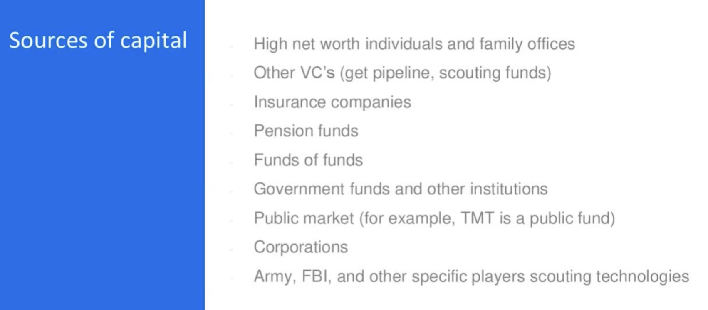
	- 
	- 
	- 
	- 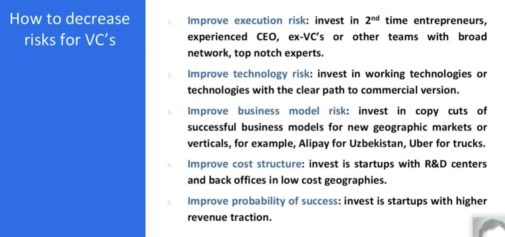
	- 
	- 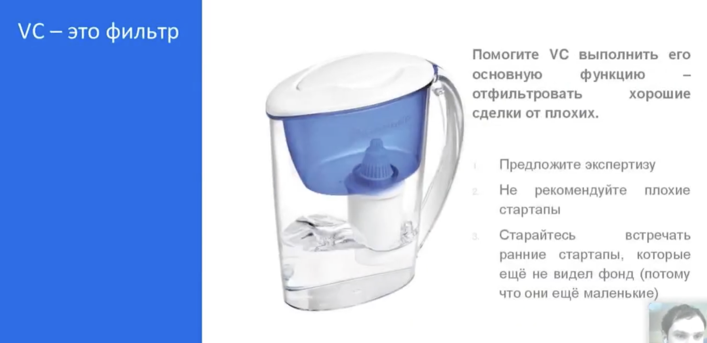
	- 
	- 
	- 
	- 
	- 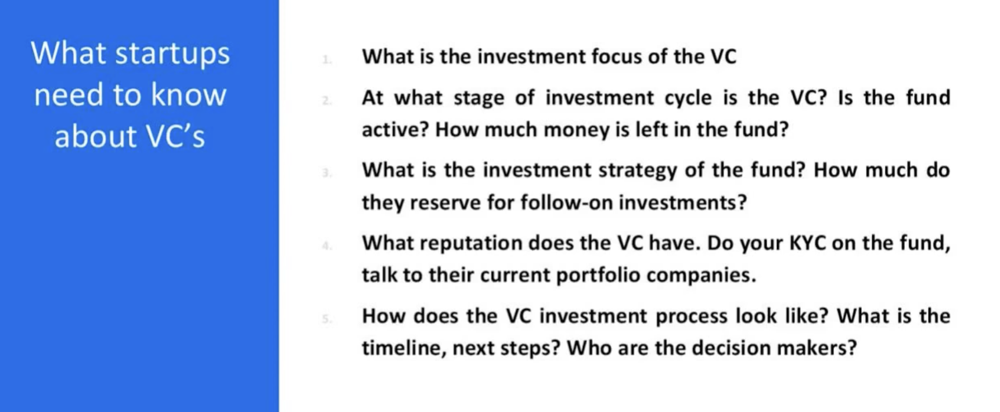
	- 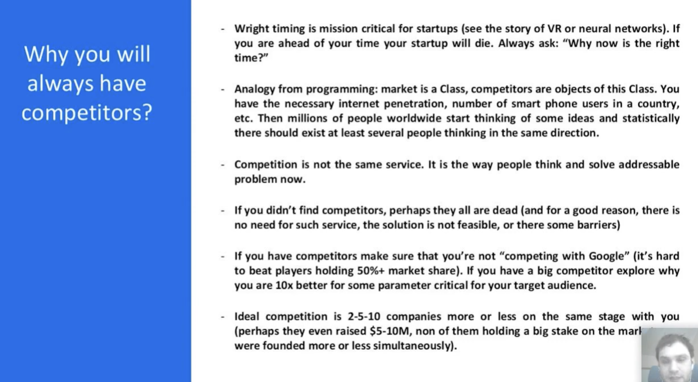
	- 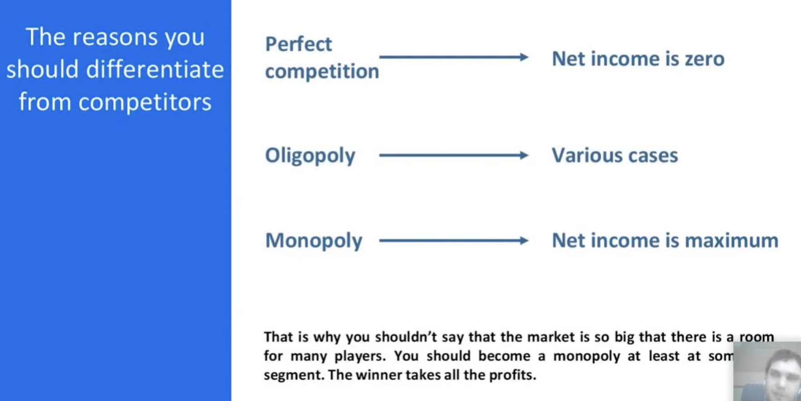
	- 
	- 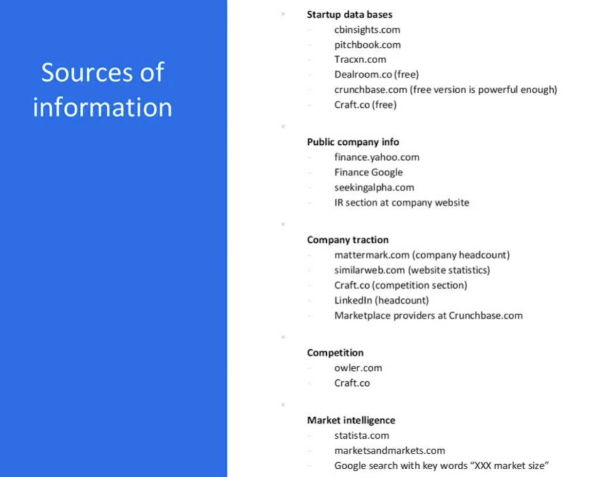
	- 
	- 
	- 
	- 
	- 
	- 
	- 
	- 
	- 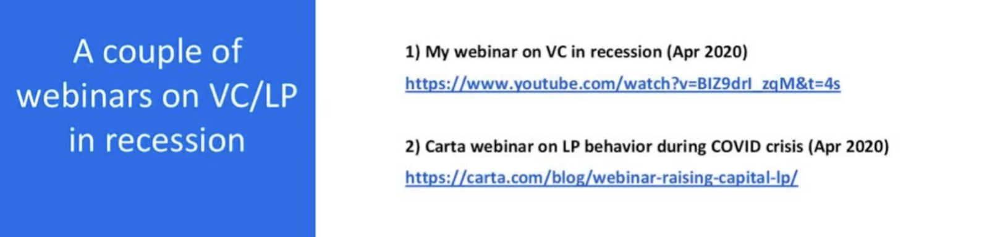
	- 
	- 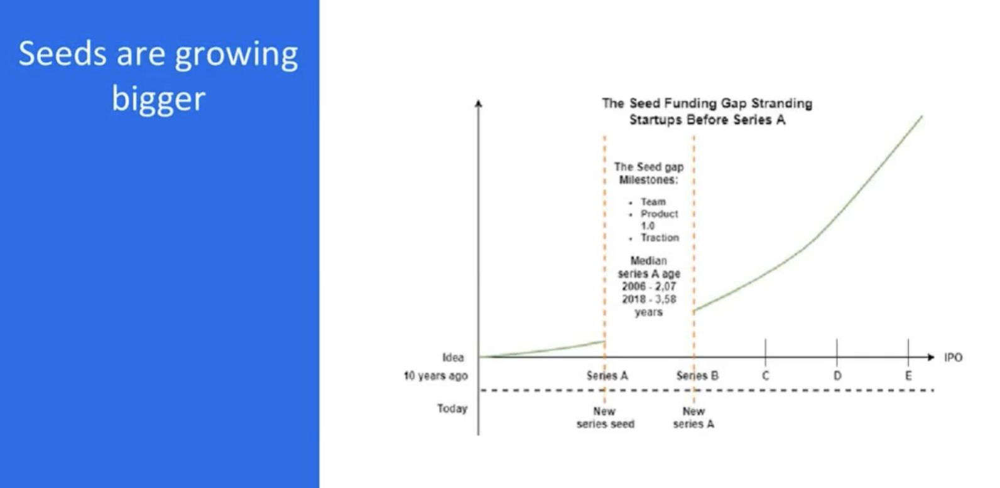
	-
	-
# Инвестиционный меморандум, критерии анализа стартапа, ошибки и когнитивные искажения VC
collapsed:: true
	- https://www.youtube.com/watch?v=gCsTesUHEYU
	- 
	- 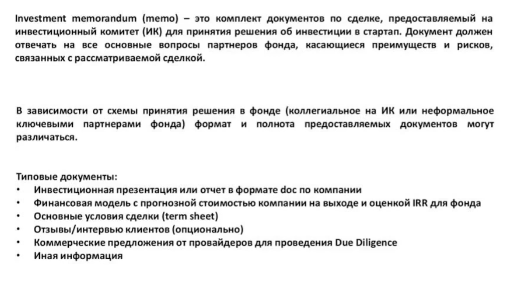
	- 
		- 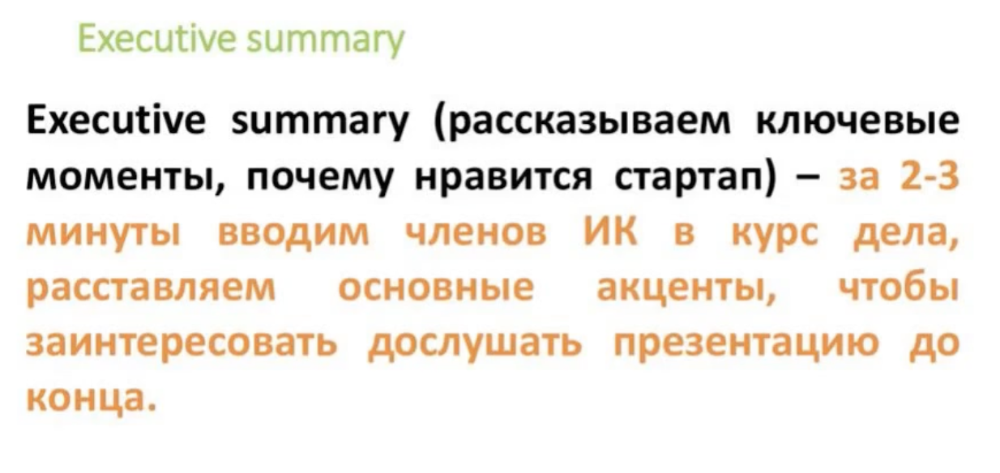
		- 
		- 
		- 
		- 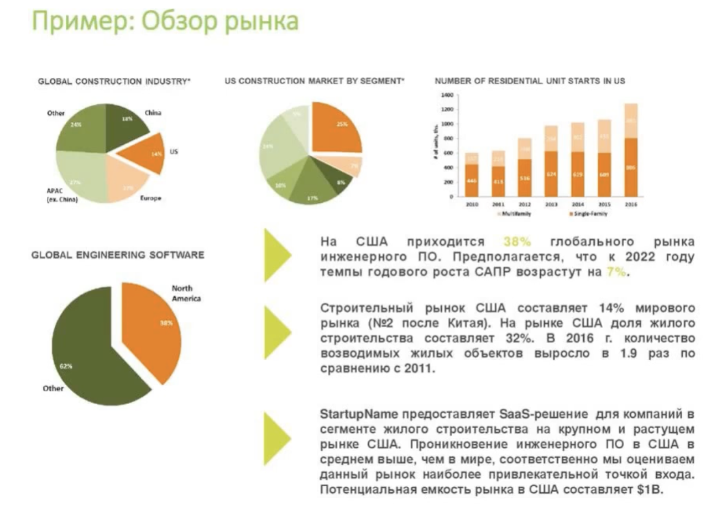
		- 
		- 
		- 
		- 
		- 
		- 
		- 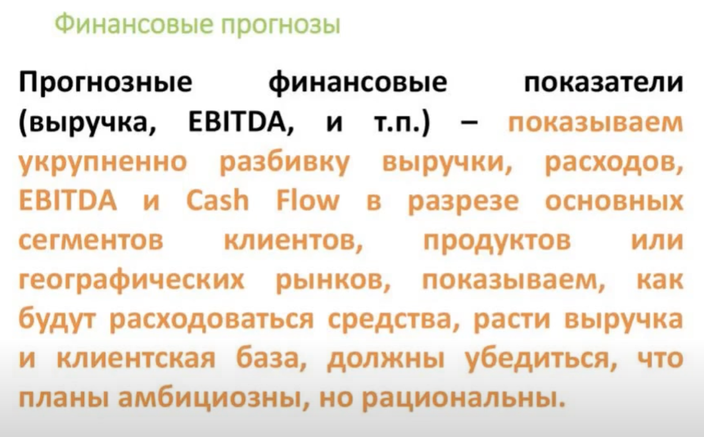
		- 
		- 
		- 
		- 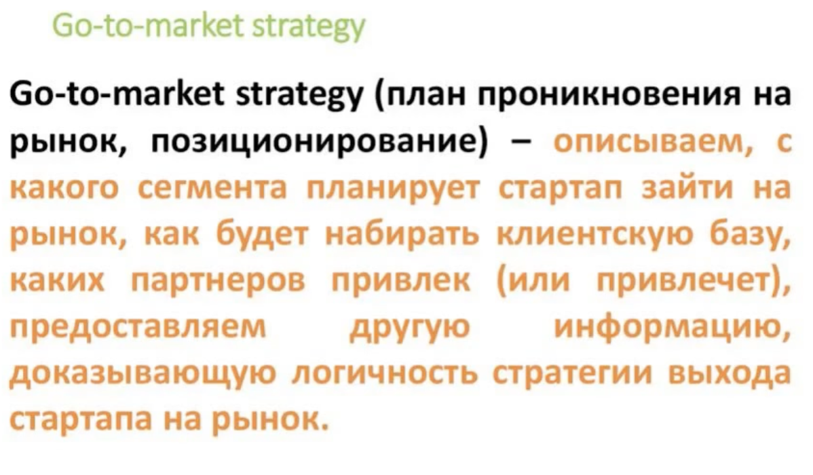
		- 
		- 
		- 
		- 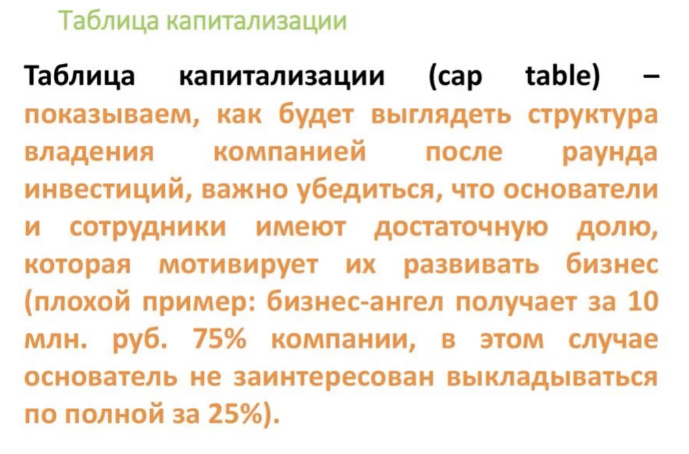
		- 
		- 
		- 
		- 
		- 
		- 
		- 
		- 
		- 
		- 
		- 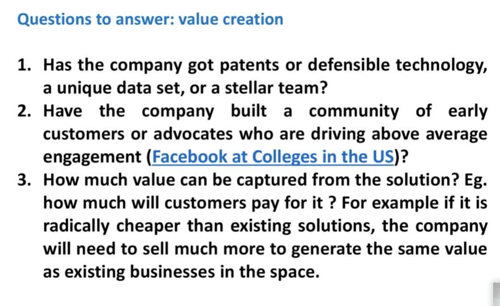
		- 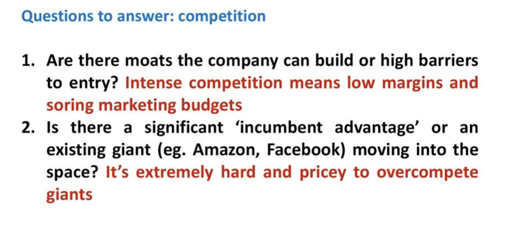
		- 
		- 
		- 
		- 
		- 
		- 
		- 
		- 
		- 
		- 
		- 
		- 
		- 
		- 
		- 
		- 
		- 
		- 
		- 
		- 
		- 
		- 
		-
		-
	-
# Качественные и количественные методы анализа рынка стартапа
collapsed:: true
	- https://youtu.be/olLtCo7xP64
	- https://t.me/ask_vc_analyst/23
	- 
	- 
	- 
	- [Crossing the chasm](https://www.hightechstrategies.com/crossing-the-chasm-summary/)
		- 
	- 
	- [Пять сил Портера](https://www.unisender.com/ru/glossary/model-5-konkurentnyh-sil-portera/)
		- 
	- 
	- Понимание макроэкономических трендов. Пример - ресторанный рынок США: мин. зарплата давит с одной стороны, из-за конкуренции нельзя растить цены => будет хорошо работать всё, направленное на повышение маржинальности
		- 
	- 
	- 
	- 
	- 
	- Декомпозиция по Ферми
		- 
		- 
		- 
		- 
		- 
		- 
		- 
		- 
		- 
		- 
		- 
	- TAM, SAM, SOM
		- 
		- 
		- 
		- 
		- 
		- 
		- 
		- 
		- 
		- 
		- 
		- 
		-
	-
# Подходы и инструменты для проведения конкурентного анализа
	- https://www.youtube.com/watch?v=AVJakJkr3M
	- https://t.me/ask_vc_analyst/24
	- Не надо показывать, что вы лучше; это не сейлз, а для понимания, как работать с конкурентами/предвосхищать их шаги
	- Пытайтесь найти свои слабые стороны, а также сильные стороны конкурентов
	- Методы
		- **SWOT** => больше про саму компанию
		- [**PEST(LE)**](https://libguides.library.usyd.edu.au/c.php?g=508107&p=5994242) => Political, Economical, Sociocultural, Technological, Legal, Environmental
	- Competitive positioning (Porter)
		- Cost leadership => снижение издержек/повышение маржи относительно конкурентов
		- Differentiation => отличительная черта продукта (лучше, функционал, качество и тд)
		- Для узкого рынка: Focus
	- Workflow
		- Определить рынок через сегментирование
			- В узком сегменте выше шанс занять значительную рыночную долю
			- Считается, что рынок достаточно маленький, если есть стратегия достижения 25% рынка за 12 месяцев
			- Виды рыночного сегментирования
			  collapsed:: true
				- 
				- География
				- Демография
				- Психография
				- Поведенческие черты
		- Собрать названия конкурентов
			- Ориентироваться на знакомых
			- Аналоги знакомого конкурента
			- Посмотреть инвесторов => в портфелях
			- Гугл по ключевым
			- Спросить клиентов
			- Хорошо получить список из 15-20 конкурентов
		- Определить успешность конкурентов
			- Количество посещений сайта
			- Скачивание продукта
			- TVL/транзакции (крипта)
			- Сотрудники
			- Отзывы клиентов и сотрудников
			- Привлеченные инвестиции
			- Фолловеры в соцсетях
		- Проанализировать функционал клиентов/фичи
			- Наполнение бэклога
			-