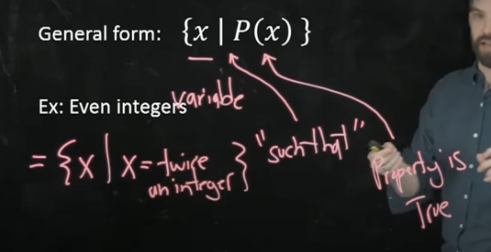
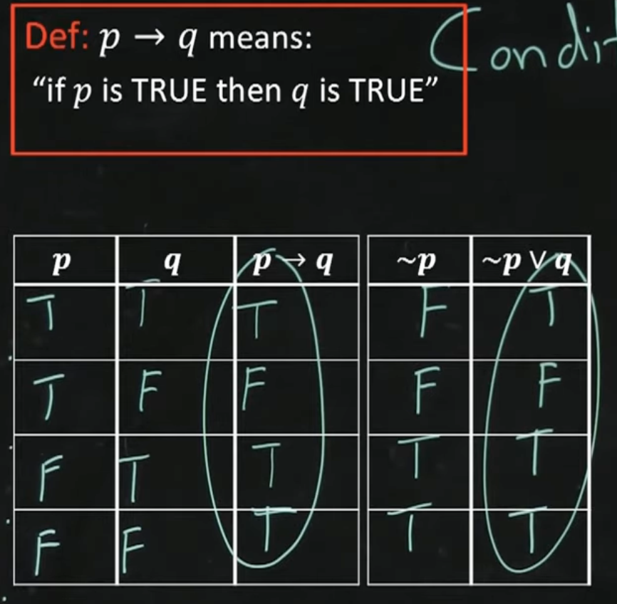

- # Set theory
- ## Set
  collapsed:: true
	- A number of elements; order and repetition don't matter.
	- $\{1,3,4,5\} = \{1,1,1,1,4,3,5\} = \{5,3,4,1\}$
	- A is a subset of B if all the elements of A are in B: $A\in B$
	- ### Set-roster notation
	  collapsed:: true
		- If there are a lot of elements in a set AND there is some clear pattern to them, we can use a set-roster notation: $\{0,2,4,6...\}, \{...-6,-4,-2,0,2,4,6...\}$
	- ### Set-builder notation
	  collapsed:: true
		- If there are a lot of elements, but no clear pattern => we can denote the elements using a function, essentially a lambda function with "such that": $\{x|x=twice\ a\ number\}$
		- 
	- ### Empty set
	  collapsed:: true
		- A collection of NO objects
		- Notation: $\{\}$ or $\emptyset$
		- Is a $\emptyset$ a subset of $\{1,2,3\}$? Yes, it's the so-called *vacuous truth*
	- ### Cartesian Product of Two Sets A x B
	  collapsed:: true
		- Ordered pairs: order matters
		- $(a,b) = (c,d)$ if $a=c \ \&\ b=d$
		- *a, b* can come from [[different]] sets
		- Cartesian product $A\times B$ is the set of all ordered pairs (a,b) where $a\in A$ and $b\in B$
		- $A \{a,b\} \times B \{0,1\} = \{(a,0), (a,1), (b,0), (b,1)\}$
- ## Function, formal definition
  collapsed:: true
	- Function F between A and B is:
		- For every element $x \in A$ there is an element $y \in B$ such that $(x,y) \in F$, i.e. for every input x, there's some output y, so $F(x)=y$
		- If $(x,y) \in F$ and $(x,z) \in F$, then $y=z$ => the same input produces the same output (vertical line test)
- ## Logical statements
	- #### Basics
	  collapsed:: true
		- ~p => not p
		- $p \wedge q$ => p AND q
		- $p \vee q$ => p OR q
		- Two statements are equivalent ==if their truth tables are identical.==
		- $P \equiv \sim P$
		- **Tautology** is a statement that is **always true**.
		- **Contradiction** is a statement that is **always false**.
		- #### DeMorgan's Laws
			- $\sim(p \vee q) \equiv (\sim p) \wedge (\sim q)$
			- $\sim(p \wedge q) \equiv (\sim p) \wedge (\vee q)$
		- #### Double negative
			- $\sim (\sim p) \equiv p$
		- #### Identity laws
			- $p \vee c \equiv p$
			- $p \wedge t \equiv p$
		- #### Universal bound laws
			- $p \vee t \equiv t$
			- $p \wedge c \equiv c$
	- ### Conditional statements
	  collapsed:: true
		- $p \rightarrow q \equiv \sim p \vee q$
		  collapsed:: true
			- 
			-
	- ### Vacuous statements
	  collapsed:: true
		- A statement is true, but in an unimportant (vacuous) way
	- ### Negating a conditional
	  collapsed:: true
		- $\sim (p \rightarrow q) \equiv \sim(\sim p \vee q) \equiv (\sim \sim p \wedge q)$ (DeMorgan's)
		- $(\sim \sim p \wedge q) \equiv p \wedge \sim q$
	- ### Contrapositive of a conditional statement
	  collapsed:: true
		- $p \rightarrow q \equiv \sim q \rightarrow \sim p \equiv \sim p \vee q \equiv p \vee \sim q$
		- Study hard -> pass == ~pass -> ~study hard (didn't study hard) == ~study hard OR pass == study hard OR ~pass
	- ### Converse and inverse of a statement
	  collapsed:: true
		- ==Converse== of $p \rightarrow q$ is $q \rightarrow p$; they are NOT logically equivalent
		- If it's a dog, it's a mammal => if it's a mammal, it's a dog
		- ==Inverse== of $p \rightarrow q$ is $\sim p \rightarrow \sim q$
	- ### Biconditional statement | if and only if
	  collapsed:: true
		- ==Biconditional== $p \leftrightarrow q$ means **both** $p \rightarrow q$ and $q \rightarrow p$
		- *Study hard -> pass* $\wedge$ *pass -> studied hard* => I will pass **if and only if** I study hard
		- I.e. *both directions are true*
		-
		-
		-
		-
	- ### Modus ponens & Modus tollens
	  collapsed:: true
		- **Ponens**: If $p$, then $q$. $p$. Therefore, $q$
		- **Tollens**: If $p$, then $q$. $\sim p$. Therefore, $\sim q$
	- ### Logical Argument Forms: Generalizations, Specialization, Contradiction
	  collapsed:: true
		- **Generalization**
			- $p$. Therefore, $p \vee q$
			- Example: I'm Israeli => I'm Israeli **or** I'm a helicopter.
		- **Specialization**
			- $p \wedge q$. Therefore, $p$
			- Example: I'm Israeli **and** I have an MSc. Therefore, I'm Israeli.
		- **Contradiction**
			- $\sim p \rightarrow c$. Therefore, $p$
	- ### Predicates and their Truth Sets
	  collapsed:: true
		- Predicate is a **sentence** depending on variables which becomes a **statement** upon substituting values in the domain.
		- Example $P(x)$: $x$ is a factor of 12 with domain $\mathbb{Z}^+$
		- $P(6)$: **factor of 12** + **positive integer** => $True$
		- $P(5)$: not a factor of 12 + **positive integer** => $False$
		- $P(\frac{1}{3})$: not a positive integer => $Non sense$
		- Truth set
		  collapsed:: true
			- ${x \in D | P(x)}$ => All values *x* in the domain *D* where *P(x)* is true
	- ### Universal and Existential Quantifiers
	  collapsed:: true
		- **Universal quantifier**: $\forall$ -> "for all"
			- Example: $\forall x \in D, P(x)$ => "for all x in domain D, P(x) is true"
		- **Existential quantifier**: $\exists$ -> "there exists"
			- Example: $\exists x \in D, P(x)$ => "there exists an x in the domain D, such that P(x) is true"
		- #### Statement vs predicate
			- *P: Roofus is a mammal* => statement
			- *P(x): x is a mammal* => predicate (depends on the variable)
	- ### Negating Universal and Existential Quantifiers
	  collapsed:: true
		- **Negating a universal**: $\sim (\forall x \in \mathbb Z^+, P(x)) \equiv \exists x \in \mathbb Z^+, \sim P(x)$
			- Negate $\forall x \in \mathbb Z^+, x>3$ => $\exists x \in \mathbb Z^+, x \ngtr 3$ or $\exists x \in \mathbb Z^+, x \leq 3$
		- **Negating an existential**: $\exists x \in D, P(x)$
			- $\sim (\exists x \in D, P(x)) \equiv \forall x \in D, \sim P(x)$
	- ### Negating Logical Statements with Multiple Quantifiers
		- "Every integer has a larger integer": $\forall x \in \mathbb Z, \exists y \in \mathbb Z, y > x$ (A)
			- $\sim A \equiv \exists x \in \mathbb Z, \sim P(x) \equiv \exists x \in \mathbb Z, \forall y \in \mathbb Z, y \leq x$
		- "Some number in D is the largest": $\exists x \in D, P(x) \equiv \exists x \in D, \forall y \in D, x \geq y$ (B)
			- $\sim B \equiv \forall x \in D, \exists y \in D, \sim