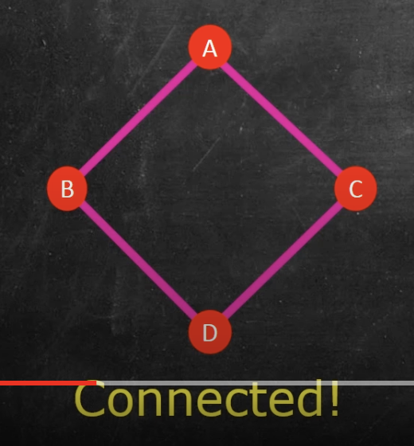
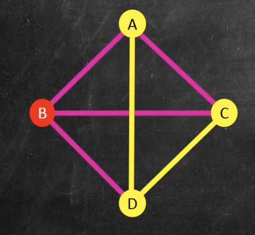

automatic-ignore:: true

- # Set theory
  collapsed:: true
	- ## Set
	  collapsed:: true
		- A number of elements; order and repetition don't matter.
		- $\{1,3,4,5\} = \{1,1,1,1,4,3,5\} = \{5,3,4,1\}$
		- A is a subset of B if all the elements of A are in B: $A\in B$
	- ## Set-roster notation
	  collapsed:: true
		- If there are a lot of elements in a set AND there is some clear pattern to them, we can use a set-roster notation: $\{0,2,4,6...\}, \{...-6,-4,-2,0,2,4,6...\}$
	- ## Set-builder notation
	  collapsed:: true
		- If there are a lot of elements, but no clear pattern => we can denote the elements using a function, essentially a lambda function with "such that": $\{x|x=twice\ a\ number\}$
		- 
	- ## Empty set
	  collapsed:: true
		- A collection of NO objects
		- Notation: $\{\}$ or $\emptyset$
		- Is a $\emptyset$ a subset of $\{1,2,3\}$? Yes, it's the so-called *vacuous truth*
	- ## Cartesian Product of Two Sets A x B
	  collapsed:: true
		- Ordered pairs: order matters
		- $(a,b) = (c,d)$ if $a=c \ \&\ b=d$
		- *a, b* can come from [[different]] sets
		- Cartesian product $A\times B$ is the set of all ordered pairs (a,b) where $a\in A$ and $b\in B$
		- $A \{a,b\} \times B \{0,1\} = \{(a,0), (a,1), (b,0), (b,1)\}$
	- ## Union & Intersection
	  collapsed:: true
		- Union: $A \cup B = \{x|x \in A \vee x \in B\}$
		- Intersection: $A \cap B = \{x| x \in A \wedge x \in B\}
	- ## Universes and complements
	  collapsed:: true
		- Universe $U$ is the larger set that gives the context
		- $A_c = \{x \in U | x \notin A\}
	- ## Power Sets and the Cardinality of the Continuum
	  collapsed:: true
		- $A = \{1,2,3\}, \{1,3\} \in A, \{1,4\} \notin A$
		- A power set $P(A)$ is the set of ==all== subsets of $A$
		  collapsed:: true
			- 
		- A power set of an empty set is a set containing an empty set, a box within a box
		- Number of elements $|P(A)|$ in a power set $|A| = n$ is $|P(A)| = 2^n$, where $n$ is the number of elements. That's because each element can be either included in a power set, or not
		- $P(\mathbb N)$ is uncountably infinite. $P(A)$ has greater **cardinality** than $A$
	- ## Relations
	  collapsed:: true
		- **Reflexive** relation is a relation of an element to itself: relation on $A$ is reflexive if $xRx, \forall x \in A$
		- **Symmetric** relation: if x relates to y, then y relates to x => $\forall x, y \in A, if\ xRy\ then\ yRx$
		- **Transitive** relation: $\forall x, z \in A, if\ xRy\ and\ yRz\ then\ xRz$
		- **Equivalence** relation: a relation that is **reflexive + symmetric + transitive** at once
- # Function, formal definition
  collapsed:: true
	- Function F between A and B is:
		- For every element $x \in A$ there is an element $y \in B$ such that $(x,y) \in F$, i.e. for every input x, there's some output y, so $F(x)=y$
		- If $(x,y) \in F$ and $(x,z) \in F$, then $y=z$ => the same input produces the same output (vertical line test)
- # Logical statements
  collapsed:: true
	- #### Basics
	  collapsed:: true
		- ~p => not p
		- $p \wedge q$ => p AND q
		- $p \vee q$ => p OR q
		- Two statements are equivalent ==if their truth tables are identical.==
		- $P \equiv \sim P$
		- **Tautology** is a statement that is **always true**.
		- **Contradiction** is a statement that is **always false**.
		- #### DeMorgan's Laws
			- $\sim(p \vee q) \equiv (\sim p) \wedge (\sim q)$
			- $\sim(p \wedge q) \equiv (\sim p) \wedge (\vee q)$
		- #### Double negative
			- $\sim (\sim p) \equiv p$
		- #### Identity laws
			- $p \vee c \equiv p$
			- $p \wedge t \equiv p$
		- #### Universal bound laws
			- $p \vee t \equiv t$
			- $p \wedge c \equiv c$
	- ### Conditional statements
	  collapsed:: true
		- $p \rightarrow q \equiv \sim p \vee q$
		  collapsed:: true
			- 
			-
	- ### Vacuous statements
	  collapsed:: true
		- A statement is true, but in an unimportant (vacuous) way
	- ### Negating a conditional
	  collapsed:: true
		- $\sim (p \rightarrow q) \equiv \sim(\sim p \vee q) \equiv (\sim \sim p \wedge q)$ (DeMorgan's)
		- $(\sim \sim p \wedge q) \equiv p \wedge \sim q$
	- ### Contrapositive of a conditional statement
	  collapsed:: true
		- $p \rightarrow q \equiv \sim q \rightarrow \sim p \equiv \sim p \vee q \equiv p \vee \sim q$
		- Study hard -> pass == ~pass -> ~study hard (didn't study hard) == ~study hard OR pass == study hard OR ~pass
	- ### Converse and inverse of a statement
	  collapsed:: true
		- ==Converse== of $p \rightarrow q$ is $q \rightarrow p$; they are NOT logically equivalent
		- If it's a dog, it's a mammal => if it's a mammal, it's a dog
		- ==Inverse== of $p \rightarrow q$ is $\sim p \rightarrow \sim q$
	- ### Biconditional statement | if and only if
	  collapsed:: true
		- ==Biconditional== $p \leftrightarrow q$ means **both** $p \rightarrow q$ and $q \rightarrow p$
		- *Study hard -> pass* $\wedge$ *pass -> studied hard* => I will pass **if and only if** I study hard
		- I.e. *both directions are true*
		-
		-
		-
		-
	- ### Modus ponens & Modus tollens
	  collapsed:: true
		- **Ponens**: If $p$, then $q$. $p$. Therefore, $q$
		- **Tollens**: If $p$, then $q$. $\sim p$. Therefore, $\sim q$
	- ### Logical Argument Forms: Generalizations, Specialization, Contradiction
	  collapsed:: true
		- **Generalization**
			- $p$. Therefore, $p \vee q$
			- Example: I'm Israeli => I'm Israeli **or** I'm a helicopter.
		- **Specialization**
			- $p \wedge q$. Therefore, $p$
			- Example: I'm Israeli **and** I have an MSc. Therefore, I'm Israeli.
		- **Contradiction**
			- $\sim p \rightarrow c$. Therefore, $p$
	- ### Predicates and their Truth Sets
	  collapsed:: true
		- Predicate is a **sentence** depending on variables which becomes a **statement** upon substituting values in the domain.
		- Example $P(x)$: $x$ is a factor of 12 with domain $\mathbb{Z}^+$
		- $P(6)$: **factor of 12** + **positive integer** => $True$
		- $P(5)$: not a factor of 12 + **positive integer** => $False$
		- $P(\frac{1}{3})$: not a positive integer => $Non sense$
		- Truth set
		  collapsed:: true
			- ${x \in D | P(x)}$ => All values *x* in the domain *D* where *P(x)* is true
	- ### Universal and Existential Quantifiers
	  collapsed:: true
		- **Universal quantifier**: $\forall$ -> "for all"
			- Example: $\forall x \in D, P(x)$ => "for all x in domain D, P(x) is true"
		- **Existential quantifier**: $\exists$ -> "there exists"
			- Example: $\exists x \in D, P(x)$ => "there exists an x in the domain D, such that P(x) is true"
		- #### Statement vs predicate
			- *P: Roofus is a mammal* => statement
			- *P(x): x is a mammal* => predicate (depends on the variable)
	- ### Negating Universal and Existential Quantifiers
	  collapsed:: true
		- **Negating a universal**: $\sim (\forall x \in \mathbb Z^+, P(x)) \equiv \exists x \in \mathbb Z^+, \sim P(x)$
			- Negate $\forall x \in \mathbb Z^+, x>3$ => $\exists x \in \mathbb Z^+, x \ngtr 3$ or $\exists x \in \mathbb Z^+, x \leq 3$
		- **Negating an existential**: $\exists x \in D, P(x)$
			- $\sim (\exists x \in D, P(x)) \equiv \forall x \in D, \sim P(x)$
	- ### Negating Logical Statements with Multiple Quantifiers
	  collapsed:: true
		- "Every integer has a larger integer": $\forall x \in \mathbb Z, \exists y \in \mathbb Z, y > x$ (A)
			- $\sim A \equiv \exists x \in \mathbb Z, \sim P(x) \equiv \exists x \in \mathbb Z, \forall y \in \mathbb Z, y \leq x$
		- "Some number in D is the largest": $\exists x \in D, P(x) \equiv \exists x \in D, \forall y \in D, x \geq y$ (B)
		  collapsed:: true
			- $\sim B \equiv \forall x \in D, \exists y \in D, x < y$ (or generally: $\sim P(x)$)
			-
	- ### Universal Conditionals P(x) implies Q(x)
	  collapsed:: true
		- $P(x) \Rightarrow Q(x) \equiv \forall x \in D, P(x) \rightarrow Q(x)$
			- "If x is POTUS (*P(x)*), then x is a US citizen (*Q(x)*)", *D = [[People]]*
			- "Every POTUS is a US citizen"
	- ### Necessary and Sufficient Conditions
	  collapsed:: true
		- *If x is a Square, then x is a Rectangle* => *If A(x), then B(x)*.
		- A(x) is a ==sufficient== condition for B(x), i.e. "x being a Square is **sufficient** to conclude x is a Rectangle"
		- *If x is a Rectangle, then x is a Quadrilateral* => *If B(x), then C(x)*
		- Contrapositive: *If x is ==not== Quadrilateral, then x is ==not== a Rectangle* => *If ~C(x), then ~B(x)*
		- C(x) is a ==necessary== condition for B(x), i.e. "x being a Quadrilateral is **necessary** to conclude x is a Rectangle"
		- **Sufficient**: every x is ..., so just a condition is enough
		- **Necessary**: not every x is..., so just a condition is not enough
	- ### Formal Definitions in [[math]] | Ex: Even & Odd Integers
	  collapsed:: true
		- Even
			- Informal: n is an even integer if n can be written as [[2]]*integer
			- Formal: n is an even integer if $\exists k \in \mathbb Z | n = 2k$
		- Odd
			- Informal: n is an odd integer if n is an integer that is not even
			- Formal: n is an odd integer if $\exists k \in \mathbb Z | n = 2k+[[1]]$
			-
		-
- # Proofs
  collapsed:: true
	- Define terms
	- State theorem formally
	- Play around
	- Formal proof
		- Start with assumptions
		- Apply definitions
		- Manipulate!
		- Deduce conslusion
	- ### Proof example
	  collapsed:: true
		- **Informal definition**: n is a rational number if it is a fraction, e.g. 3/7
		- **Formal definition**: n is a rational number if $\exists p \in \mathbb Z, \exists q \in \mathbb Z \{0\}$ such that $n=\frac{p}{q}$
		- **Theorem**: the sum of two rational numbers is another rational number
		- **Proof**
		  collapsed:: true
			- Suppose *m* and *n* are rational.
			- $\exists p_1,p_2 \in \mathbb Z, \exists q_1,q_2 \in \mathbb Z \{0\}$ such that $m=\frac{p_1}{q_1}, n=\frac{p_2}{q_2}$
			- **Manipulations**
			  collapsed:: true
				- Then, $m+n=\frac{p_1}{q_1} + \frac{p_2}{q_2}=\frac{p_1*q_2 + p_2*q_1}{q_1*q_2}$
				- Let $p_3 = p_1*q_2 + p_2*q_1$ and $q_3=q_1*q_2$
				- Hence, $\exists p_3 \in \mathbb Z, \exists q_3 \in \mathbb Z \{0\}$ so $m+n = \frac{p_3}{q_3}$
				- Thus $m+n$ is rational
- # Sequences
  collapsed:: true
	- Defined by explicit formula
	  collapsed:: true
		- $a_k$ is the $k^{th}$ term
		- $a_k = k : 1,2,3,4...$
		- $b_k = (-1)^k*(3k):-3,6,-9...$
	- The formal definition of a sequence
	  collapsed:: true
		- A sequence is a function $f: \mathbb Z^+ \rightarrow C$
		- $f(k)=(-1)^k*(3k)=a_k$
	- Sum and product of finite sequences
	  collapsed:: true
		- Sum notation: $a_m+a_{m+1}+...+a_n=\sum\limits^{n}_{k=m} a_k$
		- Product notation: $a_m*a_{m+1}*...*a_n=\prod\limits^{n}_{k=m} a_k$
	- ## Recursive sequences
		- Initial terms, e.g. $a_1 = 1$
		- Later terms described *recursively* by previous terms, e.g. $a_k=a_{k-1}=3, k>1$
- # Mathematical Induction
  collapsed:: true
	- Prove P(1) is true | *Basic step*
	- Assume P(k) is true
	- Prove P(k+1) is true | *Induction step*
	- **Example**
	  collapsed:: true
		- 
- # Probability
  collapsed:: true
	- ## Permutations
	  collapsed:: true
		- No repeats allowed => $n^s$, where $n$ is number of possibilities and $s$ is the number of "slots" to fill
		- Letters in the word **FORM** (no repeats) => factorial of number of "slots": $N(S)=4*3*2*1=4!$
		- How many ways to order four letters from the word **FORMULA**? => $N(S)=7*6*5*4$ (we're using our possibilities with each slot) => $\frac {7!}{3!}=$
		- The number of permutations that pick $r$ items from $n$ possibilities without repeats, in order, is $P(n, r) = \frac {n!}{(n-r)!}$
	- ## Summation rule for disjoint unions
	  collapsed:: true
		- How many 1, 2 or 3-letter passwords are there, using 26 letters? With repeats
			- 1-letter => $N(S_1)=26^1$
			- 2-letter => $N(S_2)=26^2$
			- 3-letter => $N(S_3)=26^3$
			- Total: $26^1 + 26^2 + 26^3 = 18278$
		- When $A \cap B = \emptyset$, the union is called the **disjoint union** and is denoted $A \sqcup B$
		  collapsed:: true
			- 
		- When the Sample Space is a disjoint union = $S=S_1 + S_2$, $N(S)=N(S_1) + N(S_2)$
	- ## Counting formula for two intersecting sets: N(A union B)=N(A)+N(B)-N(A intersect B)
	  collapsed:: true
		- When the Sample Space is a **union** $S=S_1 \cup S_2$, $N(S)=N(S_1)+N(S_2)-N(S_1 \cap S_2)$
		  collapsed:: true
			- 
		- We're subtracting the intersection to *eliminate the double counting* from $S_1$ and $S_2$
		- How many numbers between 1 and 100 are multiples of 4 or 6?
		  collapsed:: true
			- $N(S_4)=25$, $N(S_6)=16$, $N(S_4 \cap S_6) = 8$ (multiples of 12)
			- $N(S_4) + N(S_6) - N(S_4 \cap S_6) = 25 + 16 - 8 = 33$
	- ## Triple intersections
	  collapsed:: true
		- $N(S_1 \cup S_2 \cup S_3)=N(S_1) + N(S_2) + N(S_3) - N(S_1 \cap S_2) - N(S_1 \cap S_3) - N(S_2 \cap S_3) + N(S_1 \cap S_2 \cap S_3)$
		  collapsed:: true
			- 
		-
	- ## Combinations Formula
	  collapsed:: true
		- How many ways can I pick 3 people from 5 people?
			- Order **matters** => $5*4*3 = \frac{5!}{(5-3)!}$
			- Order **doesn't matter** => $\frac {P(5,3)}{ways\ to\ reorder}=\frac{P(5,3)}{3!}$
			- Choose **r** objects out of **n** without caring about order => $\frac {n!}{r!(n-r)!}$
	- ## Conditional probability
		- $P(A|B) = \frac {P(A) \cap P(B)}{P(B)}$, i.e. probability of **both events happening** out of the probability of **just** B
		  collapsed:: true
			- 
- # Graph theory
- # Markov chains
  collapsed:: true
	- A probabilistic state machine or graph
	- Transition & tri-diagram
	  collapsed:: true
		- 
	- Transition matrices
		- \begin{pmatrix}
		  \ & A & B\\
		  A & 0.75 & 0.4\\
		  B & 0.25 & 0.6
		  \end{pmatrix}
		- $S_1 = P*S_0$
		- $S_n = P^n S_0$
- # Linear programming + simplex method
  collapsed:: true
	- Optimize => $f(x,y) = 180x + 200y$
	- Constraints => $5x + 4y \leq 80$
	  $10x + 20y \leq 200$
	  $x \geq 0$
	  $y \geq 0$
	- Feasible region (with possible solutions)
	  collapsed:: true
		- 
	- Then we solve the equations for one of the vertices:
		- $5x + 4y = 80 \rightarrow y = 20 - \frac{5}{4}x$
		- $10x + 20y = 200 \rightarrow y = 10 - \frac{x}{2}$
		- $20 - \frac{5}{4}x = 10 - \frac{x}{2}$
		- $x = \frac{40}{3} \simeq 13.33$
		- $y = \frac{10}{3} \simeq 3.33$
		- $f(\frac{40}{3}, \frac{10}{3}) = 180 \frac{40}{3} + 200 \frac {10}{3} = 3066.7$
	- **Iso-value line** is tangent to the vertex and contains the "best solutions"
	- Extreme values occur at **vertices** of a **bounded feasible region**
- # Graph theory
	- A graph $(v,e)$ has a set of **v**, vertices, and a set **e**, edges
	  collapsed:: true
		- 
	- Graph isomorphism => if you've got the same list of vertices and edges, your graphs are the same
	- ## Graph properties
		- **Completeness**: $K_n$ is the **complete graph** on *n* vertices, i.e. one of every possible edge
		  collapsed:: true
			- 
		- **Connectedness**: A graph is **connected** if you can get from any vertex to any other via edges
		  collapsed:: true
			- 
			- 
		- **Subgraph**: $V_1, E_1$ is a *subgraph* of $V_2, E_2$ if it is a graph where $V_1 \subseteq V_2$ and $E_1 \subset E_2$
		  collapsed:: true
			- 
		- **Induced subgraph**: $V_1, E_1$ is an *induced subgraph* of $V_2, E_2$ if it is a graph where $V_1 \subseteq V_2$ and $E_1$ contains all edges of $E_2$ which are subsets of $V_1$
		  collapsed:: true
			- 
		-
		-