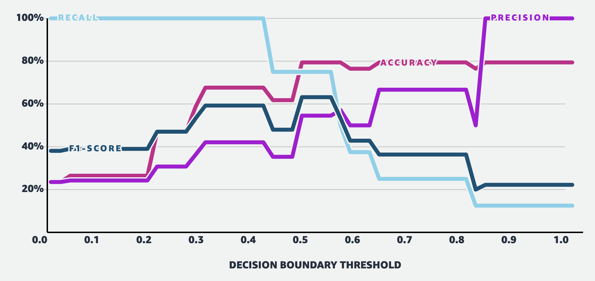
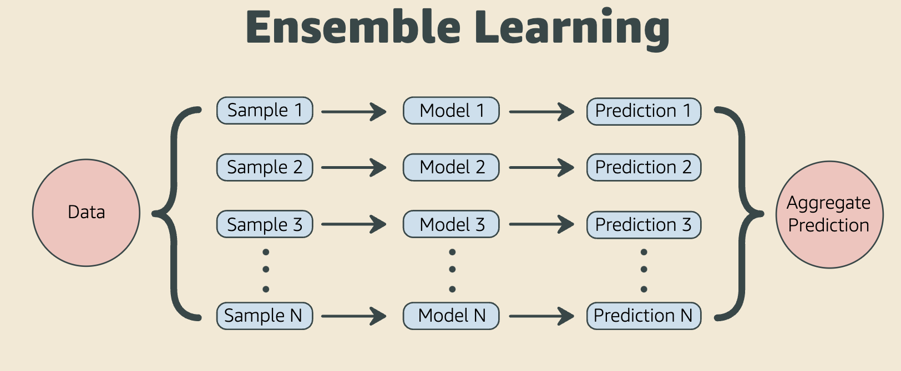
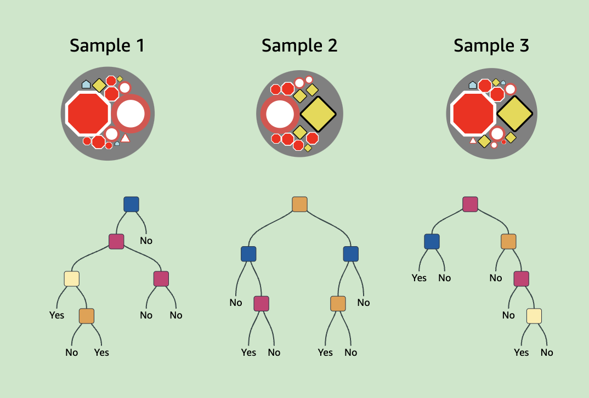

- # Logistic regression
  collapsed:: true
	- https://mlu-explain.github.io/logistic-regression/
	- logistic regression: a supervised learning algorithm that can be used to classify data into categories, or classes, by predicting the probability that an observation falls into a particular class based on its features.
	- The typical setup for logistic regression is as follows: there is an outcome y*y* that falls into one of two categories (say 0 or 1), and the following equation is used to estimate the probability that y*y* belongs to a particular category given inputs $X=(x_1​,x_2​,...,x _k):$
		- 
		- This is called a linear predictor, and it is transformed by the sigmoid function so that the values fall between 0 and 1, and can therefore be interpreted as probabilities. This resulting probability is then compared to a threshold to predict a class for **y** based on **X**
	- When fitting our model, the goal is to find the parameters that optimize a function that defines how well the model is performing. Put simply, the goal is to make predictions as close to 1 when the outcome is 1 and as close to 0 when the outcome is 0. In machine learning, the function to be optimized is called the loss function or cost function. We use the loss function to determine how well our model fits the data.
	- A suitable loss function in logistic regression is called the Log-Loss, or binary cross-entropy
	- There are two main approaches for logistic regression: gradient descent and maximum likelihood estimation.
		- In **gradient descent**, the goal is to minimize the Log-Loss cost function over all samples. This method involves selecting initial parameter values, and then updating them incrementally by moving them in the direction that decreases the loss. At each iteration, the parameter value is updated by the gradient, scaled by the step size (otherwise known as the learning rate). The gradient is the vector encompassing the direction and rate of the fastest increase of a function, which can be calculated using partial derivatives. The parameters are updated in the opposite direction of the gradient by the step size in an attempt to find the parameter values that minimize the Log-Loss.
		- Another approach is finding the model that maximizes the likelihood of observing the data by using **Maximum Likelihood Estimation (MLE)**. It turns out, minimizing the Log-Loss is equivalent to maximizing the Log-Likelihood. Therefore, the goal is to find the parameter values that maximize the following
		  collapsed:: true
			- 
	- To understand **log-odds**, we must first understand odds. Odds are calculated as $\frac{p}{1-p}$​. This gives the ratio of the probability of a sunny day to that of a rainy day. Say that the probability of a sunny day is *0.75*. This implies that the probability of a rainy day is *0.25.* The odds would then be $\frac{0.75}{0.25}$ = 3, which means that the odds of a sunny day are 3 to 1. If the probability of rain is 0.5, then the odds would be $\frac{0.5}{0.5} = 1$, meaning that the odds of a sunny day are 1 to 1, so sun and rain are equally likely. Taking the log of the odds yields the log-odds, and taking ratios of log-odds yields log-odds ratios.
- # ROC & AUC curves
  collapsed:: true
	- https://mlu-explain.github.io/roc-auc/
	- ROC curves were first employed during World War 2 to analyze radar signals: After missing the Japanese aircraft that carried out the attack on Pearl Harbor, the US wanted their radar receiver operators to better identify aircraft from signal noise (e.g. clouds). The operator's ability to identify as many true positives as possible while minimizing false positives was named the *Receiver Operating Characteristic*, and the curve analyzing their predictive abilities was called the ROC Curve. Today, ROC curves are used in a number of contexts, including clinical settings (to assess the diagnostic accuracy of a test) and machine learning (the focus of this article).
	- In particular, the ROC curve is composed by plotting a model's True-Positive Rate (TPR) versus its False-Positive Rate (FPR) across all possible classification thresholds, where:
		- *True Positive Rate (TPR)*: The probability that a positive sample is correctly predicted in the positive class. E.g., the percentage of radar signals predicted to be airplanes that actually are airplanes.
		- *False Positive Rate (FPR)*: The probability that a negative sample is incorrectly predicted in the positive class. E.g., the percentage of radar signals predicted to be airplanes that actually are *not* airplanes.
		- 
	- **AUC** (sometimes written AUROC) is just the area underneath the entire ROC curve. Think integration from calculus. AUC provides us with a nice, single measure of performance for our classifiers, independent of the exact classification threshold chosen. This allows us to compare models to each other without even looking at their ROC curves (though visualizing the performance of your models is never a bad idea!).
	- **AUC** ranges in value from 0 to 1, with higher numbers indicating better performance. A perfect classifier will have an AUC of 1, while a perfectly random classifier an AUC of 0.5. A model that always predicts that a negative sample is more likely to have a positive label than a positive sample will have AUC of 0, indicating severe failure on the modeling side. Scores in the range [0.5, 1] imply good performance, while anything under 0.5 indicates very poor performance.
	- The *AUC* is the probability that the model will rank a randomly chosen positive example more highly than a randomly chosen negative example.
- # Training, test and validation sets
  collapsed:: true
	- https://mlu-explain.github.io/train-test-validation/
	- In most supervised machine learning tasks, best practice recommends to split your data into three independent sets: a **training set**, a **testing set**, and a **validation set**.
	- Randomly split our data into three independent sets:
		- **Training Set**: The dataset that we feed our model to learn potential underlying patterns and relationships.
		- **Validation Set**: The dataset that we use to understand our model's performance across different model types and hyperparameter choices.
		- **Test Set**: The dataset that we use to approximate our model's unbiased accuracy in the wild.
	- The training set is the dataset that we employ to train our model. The training set should be as representative as possible of the population that we are trying to model. Additionally, we need to be careful and ensure that it is as unbiased as possible, as any bias at this stage may be propagated downstream during inference.
	- **This is where the validation set comes in** — it acts as an independent, unbiased dataset for comparing the performance of different algorithms trained on our training set.
	- Once we have used the validation set to determine the algorithm and parameter choices that we would like to use in production, the **test set** is used to approximate the models's true performance in the wild.
	- Remember that the test performance is not a number to optimize over — it is a metric to assess future performance.
- # Precision & recall
  collapsed:: true
	- https://mlu-explain.github.io/precision-recall/
	- Evaluating classifiers requires careful consideration. In this article, we'll explore why accuracy isn't always a great measure of classification performance, and discuss three other evaluation metrics often used in its place: **precision**, **recall**, and the **F1-score**. To help qualify the importance of these metrics, we'll make use of the **confusion matrix**, a simple technique for visualizing the performance of a classification model.
	  id:: 6343d515-a31c-486a-9e62-3b0c9dc50710
	- Instead of looking at the model's raw accuracy (the number of correctly assigned categories divided by te total number of predictions) , the confusion matrix decomposes predictions into several categories of interest, making explicit how one class may be *confused* for another:
		- **True Positives (TP):** The number of positive instances correctly classified as positive. E.g., predicting an email as spam when it actually is spam.
		- **False Positives (FP):** The number of negative instances incorrectly classified as positive. E.g., predicting an email is spam when it actually is not spam.
		- **True Negatives (TN):** The number of negative instances correctly classified as negative. E.g., predicting an email is not spam when it actually is not spam.
		- **False Negatives (FN):** The number of positive instances incorrectly classified as negative. E.g., predicting an email is not spam when it actually is spam.
	- Our model's accuracy is then: $\frac{\mathrm{TP + TN}}{\mathrm{TP + FP + TN + FN}} = \frac{26 }{34} \approx 76\%$
	- One such metric is **precision**. Precision is the ratio of correctly predicted positive classes to *all items predicted to be positive:* $\frac{\mathrm{TP}}{\mathrm{TP + FP}} = \frac{3 }{6} \approx 50\%$. Intuitively, this tells us how correct, or *precise*, are our model's positive predictions.
	- A related metric is recall. Recall is the ratio of correctly predicted positive classes to *all items that are actually positive:* $\frac{\mathrm{TP}}{\mathrm{TP + FN}} = \frac{6 }{8} \approx 75\%$. It measures how many of the actual positive instances we were able to correctly predict (or *recall*).
	- Ideally, our model would have both perfect precision *and* perfect recall. However, in practice there often exists a tradeoff between the two.
	- Thus, it's important to understand and decide ahead of time what's more consequential, False Positives or False Negatives, to investigate how the tradeoff manifests for your particular dataset, and to design your model accordingly.
	- Given this competing tradeoff, it would be very convenient to have a single performance metric that takes into account *both* precision and recall. And, given that I wrote that sentence in the first place, you can probably guess that there is. And that it's called the F1-score... Nice.
	- The **F1-score** (also sometimes called the *F-Measure*) is a single performance metric that takes both precision and recall into account. It's calculated by taking the harmonic mean of the two metrics: $F_1 = \frac{2\cdot {Precision}\cdot {Recall}} {\mathrm{Precision}+\mathrm{Recall}}$, which is equivalent to $\frac{\mathrm{TP}}{\mathrm{TP} + \frac{1}{2}(\mathrm{FP} + \mathrm{FN})}$
	- For this reason, it *takes values from zero to one*, with values closer to one indicating better performance, and values closer to zero indicating poorer performance. In situations where *either* precision or recall are poor, the F1-score will also be poor. Only when *both* precision and recall have good performance will the F1-score be high.
	- ## The tradeoff
	  collapsed:: true
		- 
		- When it comes to evaluating classifiers (or any type of model), the above metrics are by no means exhaustive. Many other techniques exist, including *calibration, popular diagnostic tools (specificity, likelihood ratios, etc.), and expectation frameworks*.
- # Random forest
  collapsed:: true
	- https://mlu-explain.github.io/random-forest/
	- In machine learning, this concept of multiple models working together to come to an aggregate prediction is called **ensemble learning.**
		- 
	- **Ensemble learning** creates a stronger model by aggregating the predictions of multiple weak models, such as decision trees. **Random Forest** is an example of ensemble learning where each model is a decision tree.
	- **Condorcet’s Jury Theorem** suggests that the majority vote aggregation can have better accuracy than the individual models. There are other methods to aggregate predictions, such as weighted majority vote.
	- The **Bagging (Bootstrap Aggregating) method** randomly draws a fixed number of samples from the training set with replacement. This means that a data point can be drawn more than once.
	- ## Decision tree
		- 
		- We previously discussed [how decision tree model suffers from high variance.](https://mlu-explain.github.io/decision-tree/) However, this variance among trees is employed in the random forest as a feature, not a bug. The inventor of the random forest model Leo Breiman says in his paper *"[o]ur results indicate that better (lower generalization error) random forests have lower correlation between classifiers and higher strength."* [Random Forest Article]
		- The high variance of the decision tree model can help keep the correlation among trees low. The Bagging Method as well as the Feature Selection are the key innovations to keep correlation low.
	- As expected, the random forest model performs the best overall even if there are trees with **very low accuracy.**
- # Bias variance tradeoff
  collapsed:: true
	- https://mlu-explain.github.io/bias-variance/
	- Prediction errors can be decomposed into two main subcomponents of interest: error from bias, and error from variance. The tradeoff between a model's ability to minimize bias and variance is foundational to training machine learning models, so it's worth taking the time to understand the concept.
	- The test error is even higher than the train error => In this case, we say that our model is underfitting the data: our model is so simple that it fails to adequately capture the relationships in the data. The high test error is a direct result of the lack of complexity of our model.
	- An **underfit** model is one that is **too simple** to accurately capture the relationships between its features X and label Y.
	- Unsurprisingly, our model is **too complicated**. We say that it **overfits** the data. Instead of learning the true trends underlying our dataset, it memorized noise and, as a result, the model is not generalizable to datasets beyond its training data.
	- Overfitting refers to the case when a model is so specific to the data on which it was trained that it is no longer applicable to different datasets. In situations where your **training error is low but your test error is high**, you've likely overfit your model.
	- In the general case, **mean-squared error** can be decomposed into three components: error due to bias, error to to variance, and error due to noise => $Error = {Bias}^2 + {Variance} + {Noise}$
	- **Bias** represents the difference between the average prediction and the true value. For underfit (low-complexity) models, the majority of our error comes from bias.
	- **Variance** measures how much, on average, predictions vary for a given data point. Predictions from overfit (high-complexity) models show a lot more error from variance than from bias.
	- By trading some bias for variance (i.e. increasing the complexity of our model), and without going overboard, we can find a balanced model for our dataset.The ideal model aims to minimize both bias and variance. It lays in the sweet spot - not too simple, nor too complex. Achieving such a balance will yield the minimum error.
- # Decision trees
	- https://mlu-explain.github.io/decision-tree/
	- A Decision Tree consists of a series of sequential decisions, or decision nodes, on some data set's features. The resulting flow-like structure is navigated via conditional control statements, or if-then rules, which split each decision node into two or more subnodes. Leaf nodes, also known as terminal nodes, represent prediction outputs for the model.
	-