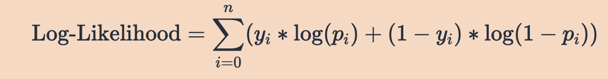
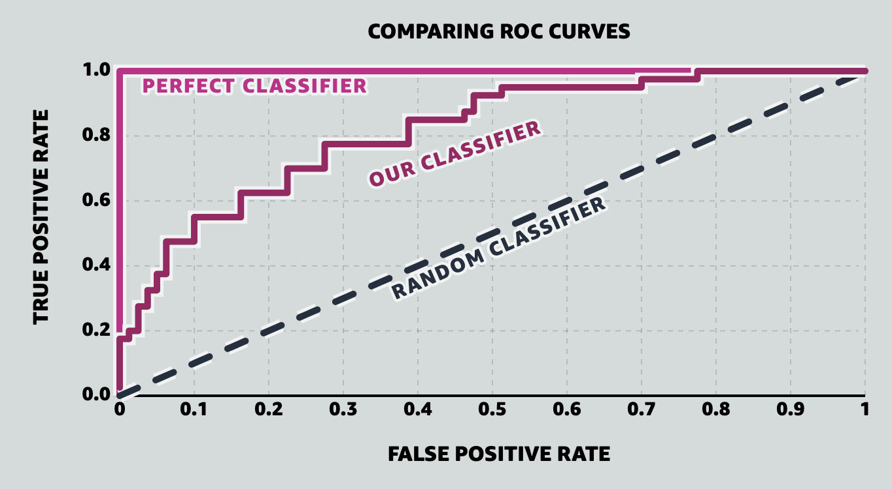

- # Logistic regression
  collapsed:: true
	- https://mlu-explain.github.io/logistic-regression/
	- logistic regression: a supervised learning algorithm that can be used to classify data into categories, or classes, by predicting the probability that an observation falls into a particular class based on its features.
	- The typical setup for logistic regression is as follows: there is an outcome y*y* that falls into one of two categories (say 0 or 1), and the following equation is used to estimate the probability that y*y* belongs to a particular category given inputs $X=(x_1​,x_2​,...,x _k):$
		- 
		- This is called a linear predictor, and it is transformed by the sigmoid function so that the values fall between 0 and 1, and can therefore be interpreted as probabilities. This resulting probability is then compared to a threshold to predict a class for **y** based on **X**
	- When fitting our model, the goal is to find the parameters that optimize a function that defines how well the model is performing. Put simply, the goal is to make predictions as close to 1 when the outcome is 1 and as close to 0 when the outcome is 0. In machine learning, the function to be optimized is called the loss function or cost function. We use the loss function to determine how well our model fits the data.
	- A suitable loss function in logistic regression is called the Log-Loss, or binary cross-entropy
	- There are two main approaches for logistic regression: gradient descent and maximum likelihood estimation.
		- In **gradient descent**, the goal is to minimize the Log-Loss cost function over all samples. This method involves selecting initial parameter values, and then updating them incrementally by moving them in the direction that decreases the loss. At each iteration, the parameter value is updated by the gradient, scaled by the step size (otherwise known as the learning rate). The gradient is the vector encompassing the direction and rate of the fastest increase of a function, which can be calculated using partial derivatives. The parameters are updated in the opposite direction of the gradient by the step size in an attempt to find the parameter values that minimize the Log-Loss.
		- Another approach is finding the model that maximizes the likelihood of observing the data by using **Maximum Likelihood Estimation (MLE)**. It turns out, minimizing the Log-Loss is equivalent to maximizing the Log-Likelihood. Therefore, the goal is to find the parameter values that maximize the following
		  collapsed:: true
			- 
	- To understand **log-odds**, we must first understand odds. Odds are calculated as $\frac{p}{1-p}$​. This gives the ratio of the probability of a sunny day to that of a rainy day. Say that the probability of a sunny day is *0.75*. This implies that the probability of a rainy day is *0.25.* The odds would then be $\frac{0.75}{0.25}$ = 3, which means that the odds of a sunny day are 3 to 1. If the probability of rain is 0.5, then the odds would be $\frac{0.5}{0.5} = 1$, meaning that the odds of a sunny day are 1 to 1, so sun and rain are equally likely. Taking the log of the odds yields the log-odds, and taking ratios of log-odds yields log-odds ratios.
- # ROC & AUC curves
	- https://mlu-explain.github.io/roc-auc/
	- ROC curves were first employed during World War 2 to analyze radar signals: After missing the Japanese aircraft that carried out the attack on Pearl Harbor, the US wanted their radar receiver operators to better identify aircraft from signal noise (e.g. clouds). The operator's ability to identify as many true positives as possible while minimizing false positives was named the *Receiver Operating Characteristic*, and the curve analyzing their predictive abilities was called the ROC Curve. Today, ROC curves are used in a number of contexts, including clinical settings (to assess the diagnostic accuracy of a test) and machine learning (the focus of this article).
	- In particular, the ROC curve is composed by plotting a model's True-Positive Rate (TPR) versus its False-Positive Rate (FPR) across all possible classification thresholds, where:
		- *True Positive Rate (TPR)*: The probability that a positive sample is correctly predicted in the positive class. E.g., the percentage of radar signals predicted to be airplanes that actually are airplanes.
		- *False Positive Rate (FPR)*: The probability that a negative sample is incorrectly predicted in the positive class. E.g., the percentage of radar signals predicted to be airplanes that actually are *not* airplanes.
		- 
	- **AUC** (sometimes written AUROC) is just the area underneath the entire ROC curve. Think integration from calculus. AUC provides us with a nice, single measure of performance for our classifiers, independent of the exact classification threshold chosen. This allows us to compare models to each other without even looking at their ROC curves (though visualizing the performance of your models is never a bad idea!).
	- **AUC** ranges in value from 0 to 1, with higher numbers indicating better performance. A perfect classifier will have an AUC of 1, while a perfectly random classifier an AUC of 0.5. A model that always predicts that a negative sample is more likely to have a positive label than a positive sample will have AUC of 0, indicating severe failure on the modeling side. Scores in the range [0.5, 1] imply good performance, while anything under 0.5 indicates very poor performance.
	- The *AUC* is the probability that the model will rank a randomly chosen positive example more highly than a randomly chosen negative example.
- # Training, test and evaluation sets
	- https://mlu-explain.github.io/train-test-validation/
	- In most supervised machine learning tasks, best practice recommends to split your data into three independent sets: a **training set**, a **testing set**, and a **validation set**.
	- Randomly split our data into three independent sets:
		- **Training Set**: The dataset that we feed our model to learn potential underlying patterns and relationships.
		- **Validation Set**: The dataset that we use to understand our model's performance across different model types and hyperparameter choices.
		- **Test Set**: The dataset that we use to approximate our model's unbiased accuracy in the wild.
	-