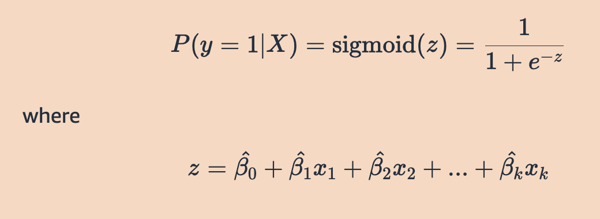

- # Logistic regression
	- https://mlu-explain.github.io/logistic-regression/
	- logistic regression: a supervised learning algorithm that can be used to classify data into categories, or classes, by predicting the probability that an observation falls into a particular class based on its features.
	- The typical setup for logistic regression is as follows: there is an outcome y*y* that falls into one of two categories (say 0 or 1), and the following equation is used to estimate the probability that y*y* belongs to a particular category given inputs $X=(x_1​,x_2​,...,x _k):$
		- 
		- This is called a linear predictor, and it is transformed by the sigmoid function so that the values fall between 0 and 1, and can therefore be interpreted as probabilities. This resulting probability is then compared to a threshold to predict a class for **y** based on **X**
	- When fitting our model, the goal is to find the parameters that optimize a function that defines how well the model is performing. Put simply, the goal is to make predictions as close to 1 when the outcome is 1 and as close to 0 when the outcome is 0. In machine learning, the function to be optimized is called the loss function or cost function. We use the loss function to determine how well our model fits the data.
	- A suitable loss function in logistic regression is called the Log-Loss, or binary cross-entropy
	- There are two main approaches for logistic regression: gradient descent and maximum likelihood estimation.
		- In gradient descent, the goal is to minimize the Log-Loss cost function over all samples. This method involves selecting initial parameter values, and then updating them incrementally by moving them in the direction that decreases the loss. At each iteration, the parameter value is updated by the gradient, scaled by the step size (otherwise known as the learning rate). The gradient is the vector encompassing the direction and rate of the fastest increase of a function, which can be calculated using partial derivatives. The parameters are updated in the opposite direction of the gradient by the step size in an attempt to find the parameter values that minimize the Log-Loss.
		- Another approach is finding the model that maximizes the likelihood of observing the data by using Maximum Likelihood Estimation (MLE). It turns out, minimizing the Log-Loss is equivalent to maximizing the Log-Likelihood. Therefore, the goal is to find the parameter values that maximize the following
			-