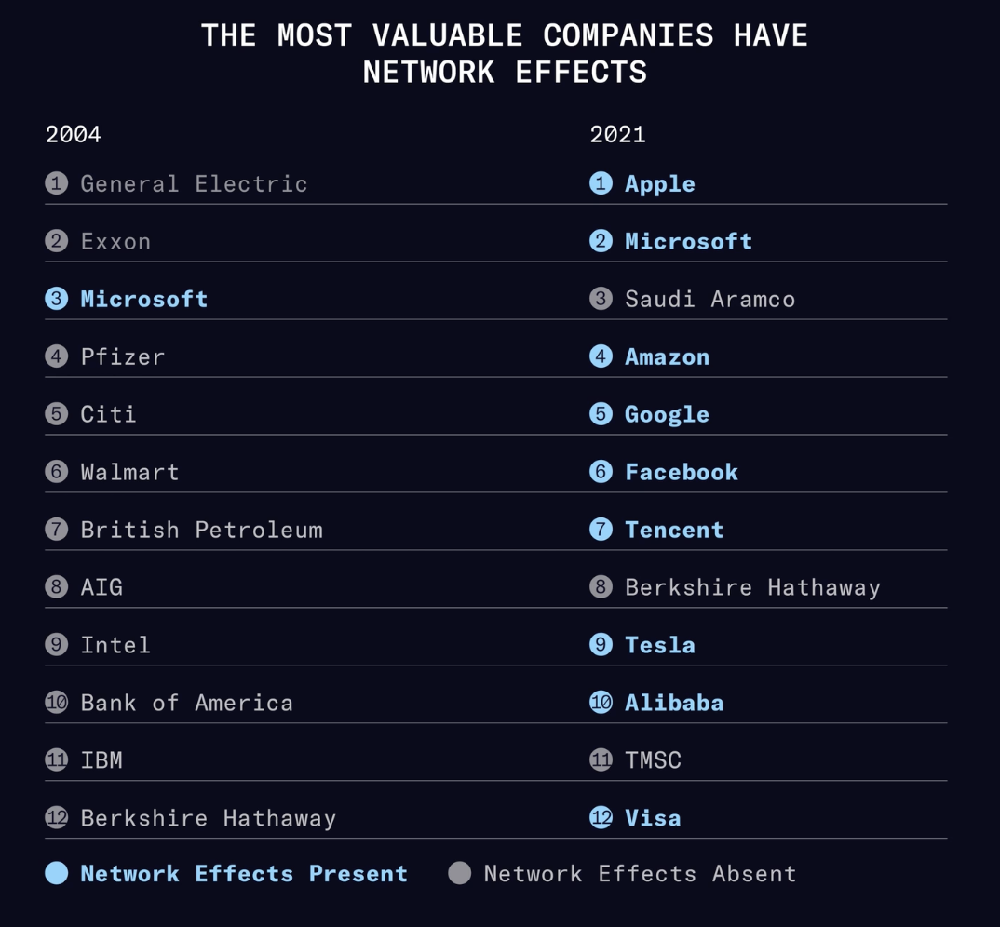

- # Why network effects are critical
	- https://www.nfx.com/masterclass/network-effects/network-effects-mission-critical
	- Network effects (NE) may be the most important factor in predicting startup's success.
	- Between 2012 and 2018 70% of tech companies employed network effects.
	  collapsed:: true
		- 
	- Viral effects are ==not== network effects. Network effect is *every user joining the product increases its value for all the other users*, Metcalfe effect.
	-