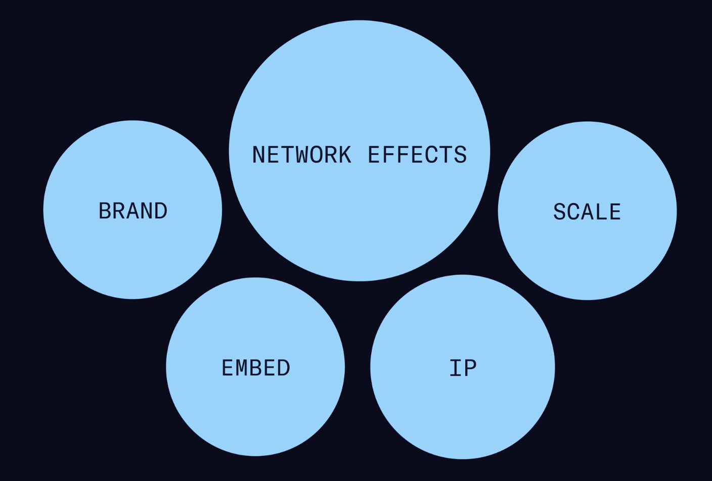

- # Why network effects are critical
	- https://www.nfx.com/masterclass/network-effects/network-effects-mission-critical
	- Network effects (NE) may be the most important factor in predicting startup's success.
	- Between 2012 and 2018 70% of tech companies employed network effects.
		- 
	- Viral effects are ==not== network effects. Network effect is *every user joining the product increases its value for all the other users*, Metcalfe effect.
- # The Underlying Properties Of Network Theory
	- https://www.nfx.com/masterclass/network-effects/network-theory-properties
	- ## Basic network
		- 
	- ## Network density
		- 
	- ## White hot center
		- So if there's one node where everybody's connecting to them, then you've got the beginnings of a **white hot center** with the core node, and then the nodes that are closest to them.
	- ## Directional / non-directional / bidirectional links
		- Another important aspect of these links is that they can be **directed**. There can be direction to these. So for instance, in Twitter, you would have an influencer who is important, sending out mostly messages to people who are just reading. That would be directional in one way. Or you could have, let's say a Venmo, where people are paying each other.
	- ## 1-1 / 1-many / many-many
		- ### Sarnoff's law
			- 
			- Works for one-to-many
			- $V=n$
		- ### Metcalfe's law
			- 
			- Works for many-to-many
			- $V=n^2$
		- ### Reed's law
			- 
			- An improvement on Metcalfe's law by a MIT professor in 1999
			- Because of local clusters, the real value may grow as $V=2^n$
	- ## Critical mass
		- Or a point of inflection => **crucial** to start getting network effects.
		- So to build the network value, you need to get to critical mass. And what happens is, as your network is growing a little bit, a little bit, a little bit all the time, at some point, it hits a moment of critical mass where it takes off, it lifts off. You can feel it. It's like someone stuck two fingers in your nose and just yanks your head forward. It just starts to take off on its own. And that critical mass moment is often facilitated through **developing your clustering.**
		- Now to get these clusters going, you're going to want to find your **minimal viable cluster.** Some small group of people that once attached to each other will stay attached to each other that you can then build on. Again, maybe creating another cluster and then bridging those two clusters. That minimal viable cluster really helps you to found the overall network. Now, to get to critical mass, the product is going to have to have some value to these users, to this cluster.
		-
	- *Real > pseudonymous > anonymous* IDs
	- ## Homogeneity
		- 
		- Conversely, **homogeneity** allows you to grow your network faster, but then often leaves you more vulnerable to attack by other competitors and other networks, simply because people are interchangeable. You think about Uber, you think about Lyft, you think about businesses where the needs are very clear and obvious, but it helps you grow faster at the beginning. So it's a trade off.
	- ## Asymptoting
		- Another interesting network property is what we call **asymptoting**. And asymptoting takes place when you might be adding more nodes onto the network, but the value doesn't actually continue to grow it. So the value of an Uber network or a Lyft network asymptotes even though you keep getting more drivers on the network, because if you're putting on your jacket or getting your bag, or you need to go to the bathroom before they come, you don't really care if they come faster than 4 minutes. It's nice if they come at 3 minutes, but as long as they come in under 10 or 6, it's pretty much good. And so the value doesn't actually get much higher.
	- ## Assymetry
		- So another important network property is what we call **asymmetry**.
		- In most marketplaces, **one side is harder** than the other. In some cases, much harder than the other. Example: Outdoorsy, doing an RV marketplace. They discovered that the supply side was much harder to get because there was, let's say, 2,500 mom and pops renting out about 50,000 RVs in the United States, but there was 30 million people trying to rent those RVs.
		- So if they could build software to allow them to work with and understand where these were, they would be able to *offer that supply out for the voracious demand* that was out there and build a pretty good marketplace, which they've done.
	- ## Cross-side network effect
		- 
		- The two sides, in this case, are the supply and the demand. So the value is the more supply on the network, the more value to the demand side. So that's **cross-side network effect**, cross-side value being created, and that can be quite intense.
	- ## Negative network effects
		- ### Congestion
			- There's so many nodes on the network that are trying to use the network that the network starts to **break down**. A good example of that would be **Ethereum**, where the more people using Ethereum, the more the gas prices go up. It just becomes unaffordable to use that network.
		- ### Pollution
			- The **pollution** is when the nodes on the link are behaving badly. An example of behaving badly could be on Facebook when your grandmother gets on and she starts posting pictures of you as a kid and embarrassing you, you don't want to be on Facebook anymore.
	- ## Chicken egg problem
		- 
		- Called **network start problem** for direct effect businesses. **Chicken and egg problem** for marketplaces.
		- You can't get anyone to join your network **unless there's already somebody there**.
		- *But how do you get them to sit there long enough? How do you attract them there at all? And then once you get them there, how do you attract enough of the demand so that these people stick around?* So there's a timing issue with bringing people in at the right time.
		- **Cold start problem** => the same situation, but when you've got a network, and there's **nobody there yet**. So when the first person comes in, there's no one there. How do you teach them to stick around so that they are there for their friends when their friends arrive?
	- ## Liquidity
		- *If someone lists something for sale on your marketplace, what percentage of the time do they sell it? What percentage of the time do they get the transaction they were looking for? If someone posts on your social network, what percentage of the time do they get likes, do they get attention, do they get responses, comments?* You can actually look at liquidity, both in terms of transactions on a marketplace and in terms of interaction on a network.
	- ## Multi-tenanting
		- So if you've got a supply and you've built your marketplace for the demand, they might be using your marketplace. But like with Lyft or Uber, I could sell my services on somebody else's marketplace, number two, or maybe marketplace number three. This happens if you're selling on eBay. You also want to sell on Amazon marketplace or on Shopify or on Etsy.
		- Can you build a system where either or both, the supply and the demand do not want to **multi-tenant** so you can capture their share of wallet, capture their average order value, capture the overall annual take that you're going to be taking from them? That's one thing you need to think about when designing your marketplace is how to keep them from multi-tenanting.
	- ## Related concepts
		- ### Viral effects
			- **Viral effects** are awarding your existing users get you new users for free. There are playbooks for that and that's great, but that's not what we're talking about. Network effects are about retention. Network effects are about defensibility. And the defensibility is what ultimately adds value to your part.
			- 
			- $K=\frac {Interactions*Conversion}{time}$
			- Now, if you get a *K-factor of 1.01* for many days in a row, you will eventually start growing very geometrically. And if you can get a viral factor of 1.25, back in the day, maybe 10 or 15 years ago, it was possible to get viral factors as high as 3.0, meaning you would triple every day. And in many cases, we were registering 250,000 people a day.
			- I know of one application that was registering 2 million people a day on top of the Facebook platform. Because there was no viral delay, the invites were going out like crazy. And the conversion rate was really high because people were already on Facebook.
			- Those conditions don't exist today anymore. But understanding viral effects, understanding virality, how to measure your *K-factor can be useful to lowering your CAC* today.
		- ### Linear vs geometric growth
			- 
- # 16 Network Effects
	- https://www.nfx.com/masterclass/network-effects/mapping-the-16-network-effects
	- ## Effects map
		- 
	- ## Direct
		- ## Physical
			- Okay, so the first time we saw a commercial application of network effects was way back, 1907. The chairman of the board of AT&T who was deploying physical phones and copper wires to connect them all together so they could talk to each other, he said in his report, his annual report, *"You know, you might want to buy our stock because what we've noticed is that when we go into a town and we get a few nodes and a few of these copper wire links, nobody can compete with us, and we end up taking all the business in the town. So in every town we get into, we own everything. We're probably going to have a pretty good business here."* He noticed it, he explained it, and he gave business reasons why it was important and boy, was he right.
			- Now, this **physical direct network effect**, the physical being the copper wires, the physical being these telephones, these heavy black telephones that would sit in people's homes, this was the first commercial network effect discovered and it turns out to be the **strongest network effect** that we know of.
			- The physical is the most powerful, because once you've actually embedded atoms in the ground, like if you're Comcast and you're putting cables to people's homes, or you're AT&T, once you have these physical things in the ground, it's very hard to rip them out.
		- ## Protocol
			- And you can see this with **faxes** or with **ethernet** or with **Bitcoin**, where you develop a protocol, you publish it widely, everyone can now attach to this protocol, and the more people use that protocol, the *more benefit everyone gets* from that protocol.
		- ## Personal utility
			- Where you have your identity, like **WhatsApp**, or like **Facebook** Messenger, or **WeChat**, where it's personal to you, it's direct because I can connect with anyone on WhatsApp, I can connect with anyone on Facebook Messenger, on WeChat, and it's utility, meaning *I get some utility out of it, like making a payment, or picking the kids up from school.*
			- I need to be on that network, I cannot leave that network. That is a *good defensibility*, that is a *good retention* of me and that's what network effects are there to do.
		- ## Personal
			- What **Facebook** has, which is *it's my person, it's my name, it's my picture*, and I've got all my friends, it's a direct network effect, I can see them all, they can see me, I can friend somebody, can unfriend somebody, everything works, but it's not as powerful as the one with utility.
			- When I get sick of being away from Facebook, I'll probably just go back to it, and we see this, people do this all the time, they quit Facebook and then nine months later they say, "I'm back," why? Because you have *this retention, this defensibility, this network effect that adds value to every node on the network,* and no one wants to leave it.
		- ## N-sided marketplace
			- 
			- This is also known as an **N-sided marketplace**, but it's still a direct network effect.
			- And basically how it works is, if you have a wedding, let's say, you're going to need a florist, you're going to need a venue, you're going to need a wedding planner, you're going to need a caterer, these are all nodes on a network collaborating on a project, and in the real world they know each other, they connect with each other, but we haven't seen it put in digital format yet so a market network puts it in digital.
			- And once you're on there, once you've got your name and your reputation and your transaction history there, *you're not going to want to leave because it's your source of income, just like a marketplace would be.* But in this case, it's N-sided, everybody in 360 degrees can transact with each other.
	- ## Indirect (cross-side)
		- Now, they **can be attacked**, right? I mean, eBay's been attacked by Amazon marketplace very successfully, by building pro seller tools that were basically better than what eBay had, so people multi-tenanted and moved off, but still these are *very durable network effects*, eBay is still with us, so is Amazon marketplace.
		- ## 2-sided marketplace
			- 
			- Very common, whether it's **Craigslist** or **Monster.com** or **Uber**, you've got a supply side and a demand side, *the more supply you have, the more value the demand gets* and vice versa
		- ## Platform
			- 
			- A platform *allows businesses to be built on top,* particularly software businesses to be built on top. The best example would be **Microsoft** OS.
			- And you see this now in sort of developer programs that, you know, even these web3 companies want to get developers developing on top of **Ethereum** or on top of **Avalanche**, these are trying to make the network effects be a platform. Same thing happened with **Salesforce**, they had a SaaS tool, they launched Force and said, "This is a platform that you can build your software business on top of, please developers come develop on our platform, you'll be able to get access to distribution, access to your customers through us," and **Salesforce** has done incredibly well.
		- ## Asymptotic marketplace
			- 
			- Then you get the asymptotic marketplaces, where like we described before, **Uber** and **Lyft**, their value of their networks *grow very quickly at the beginning, but then as the network size grows, the value doesn't increase that much*, because of the way you consume the value of the marketplace.
			- Meaning you don't want the car coming in more than four minutes, doesn't really help, you still need to go to the bathroom before you get in.
			- We've seen this again with data network effects where it asymptotes, these marketplaces for data asymptote, because the *value doesn't keep increasing as the network size increases* and you see this quite a lot.
		- ## Expertise
			- 
			- So because **QuickBooks** got a dominant market share, they were able to then create this network effect so that *employers are looking for people on QuickBooks, and they want to use QuickBooks so that they can always hire new people to work on QuickBooks, to augment whoever else they have, so they have a more liquid pool of labor to work on their accounting. So everyone's incentivized to get good at QuickBooks, to use QuickBooks, and to grow that ecosystem*, which creates great defensibility and retention, which is the definition of network effects. Other examples would include **Figma**, **CAD** software etc.
		- ## Data
			- 
			- 
			- The idea would be that the more data you get into the system, the more value your system is going to provide to everyone using the product.
			- Now, people think this might be true, and I'll give you a great example of where this does actually work, which is **Waze**. It tracks where you're driving, it can tell the system how fast you're driving, where you're driving, people can note if there's a accident or if there's a police officer or whatever, it's all in the system, and that data is changing all the time, so *once they've established 10 or 30 or 50,000 people using it in a particular city area, you really don't want to go to a different Waze app, a competitor, because you're not going to get the same granularity*, because every 10 minutes or every 20 minutes, the data is worthless, because of changing situation.
			- But generally, it's *hard to use your data to great effect.* People talked about, oh, you know, Netflix knows what you like, Netflix knows what people like. We're going to have these matching algorithms. We're going to have these suggestions algorithms, how much value did that really add to Netflix? *It didn't add that much, even though they made a big deal of it.* We see this in healthcare, we see this in all sorts of algorithms, around logistics, where the data's going to make our product that much more, it can, it can help, it can improve the product experience, but *typically these data network effects aren't as strong as we want to believe, okay? Nevertheless, they are valuable.*
		- ## Tech performance
			- **Bit Torrent**, or a **Skype**, where the idea is *the more people have downloaded the software to their computer and is running it on the network, if it's close to your home, you're going to be able to download a movie faster, or a photo faster, or have better connections* to a conversation you're having, because that bandwidth will be more available to you. So your tech performance actually increases. This *occurs in other mesh networks* where people are doing communications, phone calls.
			- You could even use a *mesh network for, let's say, solar battery charging*. So if you were to have lots of Tesla batteries on your block and they had the same protocol, you could actually share, and the tech performance would increase of all the different batteries and all the different solar panels on your house. I.e. using the batteries in a mesh network as a big *energy buffer and exchanger.*
	- ## Social (human)
		- ## Language
			- If you can get someone to say, "I'm going to **Google** something," it's hard for them to go off and use Bing. If you say, I'm going to grab an **Uber**, it's harder for them to open up the Lyft app, right? So *language can have an impact on retaining people into a network* business that you're running.
		- ## Belief
			- If I believe that **gold** is valuable, even though I can't sleep on it, I can't eat it, I can't build with it, I can't really do much with it, doesn't have that many industrial uses honestly, *if I believe it's valuable, then it's valuable*. And we've been believing it's valuable since recorded history, so we continue to believe it. There's *reasons to believe gold will become valuable in the future and stay valuable, because it's been happening of long*, but it's just belief.
			- Why is **Bitcoin** valuable? Because some people *believe it will be valuable in the future,* I certainly believe it will be, but there's really nothing other than that belief.
			- So you can *create a lot of value with just a belief network effect* and in fact, with Bitcoin and religions and other things, that is the **foundational network effect on top of which all the other network effects are built.**
		- ## Tribal
			- 
			- So these tribes grow, the *more people in those tribes, the more value there is, and people feel very strong about them, in fact, they defend them.* And that's the really unique thing about tribal network effects, is that if someone says, "I'm not using eBay, I'm using Amazon", I'm like, meh.
			- But if someone says, "I don't like the Celtics, I like the New York Knicks", I get upset, I want to fight them, okay? Or the same thing for sororities, fraternities, for universities, right?
			- There's *lots of tribes that we as humans create that become very emotional for us, and will actually cause us to stay inside a network and add more value to that network,* maybe even detract value from another network, so you have network on network violence.
		- ## Bandwagon
			- It's the *sense that humans have about not wanting to be left out.*
			- So **Apple** is the master at creating this fear of being left out, people are waiting in line to get the latest iPhone or whatever, because they want to get on the bandwagon. They don't want to be left behind.
			- **Slack** was very much like this. You know, there was **Hip Chat** well before **Slack**, but **Slack** was cooler, and the companies didn't want to be left behind, you *couldn't be a modern software company if you didn't have your employees using Slack*
		- ## Hub & spoke
			- You would be a node on the **Medium** network by signing up, you would publish into the **hub of Medium** where everyone can see it. And then once a day, *Medium would send out an email* with the best publications of the prior day or the prior few days. Which means that, *instead of your friends seeing what you posted, you might be sent out to **everyone**,* all right?
			- You might get 100,000 visitors if you won the lottery. And then your node, you would *get more attention, you'd get more status, you'd get more money, you'd get more notoriety,* which is what you were trying to get out of writing your post in the first place.
			- Now, this was used by **academic journals** for hundreds of years, where academics would seek status and notoriety from their peers and maybe an increase in salary, by publishing into the hub, they would look at the hundreds of applications and they would *pick two or three or four to publish and then send out to everyone, getting this node a lot of notoriety*
			- You can also see this in effect with **TikTok**, where people put up their material, they *hope that it gets brought into the algorithms and that they get a lot of likes and a lot of followers*, and that they will again keep growing their own network within this hub and spoke system.
	- ## Reinforcement
		- Typically when we build these startups, we start by building a product and software and a network and clusters, right?
		- The minimum viable cluster, and we build **one network effect** and we get that going and we get it going, once you've got the first one going, the **sky's the limit,** because you can **reinforce that network effect with other network effects.**
		- And part of the journey of the different seasons of running your business is to pick *what is the next network effect I'm going to add to the one I've already got? How does it relate? How does it easily flow? How do I take the people I already have and move them into a new space? How do I bring in new nodes?*
		- 
		- 
- # 4 Pillars Of Defensibility
	- https://www.nfx.com/masterclass/network-effects/4-pillars-of-defensibility
	- 
	- ## Why you should care
		- So defensibility really means **resilience**.
		- And the fact that *companies can survive against what the reality will be of any successful business is an onslaught of competitors or substitutes.* And understanding how you can build that defensibility early on means not only you can have a successful company, but also you can have one that can dominate the category that it's executing in.
	- ## Network effects
		- But it's **critical you think about network effects from the beginning.** It's *so much harder to add those in at a later stage,* and picking businesses and markets and products that can have that network effect at the beginning is critical to enabling you to incorporate those later on.
	- ## Brand
		- **Brand** arises when consumers or companies *understand who you are and what you do. And it drives this psychological switching cost.* You have this **natural preference** over one company or one brand over another, and that's really critical to enable consumers to be drawn to your product.
		- In many ways, **brand is a proxy for trust** and consumers are risk-averse.
		- So early stage founders, you really need to think about this from the earliest days. *How do you define your brand? How do you stand out? How do you have consistency in what you do and have high visibility in the brand that you're creating?*
		- ### Building early-stage brands
			- You do need to **ensure that your brand stands for something.** The most powerful brands in the world have a **specific purpose** and **specific mission.**
			- And by repeating that again and again, alongside a **clear visual identity that's consistent** and then **amplifying** that across as many media channels as possible, will create an efficient but important platform to build a long-term successful brand.
			- The best early stage brands are often ones that are **surprisingly quite controversial.** They stand for something, they make an impact, they make you think. And that can be quite uncomfortable.
			- 
		- ## Why is brand important
			- So brand is particularly important **in categories where there's like many options**, so it could be commodity products or services, 'cause it helps consumers to **shortcut the decision-making process** and choose the brand or service that's right for them. And also enables their company to have, you know, easier customer acquisition and higher prices.
			- The other end is those that are really **high consideration purchases**, where trust is paramount. *If you are going to choose an investment bank to make you go public, you don't want a no-name organization. You want the strong, branded, trustworthy service.*
			- The same goes for **enterprise software** where building a thoughtful brand that's trusted and well-known is critical for the success of that organization.
	- ## Embedding
		- So what **embedding** is, is it's *deeply integrating your product or service into another customer's operations.* So it's deeply wound into that and bound into that organization, making it very hard to remove, thus **increasing the switching costs** of that product or service into the others' organization. So when people think of embedding, they often think first of **enterprise software.**
		- But where we are today, we see this embedding in all sorts of forms, whether that's cloud services, APIs. Take **Stripe**, for example. They focused early on on small fast-growing companies that enabled them to scale over time very, very significantly to become a massive organization.
		- Same with **Twilio**, providing APIs for communication services. Something that was traditionally very hard, they made very, very easy. They made that embedding very simple for developers to incorporate into their websites.
		- They made that embedding very simple for developers to incorporate into their websites. **Enabling, an example would be Uber, to send text messages very efficiently. And as Uber grew, Twilio benefited from that.**
		- ### Embedding strategy
			- So if you are pursuing an embedding strategy, it's really important to understand **who the decision-maker is in the organization.**
			- Many other companies are focused on **identifying who is a decision-maker** in the organization, could be a developer, and *building a community and a brand focused on those developers and giving them the tools and the documentations to make it incredibly easy, taking out the friction of the service and boarding a highly scalable platform that they can incorporate into their service.*
			- In effect, it is practically impossible to rip these services out at scale because they *become so mission-critical to the company organization that the leadership just doesn't want to focus on changing it* and will keep that service or product in the organization.
	- ## Scale
		- By **scale effects**, we really mean economies of scale. In that at scale, an organization is *able to reduce the unit cost of a particular component or service its providing,* so to provide these economies of scale to *enable that product to be done cheaper or better* than could be done otherwise by a smaller competitor. So *as an organization scales, they build that inherent cost or functionality advantage as they get bigger.*
		- We often see **scale** effects exhibiting a **flywheel effect.** In that take, for example, a company that's manufacturing. The *more they manufacture, the cheaper the cost* of those individual components are to manufacture, *thus the cheaper the entire product or service* that they're building is. **That attracts more customers.** Then it enables them to buy the component materials at a cheaper price. And so the flywheel continues.
		- 
	- ## Intellectual property
		- We also see **IP as a defensibility**, particularly in *science and bio.* In our focus on TechBio companies, we see IP defensibility being often a critical component. Helping and finding these novel scientific innovations with really proprietary IP can be a form of core defensibility.
		- 
	- ## Defensibility as an early-stage founder
		- Many of the larger startups and companies have a combination of these defensibilities. They build a brand, they have embedding, and they have core network effects. So they work absolutely in concert.
		- The earlier stage startups, we **generally prefer early stage focus on network effects** because they're digitally native, because they scale so quickly and they're often the most capital-efficient to get going. And then *over time, companies can incorporate other defensibilities, such as brand, such as embedding.* And at *larger startups, they can provide scale.*
- # Network bonding theory
	- https://www.nfx.com/masterclass/network-effects/network-bonding-theory
	- Look, software used to be the hard part about your startup. Software is getting a lot easier. What's hard now is community building, is building the network, is getting people and other things to bond to your networks, which is how to bond people to the network of your company, because your company itself is a network.
	- And companies have forever made implicit decisions about what to compensate people, how to pay nodes to bond to their network, particularly in the form of shares and salary compensation.
	- At the beginning of a company, you will pay someone a lot more equity to cause them to bond to the network and then you pay less and less, and really a power law of geometrically declining rate at which you give out equity in your company, because once that network gets bigger and stronger, more and more people will join to that network.
	- ## Single player vs multiplayer
		- But if you think about how to **turn everything you're doing into a multiplayer game,** or think of how, what you're doing is a multiplayer game and you didn't see it that way, you will start, that's the easiest way I've learned to help founders start to see what I'm talking about, which is:*how do I add other people into this game with me? What am I compensating them? What are they getting? What are they giving? What's the implicit arrangement we have with each of the nodes and the network we're bonding into this multiplayer game?*
		- 
	- ## Startup is your network
		- So you've got this **asymptoting declination of your willingness to pay people** to join onto your network.
		- Then, you go to an investor and you say, "I need to raise $2 million." And that investor gives you a seed check.And for $2 million, maybe they buy 15% of your company. But the next firm that comes along, they might give you $6 million for 15% of your company. And the next firm might give you $25 million for 15% of your company.
		- And again, you've got a **geometrically declining amount of equity you spend in order to get that new investor node to bond** to your network. And we've been doing this implicitly forever.
		- And I believe that over time, ==we're going to have software, spreadsheets that will help us measure the value impact of every new employee, every new customer, every new investor, every new press release we get, that gets published around, and we're going to be able to calculate what we should be willing to pay and when to walk away from a deal, or to bring a new node into your network.==
		- If you were to land Nike as a customer, you'll be able to tell everybody else, "Nike is a customer. They've made the decision to work with our software. They've made the decision to join our network." *That's going to help you land other customers.* You know, there's a value there. Nike knows it too, and they want you to charge them less, or, but we don't have a formula for it. In the future, ==I believe we will have formulas for all these things, because we will understand all the math about all this specific tactical network bonding that we're doing to companies.==
		- For instance, a skeleton we can use for this is, to use maybe four factors in determining what you should be willing to pay a node to bond to your network.
			- **Time since inception of the company.** The longer it is from the such of the company, the less you're going to be willing to pay.
			- **Promise of the node.** The node has some following on Twitter, they have some performance they've had in the past. There's some promise to them that you could probably measure in calculating what you should be willing to pay them.
			- **Engagement and performance they have after they bond to your network.** So for instance, if we use Twitter as another example. You could pay someone with a big following to join your Twitter network, to grow out the graph, and to grow attention into that ecosystem. *But if they don't tweet, that's a huge problem for you. People will go to their profile, they'll see that they haven't tweeted, and they'll think, "Oh, this Twitter thing is dead." This isn't cool enough for Kobe to be tweeting"* And so without Kobe tweeting, it actually hurts your network to have Kobe having bonded in your network. So you actually want to compensate each node for their performance after their initial bonding.
			- **Different curves you can use in declining** how much you're willing to pay somebody.
		- 
	- ## Types of compensation for bonding
		- Value of using the product. So the value of your product is actually the first and most useful thing that you can still do going forward.
		- Cash. US dollars, or Euros, or Bitcoins, or whatever they might want to get paid to join your network. You can see this in a lot of entertainment products, with celebrities, and whatnot.
		- Equity shares, traditionally, to your employees. But increasingly, people are wondering whether it should be shared beyond employees.
		- Discounted fees.
		- Premier placements and traffic and attention, extra traffic and attention to people. People are willing to bond to you if you promise them things like that.
		- You give them status symbols in the system.
		- Early access to various pieces, or to different communities within your product.
		- Voting or decision making, the ability to edit things or to change things, really power in your network.
		- Premier software features. Functionality like power that other people don't have.
		- Membership into this valuable clique, or access to other nodes they wouldn't normally get access to.
		- Real world perks like dinner, or tickets to the ball game. We've seen that repeatedly, certainly in the sales process.
		- Another thing you can give people is really a belief in the mission. This is a right brain compensation. It's a intrinsic motivator, but you've got to put it on your list, because some of your businesses will have the ability to create belief in the various nodes who want to join.
		- Commitment to a set of human relationships, another right brain intrinsic thing.
		- Fungible tokens. Just people are adding tokens to certain marketplaces and saying, "If you continue to run your labor through our marketplace, you will earn more tokens, which will be worth money in the future."
		- Non-fungible tokens. NFTs, so far have been mostly about art and art communities and whatnot.